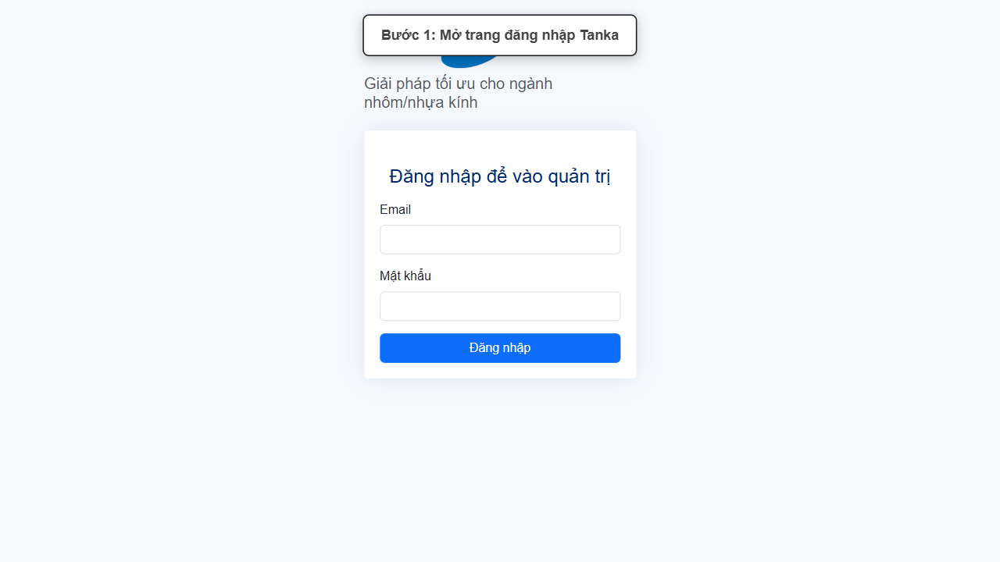
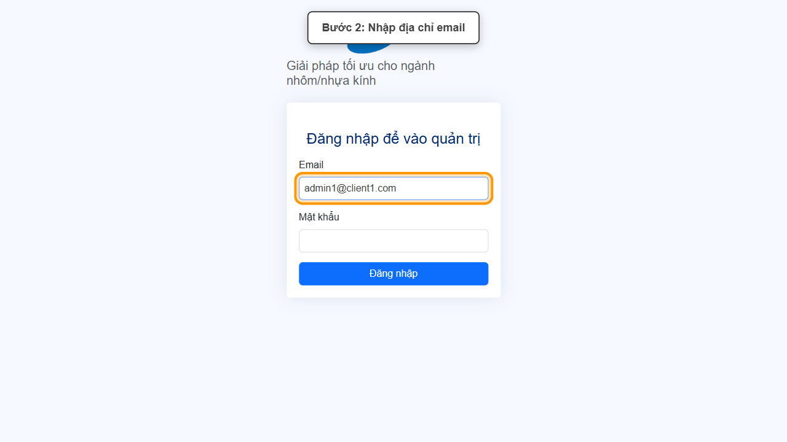
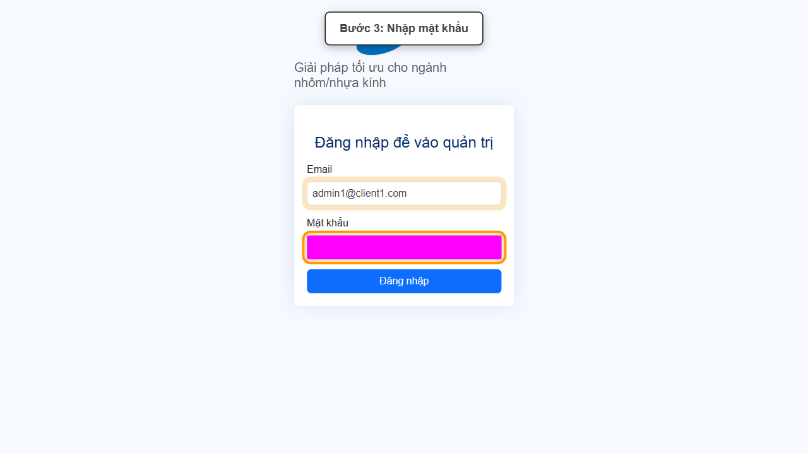
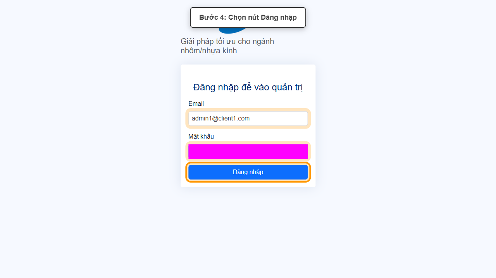
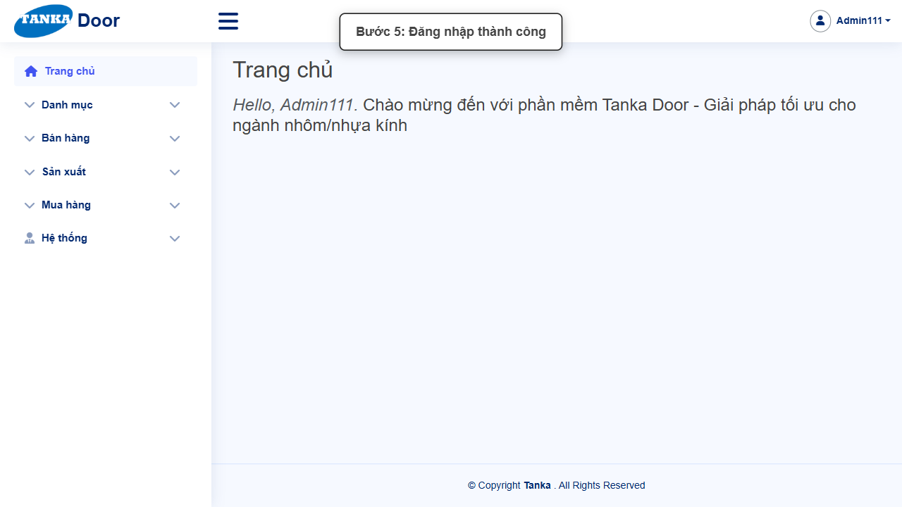

# HƯỚNG DẪN SỬ DỤNG — ĐĂNG NHẬP HỆ THỐNG

**Đường dẫn:** Trang đăng nhập TANKA Door (door-v1.test.tankasoft.com)  
**Mục tiêu:** Đăng nhập đúng cách bằng tài khoản được cấp và xác nhận đã vào được Trang chủ.  
**Dành cho:** Người mới sử dụng TANKA Door

## 1. Dữ liệu mẫu dùng trong hướng dẫn

Dữ liệu dưới đây là tài khoản thật đã dùng để kiểm chứng hướng dẫn này.

| Trường | Giá trị |
| --- | --- |
| URL | https://door-v1.test.tankasoft.com/ |
| Email | admin1@client1.com |
| Mật khẩu | Mật khẩu được quản trị viên cấp cho tài khoản của bạn |

## 2. Sơ đồ quy trình tóm tắt

BẮT ĐẦU → Mở trang đăng nhập → Nhập Email và Mật khẩu → Bấm Đăng nhập → Xác nhận đã vào Trang chủ

## 3. Quy trình thao tác từng bước

### Bước 1. Mở trang đăng nhập Tanka

Mở trình duyệt, truy cập `https://door-v1.test.tankasoft.com/`. Màn hình hiện khung "Đăng nhập để vào quản trị" với hai ô Email, Mật khẩu và nút Đăng nhập.

*Hình 1: Màn hình đăng nhập.*

### Bước 2. Nhập địa chỉ Email

Bấm vào ô Email và nhập đúng email được cấp, ví dụ `admin1@client1.com`.

*Hình 2: Nhập Email.*

### Bước 3. Nhập Mật khẩu

Bấm vào ô Mật khẩu và nhập đúng mật khẩu được cấp. Kiểm tra phím Caps Lock nếu nghi ngờ gõ sai ký tự.

*Hình 3: Nhập Mật khẩu (ảnh được che để bảo mật).*

### Bước 4. Bấm nút Đăng nhập

Kiểm tra lại Email/Mật khẩu rồi bấm nút **Đăng nhập** đúng một lần, chờ hệ thống xử lý.

*Hình 4: Bấm Đăng nhập.*

### Bước 5. Xác nhận đăng nhập thành công

Hệ thống chuyển sang **Trang chủ** với menu bên trái (Danh mục, Bán hàng, Sản xuất, Mua hàng, Hệ thống...) và tên tài khoản ở góc phải trên — đây là dấu hiệu đăng nhập thành công.

*Hình 5: Trang chủ sau khi đăng nhập.*

## 4. Khi không thao tác được

| Hiện tượng | Cách xử lý ngay |
| --- | --- |
| Bấm Đăng nhập nhưng vẫn ở trang đăng nhập | Kiểm tra lại Email/Mật khẩu, chú ý phím Caps Lock và khoảng trắng thừa. |
| Không nhớ mật khẩu | Liên hệ quản trị viên hệ thống của công ty để được cấp lại, không tự đoán thử nhiều lần liên tiếp. |
| Trang tải rất lâu hoặc trắng trang | Kiểm tra kết nối mạng, tải lại trang; nếu vẫn lỗi, thử trình duyệt khác. |

## 5. Dấu hiệu hoàn thành

- Không còn ở trang đăng nhập; URL đã chuyển sang trang nội bộ hệ thống.
- Thấy menu bên trái và tên tài khoản (ví dụ Admin111) ở góc phải trên.
- Trang chủ hiển thị các số liệu tổng quan (Báo giá tháng này, Đơn bán hàng tháng này...).

## 6. Checklist dành cho người mới

- [ ] Đã mở đúng URL hệ thống.
- [ ] Đã nhập đúng Email và Mật khẩu được cấp.
- [ ] Chỉ bấm Đăng nhập một lần và chờ xử lý.
- [ ] Đã xác nhận thấy Trang chủ với menu bên trái.

---

_Tài liệu này được biên soạn dựa trên thao tác thực tế trên hệ thống door-v1.test.tankasoft.com. Ảnh minh họa có thể thay đổi theo phiên bản giao diện._
