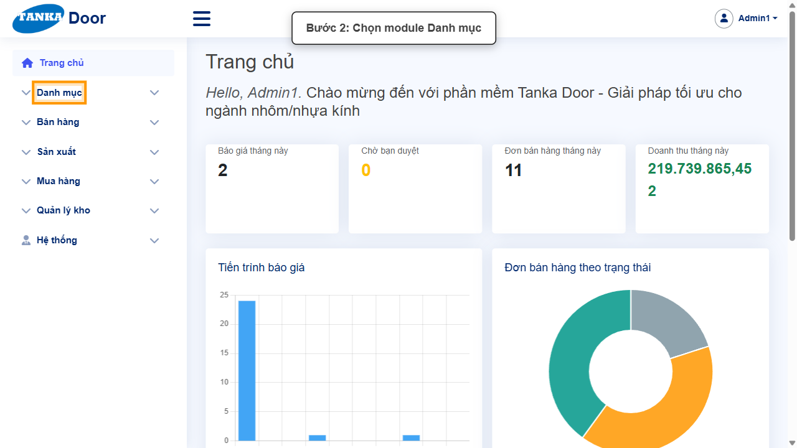
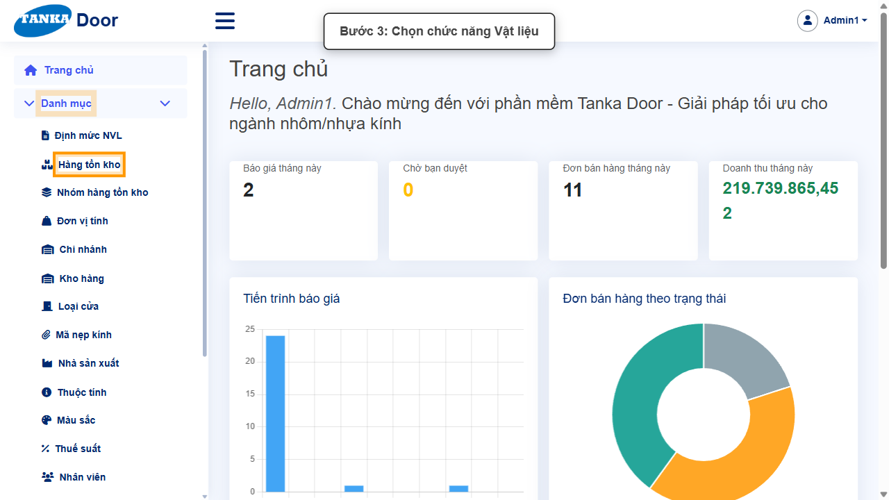
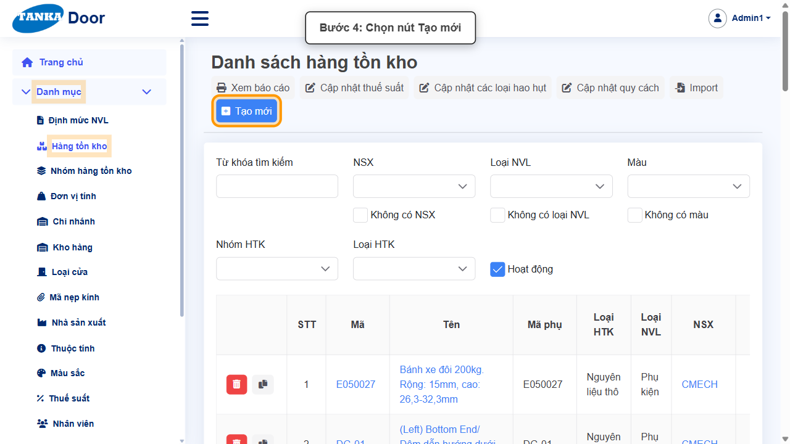
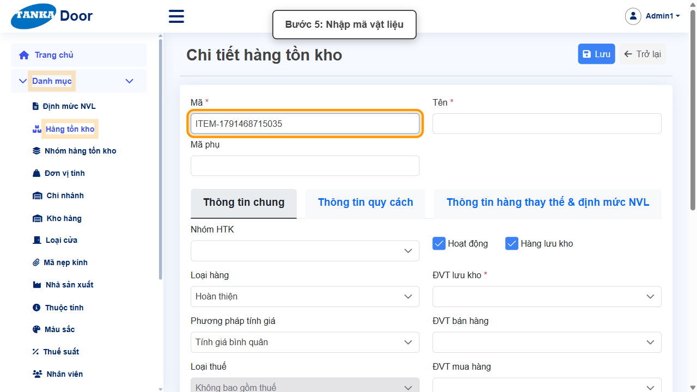
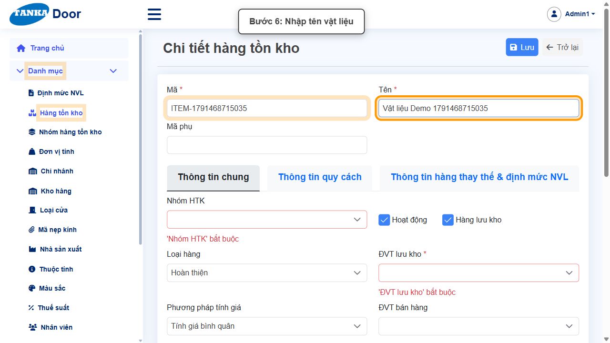
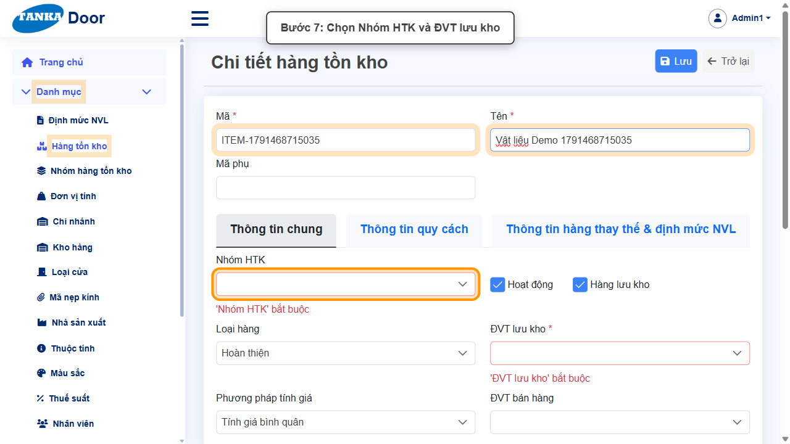
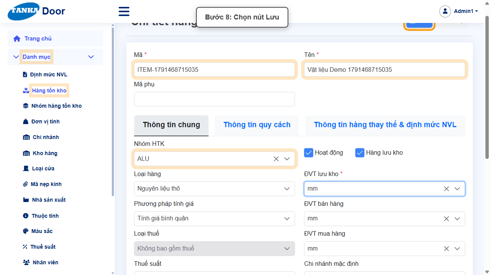
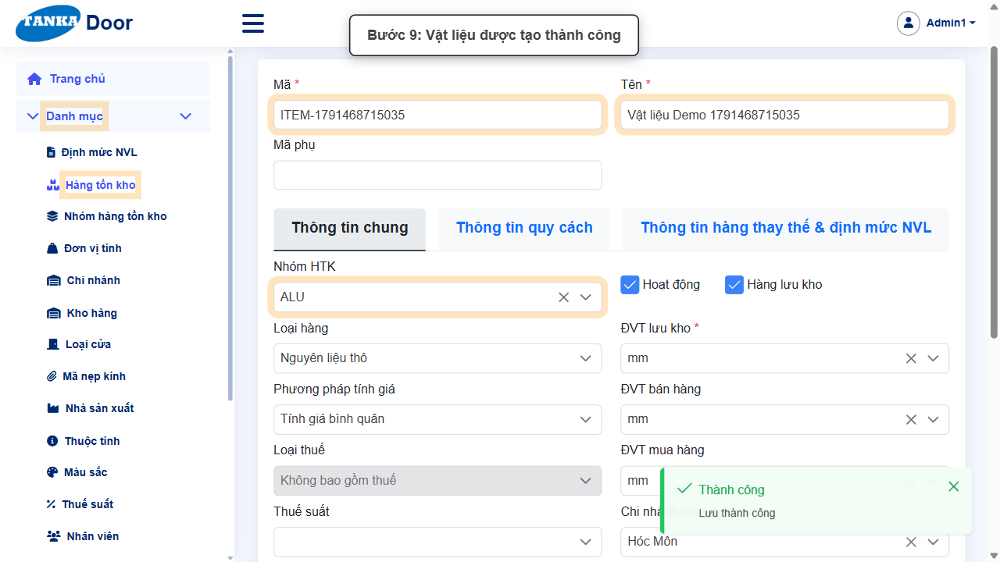

# HƯỚNG DẪN SỬ DỤNG — VẬT LIỆU (HÀNG TỒN KHO)

**Đường dẫn:** Danh mục > Hàng tồn kho  
**Mục tiêu:** Khai báo một vật liệu (hàng tồn kho — HTK) mới với mã, tên, nhóm HTK và đơn vị tính lưu kho.  
**Dành cho:** Người mới sử dụng TANKA Door

## 1. Dữ liệu mẫu dùng trong hướng dẫn

Dữ liệu dưới đây là dữ liệu thật đã dùng để tạo vật liệu minh họa.

| Trường | Giá trị |
| --- | --- |
| Mã | ITEM-1791468715035 |
| Tên | Vật liệu Demo 1791468715035 |
| Nhóm HTK | ALU |
| ĐVT lưu kho | mm |

## 2. Sơ đồ quy trình tóm tắt

BẮT ĐẦU → Mở Danh mục > Hàng tồn kho → Bấm Tạo mới → Nhập Mã, Tên → Chọn Nhóm HTK, ĐVT lưu kho → Bấm Lưu → Kiểm tra thông báo Lưu thành công

## 3. Quy trình thao tác từng bước

### Bước 1. Mở trang chủ Tanka Door

Đăng nhập vào hệ thống, màn hình **Trang chủ** hiện ra.

*Hình 1: Trang chủ sau khi đăng nhập.*

### Bước 2. Mở menu Danh mục

Ở menu bên trái, bấm vào **Danh mục** để xổ ra các chức năng con.

*Hình 2: Mở menu Danh mục.*

### Bước 3. Chọn Hàng tồn kho

Bấm **Hàng tồn kho**. Màn hình **Danh sách hàng tồn kho** hiện ra với các ô lọc (Từ khóa, NSX, Loại NVL, Màu, Nhóm HTK...).

*Hình 3: Chọn chức năng Hàng tồn kho.*

### Bước 4. Bấm nút Tạo mới

Trước khi tạo mới, có thể dùng ô **Từ khóa tìm kiếm** để kiểm tra mã đã tồn tại chưa. Nếu chưa có, bấm **Tạo mới** để mở **Chi tiết hàng tồn kho**.

*Hình 4: Bấm nút Tạo mới.*

### Bước 5. Nhập Mã vật liệu

Nhập **Mã *** — mã duy nhất của vật liệu.

*Hình 5: Nhập Mã vật liệu.*

### Bước 6. Nhập Tên vật liệu

Nhập **Tên *** của vật liệu.

*Hình 6: Nhập Tên vật liệu.*

### Bước 7. Chọn Nhóm HTK và ĐVT lưu kho

Ở tab **Thông tin chung**:

- **Nhóm HTK** — chọn nhóm (ví dụ **ALU**).
- **ĐVT lưu kho *** — chọn đơn vị tính lưu kho (ví dụ **mm**).

> **Quan trọng:** ĐVT bán hàng và ĐVT mua hàng mặc định là **mm**. Nếu chọn ĐVT lưu kho khác (ví dụ "Bình") mà chưa khai báo quy đổi giữa hai đơn vị, khi Lưu hệ thống báo lỗi _"ĐVT mm chưa có quy đổi sang ĐVT lưu kho ... Hãy thêm quy đổi cho ĐVT trước"_. Khi đó chọn ĐVT lưu kho trùng ĐVT bán/mua, hoặc khai báo quy đổi ở **Danh mục > Đơn vị tính** trước.

*Hình 7: Chọn Nhóm HTK và ĐVT lưu kho.*

### Bước 8. Bấm Lưu

Kiểm tra lại các ô bắt buộc rồi bấm **Lưu** đúng một lần.

*Hình 8: Bấm nút Lưu.*

### Bước 9. Kiểm tra kết quả

Thông báo xanh **"Thành công — Lưu thành công"** hiện ra. Màn hình **vẫn ở lại form chi tiết** với dữ liệu vừa lưu; bấm **Trở lại** để về danh sách và tìm lại vật liệu theo mã.

*Hình 9: Vật liệu được tạo thành công.*

## 4. Khi không thao tác được

| Hiện tượng | Cách xử lý ngay |
| --- | --- |
| Ô Nhóm HTK / ĐVT lưu kho viền đỏ "bắt buộc" | Chọn một giá trị trong danh sách sổ xuống trước khi Lưu. |
| Lưu báo "ĐVT ... chưa có quy đổi sang ĐVT lưu kho ..." | Chọn ĐVT lưu kho trùng ĐVT bán hàng/mua hàng, hoặc khai báo quy đổi đơn vị trước (xem lưu ý Bước 7). |
| Lưu báo trùng mã | Mã đã tồn tại — đổi sang mã khác hoặc tìm và sửa vật liệu đã có. |
| Bấm Lưu nhưng không thấy phản hồi | Không bấm thêm lần nữa; chờ thông báo rồi tìm lại vật liệu trong danh sách. |

## 5. Dấu hiệu hoàn thành

- Thông báo "Thành công — Lưu thành công" xuất hiện.
- Tìm theo mã trong Danh sách hàng tồn kho thấy vật liệu mới với đúng Nhóm HTK và ĐVT lưu kho.

## 6. Checklist dành cho người mới

- [ ] Đã nhập Mã, Tên.
- [ ] Đã chọn Nhóm HTK và ĐVT lưu kho phù hợp với ĐVT bán/mua.
- [ ] Chỉ bấm Lưu một lần và đã thấy thông báo Thành công.

---

_Tài liệu này được biên soạn dựa trên thao tác thực tế trên hệ thống door-v1.test.tankasoft.com. Ảnh minh họa có thể thay đổi theo phiên bản giao diện._
