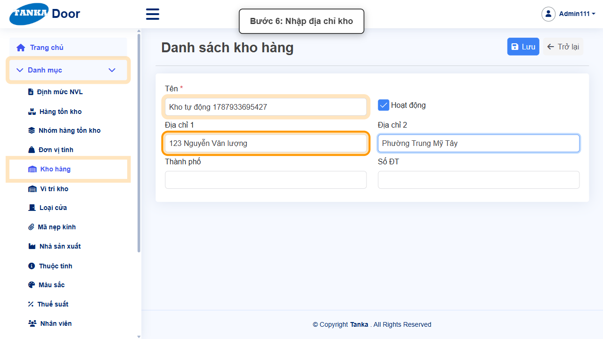
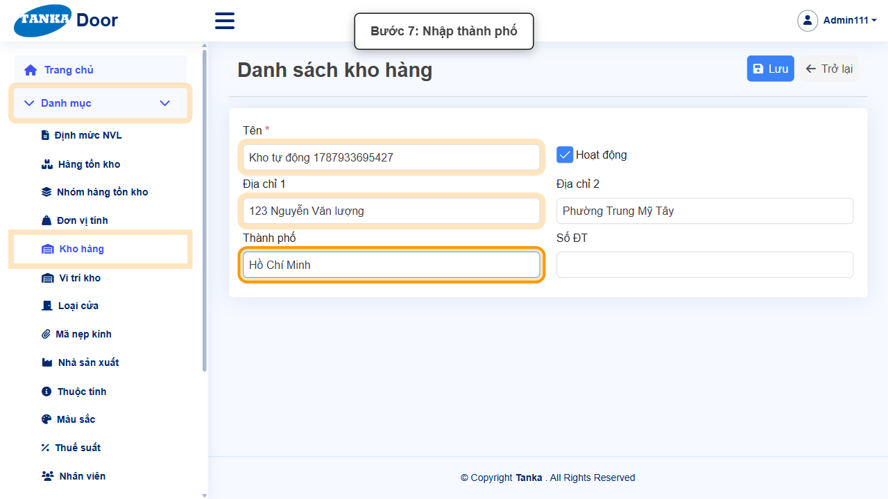
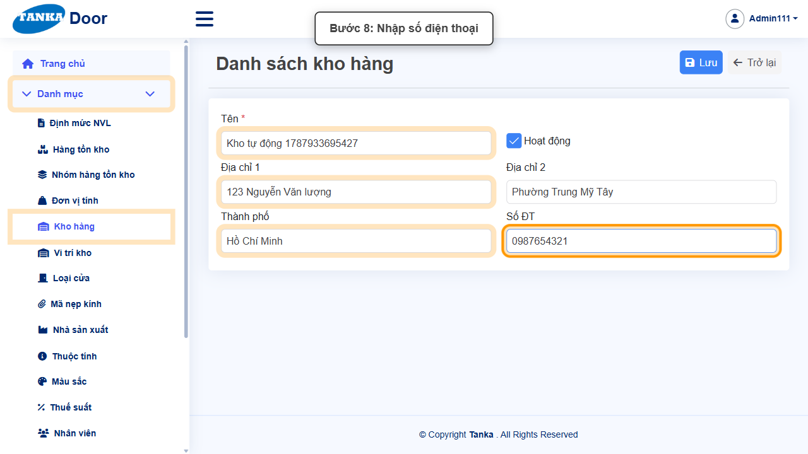
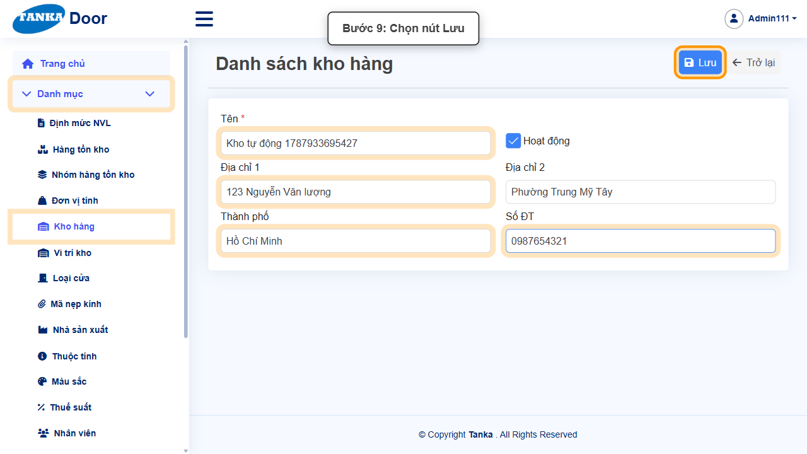
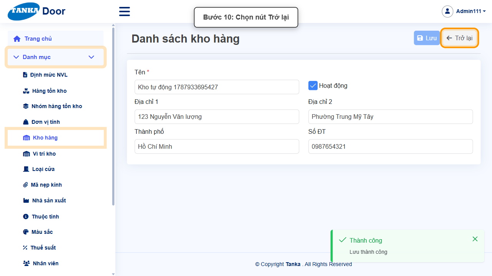

# HƯỚNG DẪN SỬ DỤNG — KHO HÀNG

**Đường dẫn:** Danh mục > Kho hàng  
**Mục tiêu:** Khai báo một kho hàng mới để dùng trong tồn kho và các chứng từ (báo giá, đơn bán hàng, đơn mua hàng...).  
**Dành cho:** Người mới sử dụng TANKA Door

## 1. Dữ liệu mẫu dùng trong hướng dẫn

Dữ liệu dưới đây là dữ liệu thật đã dùng để tạo kho hàng minh họa trong tài liệu này.

| Trường | Giá trị |
| --- | --- |
| Tên kho | Kho tự động 1787933695427 |
| Địa chỉ 1 | 123 Nguyễn Văn lượng |
| Địa chỉ 2 | Phường Trung Mỹ Tây |
| Thành phố | Hồ Chí Minh |
| Số ĐT | 0987654321 |

## 2. Sơ đồ quy trình tóm tắt

BẮT ĐẦU → Mở Danh mục > Kho hàng → Bấm Tạo mới → Nhập Tên, Địa chỉ, Thành phố, Số ĐT → Bấm Lưu, rồi Trở lại để kiểm tra

## 3. Quy trình thao tác từng bước

### Bước 1. Mở trang chủ Tanka Door

Đăng nhập vào hệ thống, màn hình **Trang chủ** hiện ra.

*Hình 1: Trang chủ sau khi đăng nhập.*

### Bước 2. Mở menu Danh mục

Ở menu bên trái, bấm vào mục **Danh mục** để xổ ra các chức năng con.

*Hình 2: Mở menu Danh mục.*

### Bước 3. Chọn chức năng Kho hàng

Trong danh sách con, bấm vào **Kho hàng**. Trang chuyển sang **Danh sách kho hàng**.

*Hình 3: Chọn chức năng Kho hàng.*

### Bước 4. Bấm nút Tạo mới

Trước khi tạo mới, có thể dùng ô Từ khóa tìm kiếm phía trên bảng để kiểm tra kho đã tồn tại chưa. Nếu chưa có, bấm **Tạo mới**.

*Hình 4: Bấm nút Tạo mới.*

### Bước 5. Nhập Tên kho

Form hiện ra ngay dưới tiêu đề (không chuyển trang). Nhập **Tên *** — ô bắt buộc duy nhất trên form này. Ô **Hoạt động** mặc định đã bật.

*Hình 5: Nhập Tên kho.*

### Bước 6. Nhập Địa chỉ kho

Nhập **Địa chỉ 1** và **Địa chỉ 2** (không bắt buộc nhưng nên điền đầy đủ để dùng khi in chứng từ).

*Hình 6: Nhập Địa chỉ 1 và Địa chỉ 2.*

### Bước 7. Nhập Thành phố

Nhập **Thành phố** nơi đặt kho.

*Hình 7: Nhập Thành phố.*

### Bước 8. Nhập Số điện thoại

Nhập **Số ĐT** liên hệ của kho.

*Hình 8: Nhập Số điện thoại.*

### Bước 9. Rà soát rồi bấm Lưu

Kiểm tra lại Tên và các thông tin vừa nhập, sau đó bấm nút **Lưu** ở góc phải phía trên đúng một lần.

*Hình 9: Bấm nút Lưu.*

### Bước 10. Xác nhận lưu thành công và trở lại danh sách

Hệ thống hiện thông báo xanh **"Thành công — Lưu thành công"** ở góc phải màn hình. Bấm nút **Trở lại** (lúc này đã bật) để quay về danh sách.

*Hình 10: Thông báo Lưu thành công, bấm Trở lại.*

## 4. Khi không thao tác được

| Hiện tượng | Cách xử lý ngay |
| --- | --- |
| Nút Lưu đang mờ / không bấm được | Tìm ô có dấu * chưa nhập hoặc dropdown chưa chọn; cuộn hết form để kiểm tra. |
| Ô hiện viền đỏ kèm thông báo lỗi | Đọc đúng thông báo dưới ô, sửa lại giá trị rồi bấm ra ngoài ô để hệ thống kiểm tra lại. |
| Gõ vào dropdown nhưng không thấy dữ liệu | Xóa bớt từ khóa, gõ lại đúng một phần mã/tên và chờ vài giây để danh sách tải xong. |
| Bấm Lưu nhưng không thấy phản hồi | Không bấm thêm lần nữa; chờ hệ thống xử lý xong rồi tìm lại bản ghi trong danh sách. |
| Không thấy kho vừa tạo trong dropdown Kho ở chứng từ khác | Kiểm tra lại ô Hoạt động của kho đã được bật; chỉ kho đang Hoạt động mới xuất hiện trong các dropdown Kho hàng. |

## 5. Dấu hiệu hoàn thành

- Thông báo xanh "Thành công — Lưu thành công" xuất hiện sau khi bấm Lưu.
- Bản ghi mới xuất hiện trong danh sách với đúng dữ liệu đã nhập.
- Mở lại bản ghi vẫn thấy đúng dữ liệu đã nhập/chọn.
- Kho mới có thể được chọn trong dropdown Kho hàng ở các chứng từ khác (báo giá, đơn bán hàng...).

## 6. Checklist dành cho người mới

- [ ] Đã mở đúng menu và chức năng theo đường dẫn hướng dẫn.
- [ ] Đã nhập/chọn đủ các ô bắt buộc (có dấu *).
- [ ] Toàn form không còn ô viền đỏ trước khi Lưu.
- [ ] Chỉ bấm Lưu một lần và đã thấy thông báo Thành công.
- [ ] Đã tìm và mở lại kết quả vừa tạo để đối chiếu dữ liệu.

---

_Tài liệu này được biên soạn dựa trên thao tác thực tế trên hệ thống door-v1.test.tankasoft.com. Ảnh minh họa có thể thay đổi theo phiên bản giao diện._
