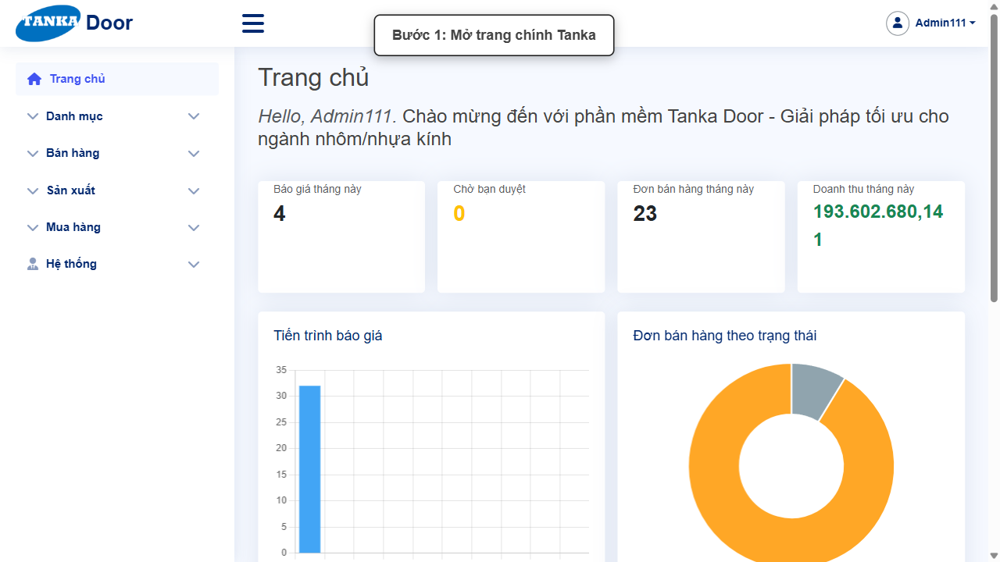
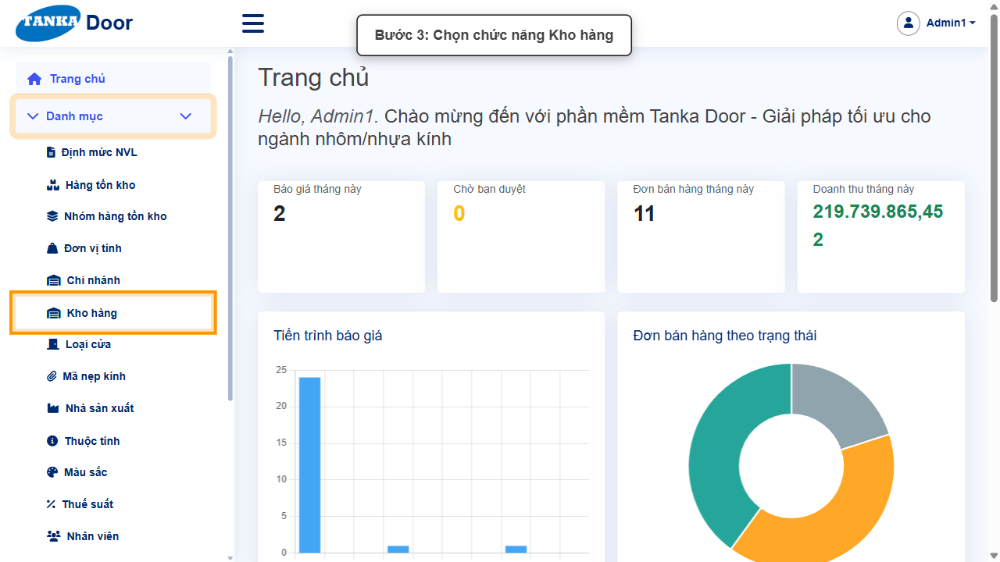
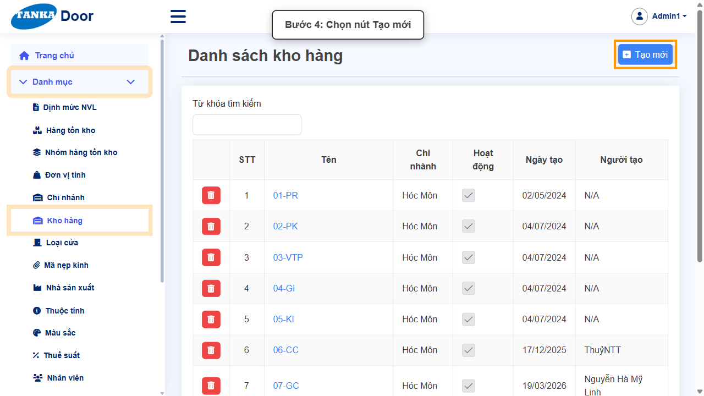
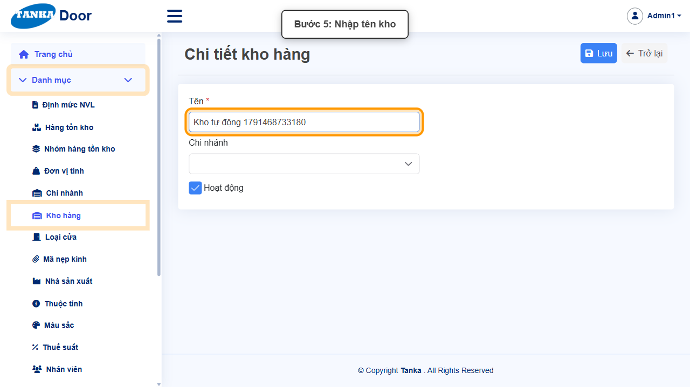
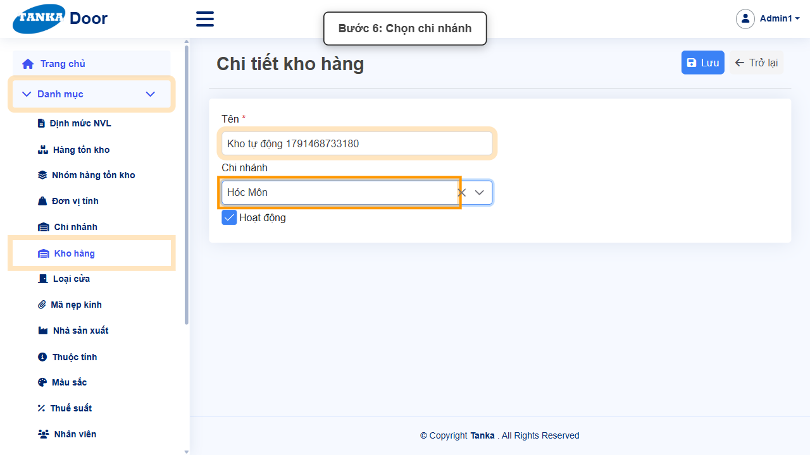
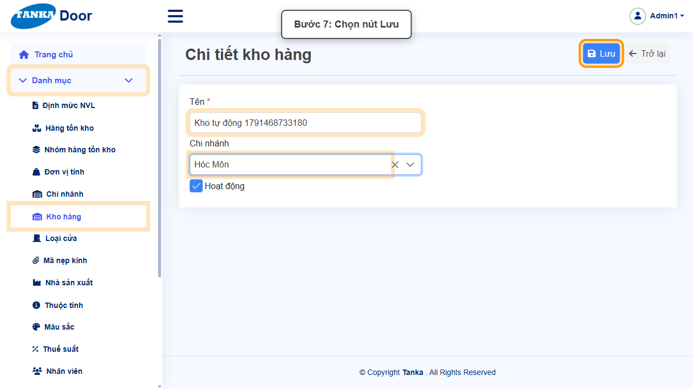
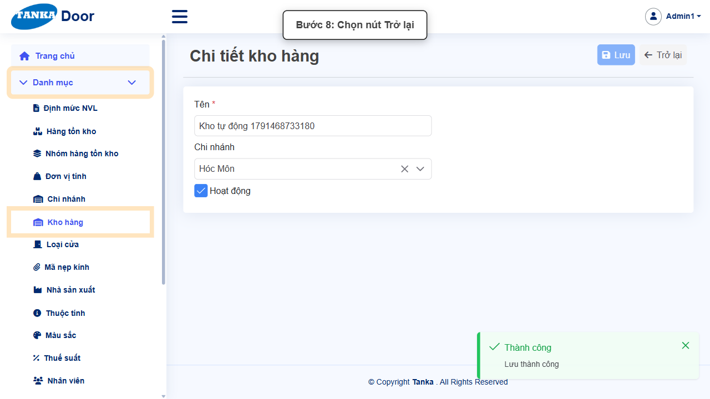

# HƯỚNG DẪN SỬ DỤNG — KHO HÀNG

**Đường dẫn:** Danh mục > Kho hàng  
**Mục tiêu:** Khai báo một kho hàng mới thuộc một chi nhánh, dùng làm kho nhận/xuất hàng trong các phiếu kho (nhận hàng, xuất vật tư sản xuất...).  
**Dành cho:** Người mới sử dụng TANKA Door

## 1. Dữ liệu mẫu dùng trong hướng dẫn

Dữ liệu dưới đây là dữ liệu thật đã dùng để tạo kho hàng minh họa trong tài liệu này.

| Trường | Giá trị |
| --- | --- |
| Tên kho | Kho tự động 1791468733180 |
| Chi nhánh | Hóc Môn |

> Từ phiên bản hiện tại, **Kho hàng** chỉ còn Tên, Chi nhánh và Hoạt động. Các thông tin Địa chỉ 1, Địa chỉ 2, Thành phố, Số ĐT được khai báo ở **Danh mục > Chi nhánh**. Các chứng từ (báo giá, đơn bán hàng, lệnh sản xuất...) giờ chọn **Chi nhánh** thay cho Kho hàng.

## 2. Sơ đồ quy trình tóm tắt

BẮT ĐẦU → Mở Danh mục > Kho hàng → Bấm Tạo mới → Nhập Tên, chọn Chi nhánh → Bấm Lưu, rồi Trở lại để kiểm tra

## 3. Quy trình thao tác từng bước

### Bước 1. Mở trang chủ Tanka Door

Đăng nhập vào hệ thống, màn hình **Trang chủ** hiện ra.

*Hình 1: Trang chủ sau khi đăng nhập.*

### Bước 2. Mở menu Danh mục

Ở menu bên trái, bấm vào mục **Danh mục** để xổ ra các chức năng con.

*Hình 2: Mở menu Danh mục.*

### Bước 3. Chọn chức năng Kho hàng

Trong danh sách con, bấm vào **Kho hàng** (nằm ngay dưới **Chi nhánh**). Trang chuyển sang **Danh sách kho hàng**.

*Hình 3: Chọn chức năng Kho hàng.*

### Bước 4. Bấm nút Tạo mới

Trước khi tạo mới, có thể dùng ô Từ khóa tìm kiếm phía trên bảng để kiểm tra kho đã tồn tại chưa. Nếu chưa có, bấm **Tạo mới**. Màn hình **Chi tiết kho hàng** mở ra.

*Hình 4: Bấm nút Tạo mới.*

### Bước 5. Nhập Tên kho

Nhập **Tên *** — ô bắt buộc duy nhất trên form này. Ô **Hoạt động** mặc định đã bật.

*Hình 5: Nhập Tên kho.*

### Bước 6. Chọn Chi nhánh

Bấm vào ô **Chi nhánh** và chọn chi nhánh quản lý kho này (ví dụ **Hóc Môn**). Danh sách chi nhánh lấy từ **Danh mục > Chi nhánh**.

*Hình 6: Chọn Chi nhánh cho kho.*

### Bước 7. Rà soát rồi bấm Lưu

Kiểm tra lại Tên và Chi nhánh, sau đó bấm nút **Lưu** ở góc phải phía trên đúng một lần.

*Hình 7: Bấm nút Lưu.*

### Bước 8. Xác nhận lưu thành công và trở lại danh sách

Hệ thống hiện thông báo xanh **"Thành công — Lưu thành công"** ở góc phải màn hình. Bấm nút **Trở lại** để quay về danh sách và kiểm tra kho vừa tạo.

*Hình 8: Thông báo Lưu thành công, bấm Trở lại.*

## 4. Khi không thao tác được

| Hiện tượng | Cách xử lý ngay |
| --- | --- |
| Nút Lưu đang mờ / không bấm được | Tìm ô có dấu * chưa nhập hoặc dropdown chưa chọn; cuộn hết form để kiểm tra. |
| Ô hiện viền đỏ kèm thông báo lỗi | Đọc đúng thông báo dưới ô, sửa lại giá trị rồi bấm ra ngoài ô để hệ thống kiểm tra lại. |
| Gõ vào dropdown nhưng không thấy dữ liệu | Xóa bớt từ khóa, gõ lại đúng một phần mã/tên và chờ vài giây để danh sách tải xong. |
| Bấm Lưu nhưng không thấy phản hồi | Không bấm thêm lần nữa; chờ hệ thống xử lý xong rồi tìm lại bản ghi trong danh sách. |
| Không thấy kho vừa tạo khi chọn kho nhận/xuất ở các phiếu kho | Kiểm tra ô Hoạt động của kho đã được bật và kho đã gán đúng Chi nhánh; chỉ kho đang Hoạt động mới xuất hiện trong danh sách chọn. |
| Không tìm thấy ô Địa chỉ, Thành phố, Số ĐT | Các ô này đã chuyển sang **Danh mục > Chi nhánh**; form Kho hàng chỉ còn Tên, Chi nhánh và Hoạt động. |

## 5. Dấu hiệu hoàn thành

- Thông báo xanh "Thành công — Lưu thành công" xuất hiện sau khi bấm Lưu.
- Bản ghi mới xuất hiện trong danh sách với đúng dữ liệu đã nhập.
- Mở lại bản ghi vẫn thấy đúng dữ liệu đã nhập/chọn.
- Kho mới hiển thị trong danh sách kho với đúng Chi nhánh đã chọn.

## 6. Checklist dành cho người mới

- [ ] Đã mở đúng menu và chức năng theo đường dẫn hướng dẫn.
- [ ] Đã nhập/chọn đủ các ô bắt buộc (có dấu *).
- [ ] Toàn form không còn ô viền đỏ trước khi Lưu.
- [ ] Chỉ bấm Lưu một lần và đã thấy thông báo Thành công.
- [ ] Đã tìm và mở lại kết quả vừa tạo để đối chiếu dữ liệu.

---

_Tài liệu này được biên soạn dựa trên thao tác thực tế trên hệ thống door-v1.test.tankasoft.com. Ảnh minh họa có thể thay đổi theo phiên bản giao diện._
