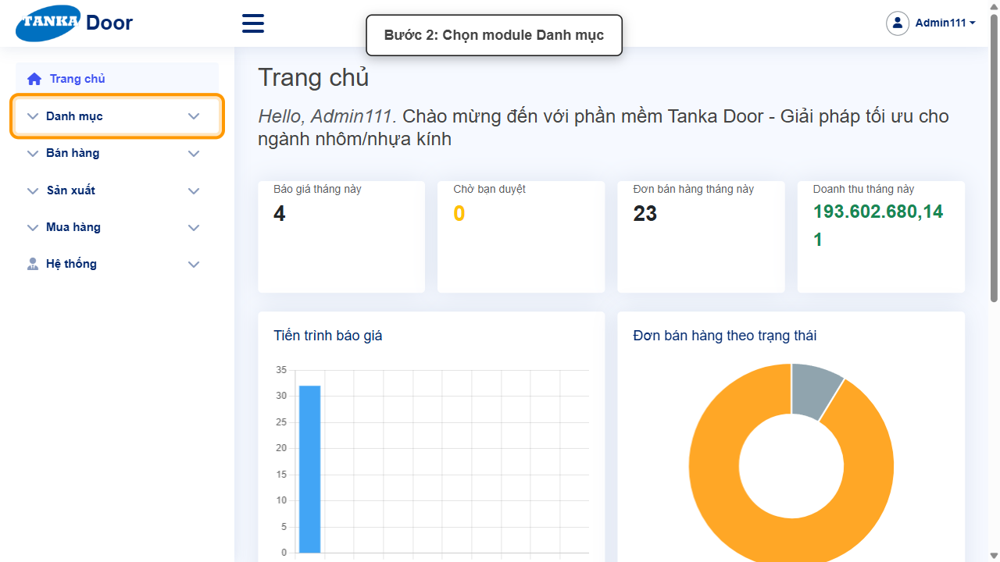
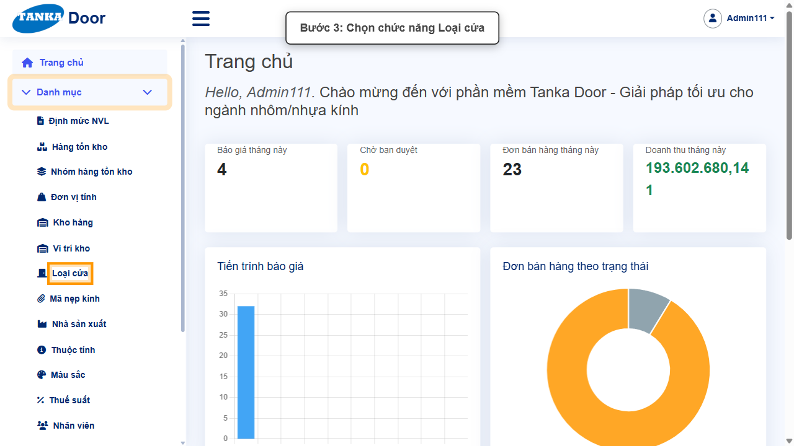
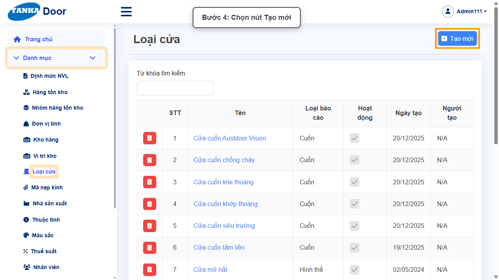
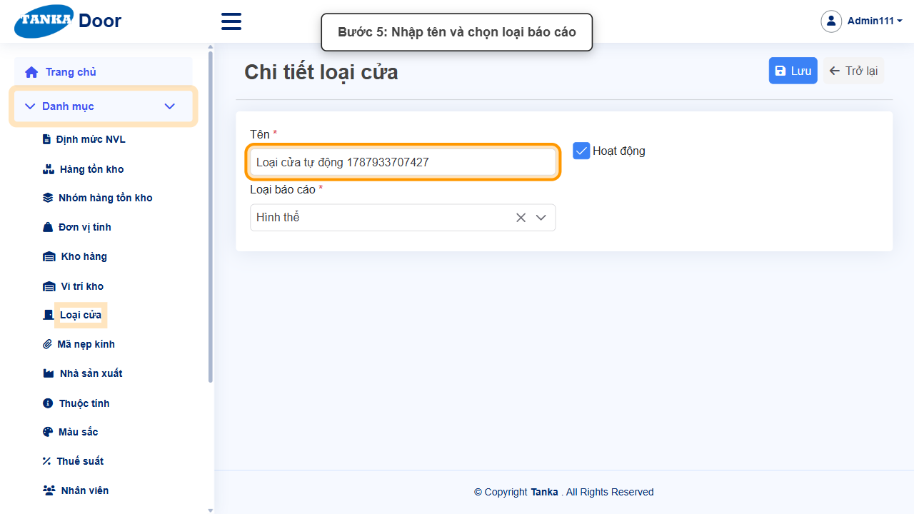
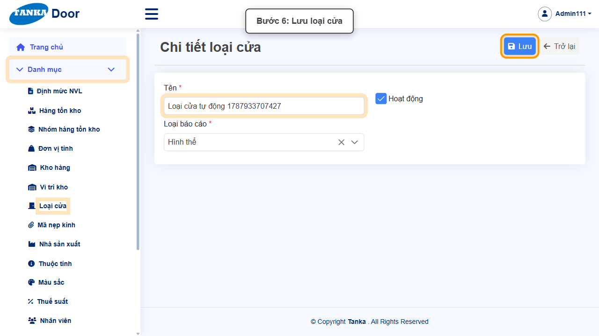
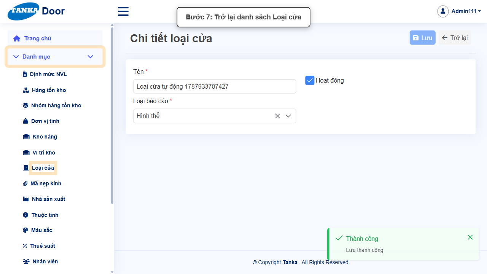

# HƯỚNG DẪN SỬ DỤNG — LOẠI CỬA

**Đường dẫn:** Danh mục > Loại cửa  
**Mục tiêu:** Khai báo một loại cửa mới và gắn đúng Loại báo cáo để dùng cho thiết kế/chứng từ.  
**Dành cho:** Người mới sử dụng TANKA Door

## 1. Dữ liệu mẫu dùng trong hướng dẫn

Dữ liệu dưới đây là dữ liệu thật đã dùng để tạo loại cửa minh họa trong tài liệu này.

| Trường | Giá trị |
| --- | --- |
| Tên | Loại cửa tự động 1787933707427 |
| Loại báo cáo | Hình thể |

## 2. Sơ đồ quy trình tóm tắt

BẮT ĐẦU → Mở Danh mục > Loại cửa → Bấm Tạo mới, nhập Tên và chọn Loại báo cáo → Bấm Lưu → Bấm Trở lại, kiểm tra kết quả

## 3. Quy trình thao tác từng bước

### Bước 1. Mở trang chủ Tanka Door

Đăng nhập vào hệ thống, màn hình **Trang chủ** hiện ra.

*Hình 1: Trang chủ sau khi đăng nhập.*

### Bước 2. Mở menu Danh mục

Ở menu bên trái, bấm vào mục **Danh mục** để xổ ra các chức năng con.

*Hình 2: Mở menu Danh mục.*

### Bước 3. Chọn chức năng Loại cửa

Trong danh sách con, bấm vào **Loại cửa**.

*Hình 3: Chọn chức năng Loại cửa.*

### Bước 4. Bấm nút Tạo mới

Trước khi tạo mới, có thể tìm trong danh sách để tránh trùng. Nếu chưa có, bấm **Tạo mới**.

*Hình 4: Bấm nút Tạo mới.*

### Bước 5. Nhập Tên và chọn Loại báo cáo

Hệ thống mở màn hình **Chi tiết loại cửa** với các ô: **Tên *** (bắt buộc), **Hoạt động** (checkbox, mặc định bật), **Loại báo cáo *** (dropdown bắt buộc, ví dụ chọn "Hình thể").

*Hình 5: Nhập Tên và chọn Loại báo cáo.*

### Bước 6. Bấm Lưu

Rà soát lại hai ô bắt buộc (Tên, Loại báo cáo), sau đó bấm nút **Lưu** đúng một lần.

*Hình 6: Bấm nút Lưu.*

### Bước 7. Xác nhận lưu thành công và trở lại danh sách

Hệ thống hiện thông báo xanh **"Thành công — Lưu thành công"**. Bấm nút **Trở lại** để quay về danh sách Loại cửa và kiểm tra bản ghi vừa tạo.

*Hình 7: Thông báo Lưu thành công, bấm Trở lại.*

## 4. Khi không thao tác được

| Hiện tượng | Cách xử lý ngay |
| --- | --- |
| Nút Lưu đang mờ / không bấm được | Tìm ô có dấu * chưa nhập hoặc dropdown chưa chọn; cuộn hết form để kiểm tra. |
| Ô hiện viền đỏ kèm thông báo lỗi | Đọc đúng thông báo dưới ô, sửa lại giá trị rồi bấm ra ngoài ô để hệ thống kiểm tra lại. |
| Gõ vào dropdown nhưng không thấy dữ liệu | Xóa bớt từ khóa, gõ lại đúng một phần mã/tên và chờ vài giây để danh sách tải xong. |
| Bấm Lưu nhưng không thấy phản hồi | Không bấm thêm lần nữa; chờ hệ thống xử lý xong rồi tìm lại bản ghi trong danh sách. |

## 5. Dấu hiệu hoàn thành

- Thông báo xanh "Thành công — Lưu thành công" xuất hiện sau khi bấm Lưu.
- Bản ghi mới xuất hiện trong danh sách với đúng dữ liệu đã nhập.
- Mở lại bản ghi vẫn thấy đúng dữ liệu đã nhập/chọn.
- Loại cửa mới có thể được chọn khi khai báo Thiết kế cửa/Vật liệu liên quan.

## 6. Checklist dành cho người mới

- [ ] Đã mở đúng menu và chức năng theo đường dẫn hướng dẫn.
- [ ] Đã nhập/chọn đủ các ô bắt buộc (có dấu *).
- [ ] Toàn form không còn ô viền đỏ trước khi Lưu.
- [ ] Chỉ bấm Lưu một lần và đã thấy thông báo Thành công.
- [ ] Đã tìm và mở lại kết quả vừa tạo để đối chiếu dữ liệu.

---

_Tài liệu này được biên soạn dựa trên thao tác thực tế trên hệ thống door-v1.test.tankasoft.com. Ảnh minh họa có thể thay đổi theo phiên bản giao diện._
