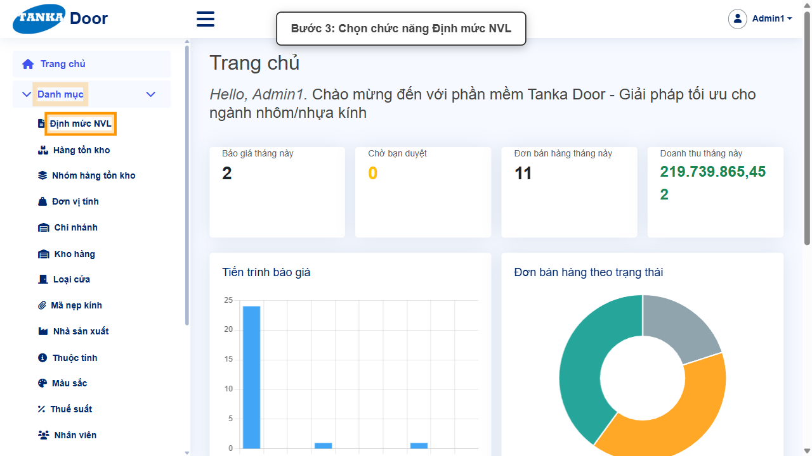
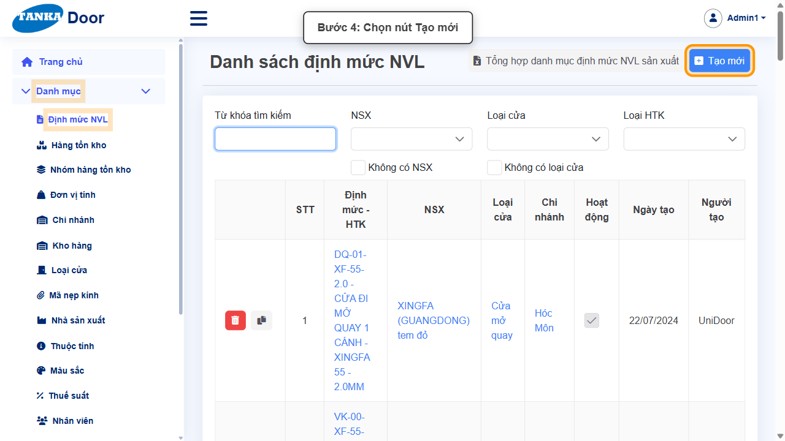
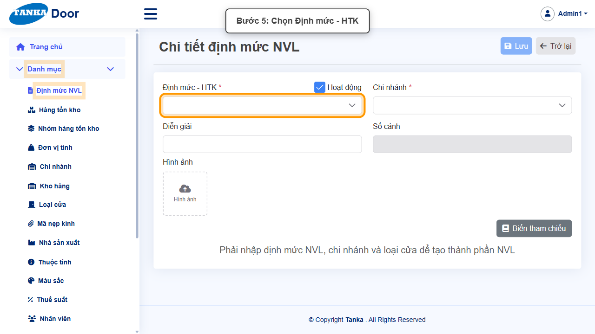
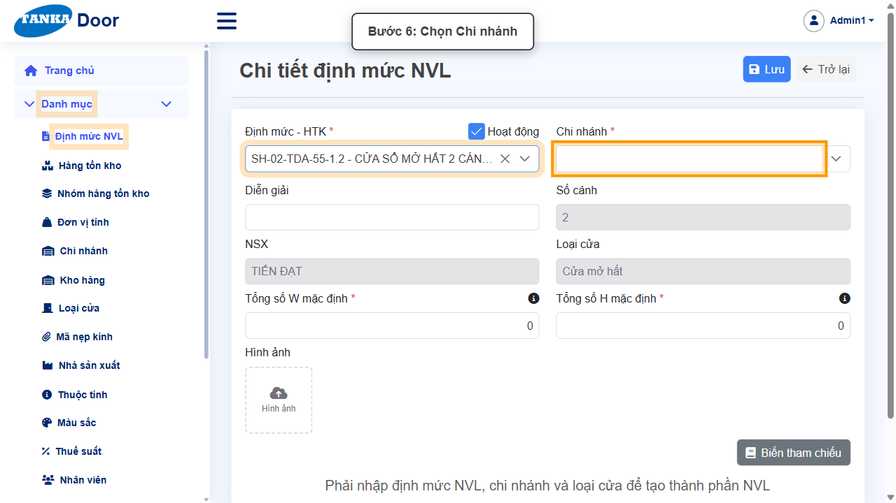
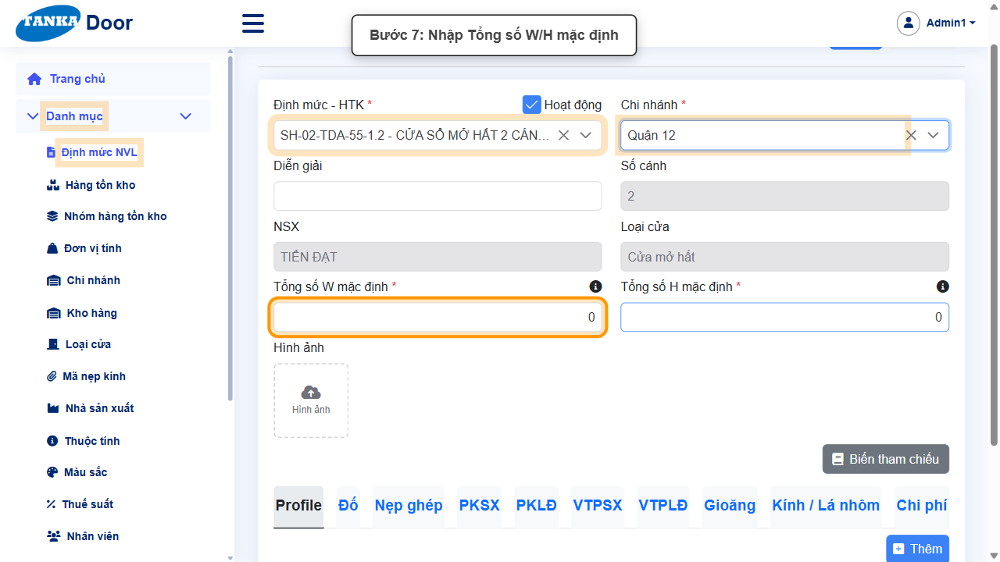
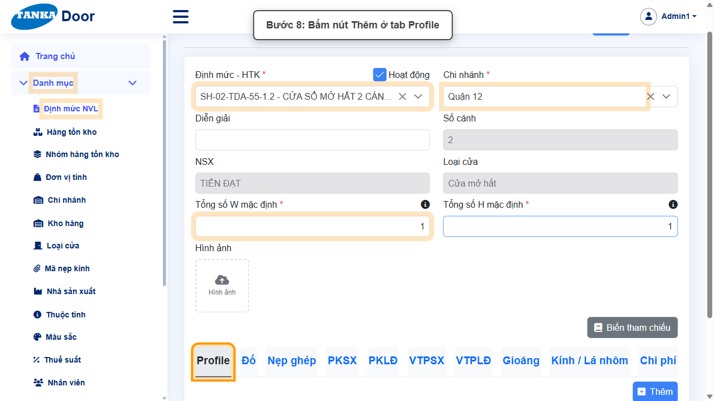
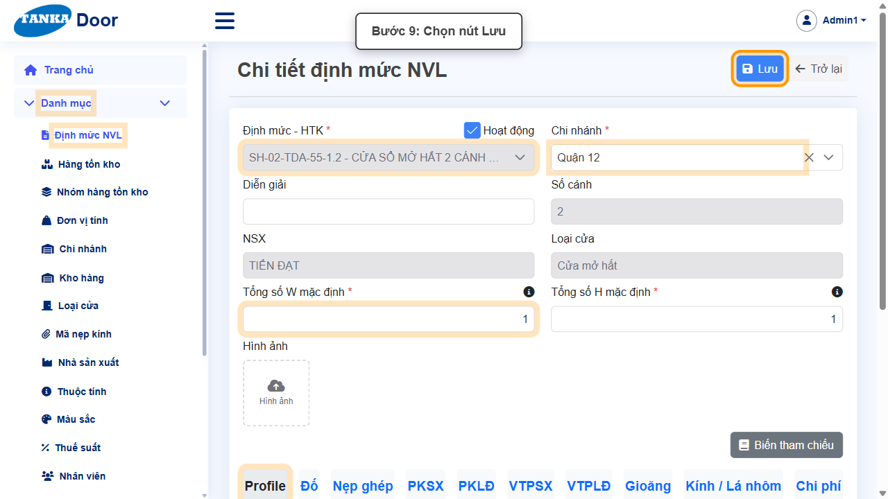
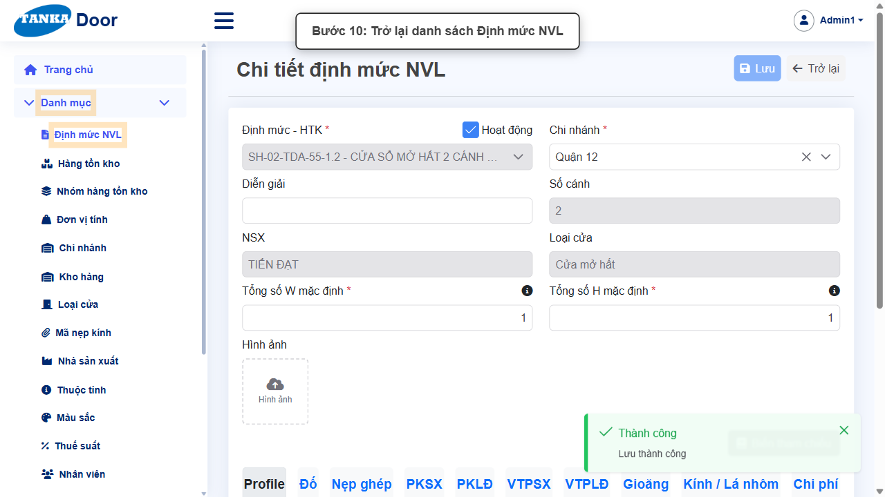
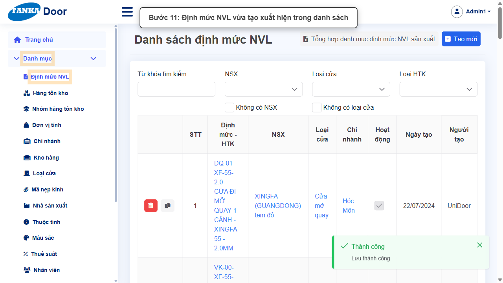

# HƯỚNG DẪN SỬ DỤNG — ĐỊNH MỨC NGUYÊN VẬT LIỆU (BOM)

**Đường dẫn:** Danh mục > Định mức NVL  
**Mục tiêu:** Tạo định mức NVL cho một thành phẩm (HTK cửa) tại một chi nhánh, gồm số lượng kích thước W/H mặc định và ít nhất một thành phần NVL.  
**Dành cho:** Người mới sử dụng TANKA Door

## 1. Dữ liệu mẫu dùng trong hướng dẫn

Dữ liệu dưới đây là dữ liệu thật đã dùng để minh họa.

| Trường | Giá trị |
| --- | --- |
| Định mức - HTK | SH-02-TDA-55-1.2 — Cửa sổ mở hất 2 cánh - Tiến Đạt 55 - 1.2mm |
| Chi nhánh | Quận 12 |
| Tổng số W / H mặc định | 1 / 1 |
| Thành phần NVL (tab Profile) | Một thanh profile hệ TDA (gõ "TDA" để tìm) |

> **Mỗi cặp HTK + Chi nhánh chỉ có một định mức.** Nếu chọn HTK đã có định mức ở chi nhánh đó, khi Lưu hệ thống báo _"Định mức NVL and chi nhánh đã tồn tại"_. Trước khi tạo, gõ mã HTK vào ô tìm kiếm ở danh sách để kiểm tra cột **Chi nhánh**.

## 2. Sơ đồ quy trình tóm tắt

BẮT ĐẦU → Mở Danh mục > Định mức NVL → Bấm Tạo mới → Chọn Định mức - HTK → Chọn Chi nhánh → Nhập Tổng số W/H mặc định → Thêm thành phần NVL ở tab Profile → Bấm Lưu → Trở lại kiểm tra

## 3. Quy trình thao tác từng bước

### Bước 1. Mở trang chủ Tanka Door

Đăng nhập vào hệ thống, màn hình **Trang chủ** hiện ra.

*Hình 1: Trang chủ sau khi đăng nhập.*

### Bước 2. Mở menu Danh mục

Ở menu bên trái, bấm vào **Danh mục**.

*Hình 2: Mở menu Danh mục.*

### Bước 3. Chọn Định mức NVL

Bấm **Định mức NVL**. Màn hình **Danh sách định mức NVL** hiện ra, mỗi dòng gồm Định mức - HTK, NSX, Loại cửa, **Chi nhánh**.

*Hình 3: Chọn chức năng Định mức NVL.*

### Bước 4. Bấm nút Tạo mới

Bấm **Tạo mới** để mở **Chi tiết định mức NVL**.

*Hình 4: Bấm nút Tạo mới.*

### Bước 5. Chọn Định mức - HTK

Bấm ô **Định mức - HTK ***, gõ một phần mã (ví dụ `TDA-55`) và chọn thành phẩm cần lập định mức. Các ô NSX, Loại cửa, Số cánh tự điền theo HTK đã chọn.

*Hình 5: Chọn Định mức - HTK.*

### Bước 6. Chọn Chi nhánh

Bấm ô **Chi nhánh *** và chọn chi nhánh áp dụng định mức (ví dụ **Quận 12**). Trường này thay cho ô "Kho hàng" ở phiên bản trước.

*Hình 6: Chọn Chi nhánh.*

### Bước 7. Nhập Tổng số W/H mặc định

Nhập **Tổng số W mặc định *** và **Tổng số H mặc định ***. Đây là **số lượng** kích thước chiều rộng/chiều cao của bộ cửa (từ 0 đến 10, thường là 1), **không phải** kích thước tính bằng mm. Nhập số lớn hơn 10, ô sẽ tự giới hạn về 10.

*Hình 7: Nhập Tổng số W/H mặc định.*

### Bước 8. Thêm thành phần NVL ở tab Profile

Ở nhóm tab thành phần (Profile, Đố, Nẹp ghép, PKSX, PKLĐ, VTPSX, VTPLĐ, Gioăng, Kính / Lá nhôm, Chi phí), tab **Profile** đang được chọn. Bấm **Thêm** để thêm một dòng, rồi ở ô **Thành phần HTK** gõ mã (ví dụ `TDA`) và chọn thanh profile cùng hệ với thành phẩm.

*Hình 8: Bấm nút Thêm ở tab Profile.*

### Bước 9. Bấm Lưu

Kiểm tra lại thông tin rồi bấm **Lưu** đúng một lần. Sau khi lưu, ô Định mức - HTK chuyển sang chỉ đọc.

*Hình 9: Bấm nút Lưu.*

### Bước 10. Trở lại danh sách

Bấm **Trở lại** để về **Danh sách định mức NVL**.

*Hình 10: Bấm Trở lại.*

### Bước 11. Kiểm tra kết quả

Định mức vừa tạo xuất hiện trong danh sách với đúng HTK và Chi nhánh.

*Hình 11: Định mức NVL vừa tạo xuất hiện trong danh sách.*

## 4. Khi không thao tác được

| Hiện tượng | Cách xử lý ngay |
| --- | --- |
| Lưu báo "Định mức NVL and chi nhánh đã tồn tại" | HTK này đã có định mức ở chi nhánh đã chọn — mở định mức cũ để sửa, hoặc chọn HTK/chi nhánh khác. |
| Bấm Trở lại hiện "Bạn có chắc chắn muốn thoát mà không lưu không?" | Lần Lưu trước chưa thành công — bấm **Không**, đọc thông báo lỗi và sửa rồi Lưu lại. |
| Nút Thêm ở tab thành phần bị mờ | Phải chọn xong Định mức - HTK, Chi nhánh (Loại cửa tự điền) trước khi thêm thành phần. |
| Tổng số W/H tự đổi thành 10 | Ô này là số lượng (tối đa 10), không phải kích thước mm — nhập 1 hoặc số kích thước thực tế. |

## 5. Dấu hiệu hoàn thành

- Thông báo "Thành công — Lưu thành công" xuất hiện.
- Định mức mới có trong danh sách với đúng Định mức - HTK và Chi nhánh.

## 6. Checklist dành cho người mới

- [ ] Đã kiểm tra HTK chưa có định mức ở chi nhánh định tạo.
- [ ] Đã chọn Định mức - HTK và Chi nhánh.
- [ ] Đã nhập Tổng số W/H mặc định (số lượng, không phải mm).
- [ ] Đã thêm ít nhất một thành phần NVL và Lưu thành công.

---

_Tài liệu này được biên soạn dựa trên thao tác thực tế trên hệ thống door-v1.test.tankasoft.com. Ảnh minh họa có thể thay đổi theo phiên bản giao diện._
