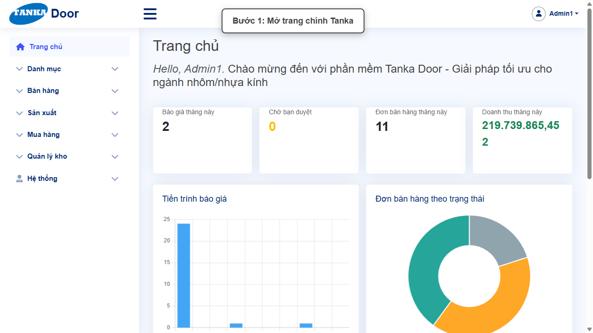
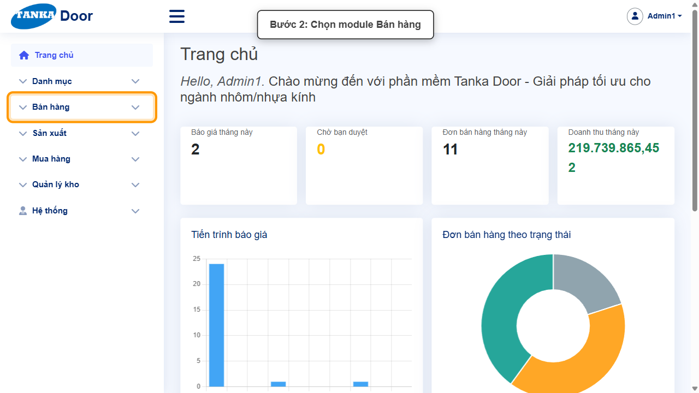
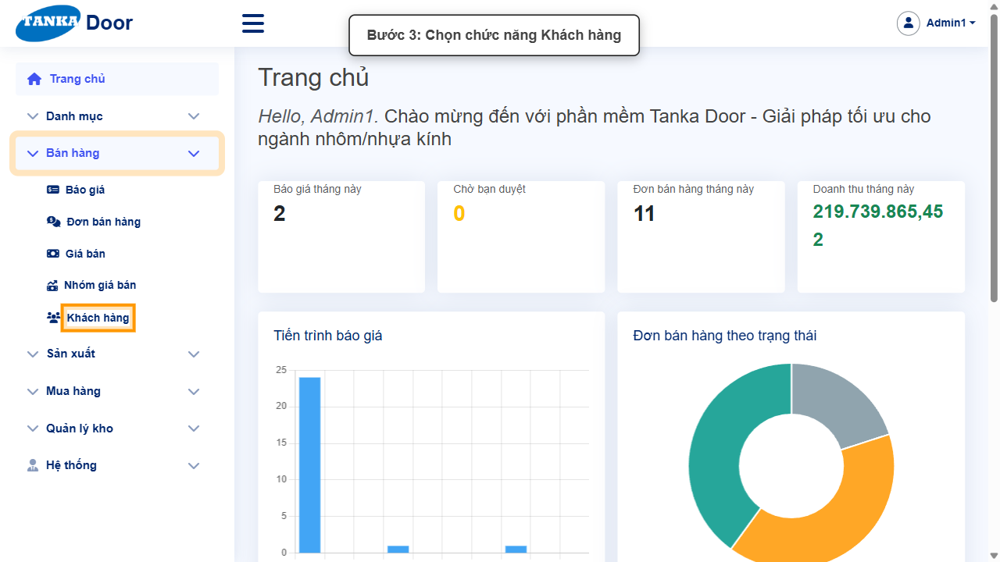
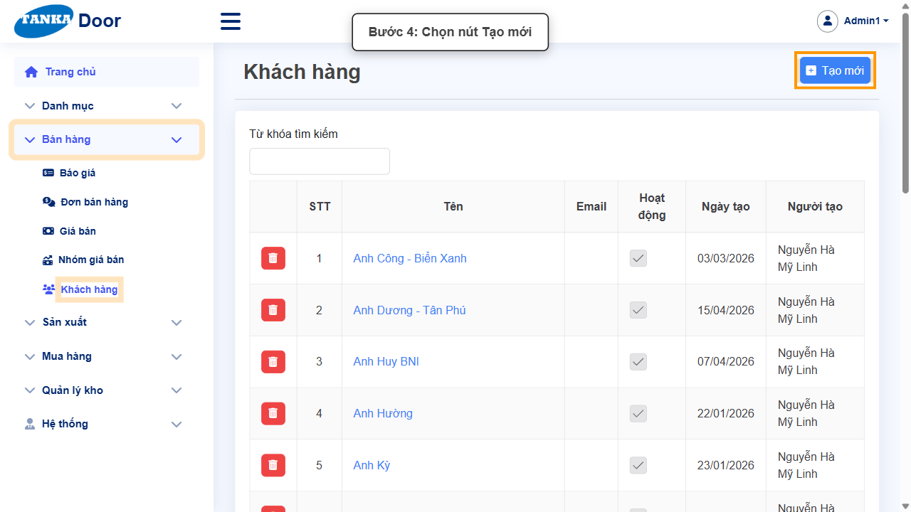
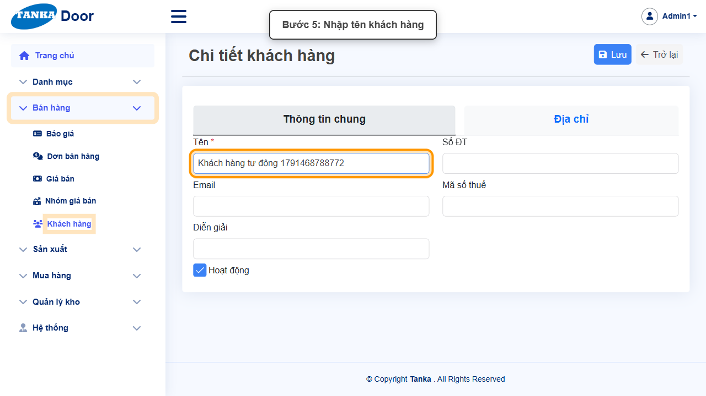
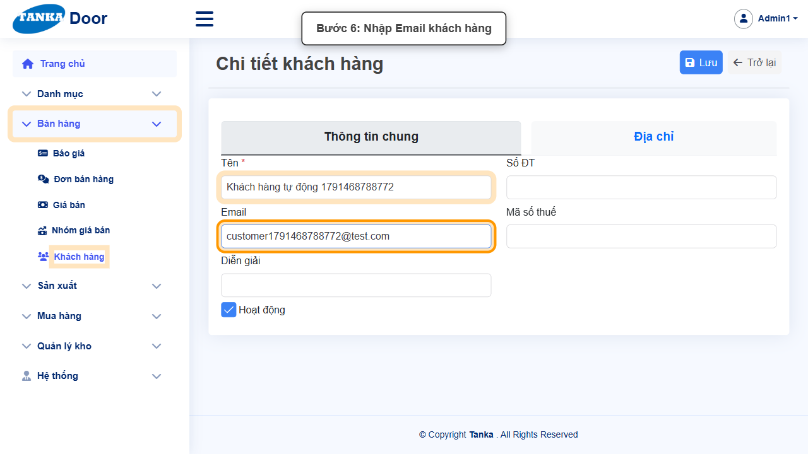
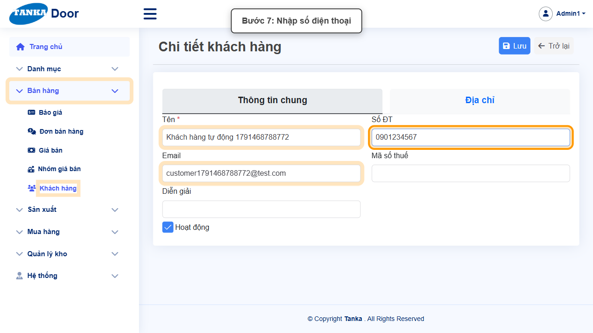
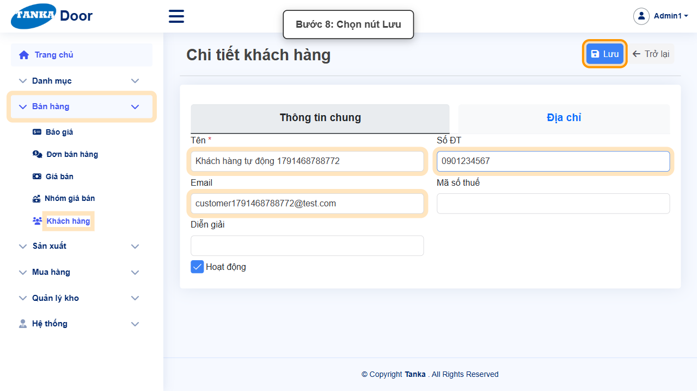
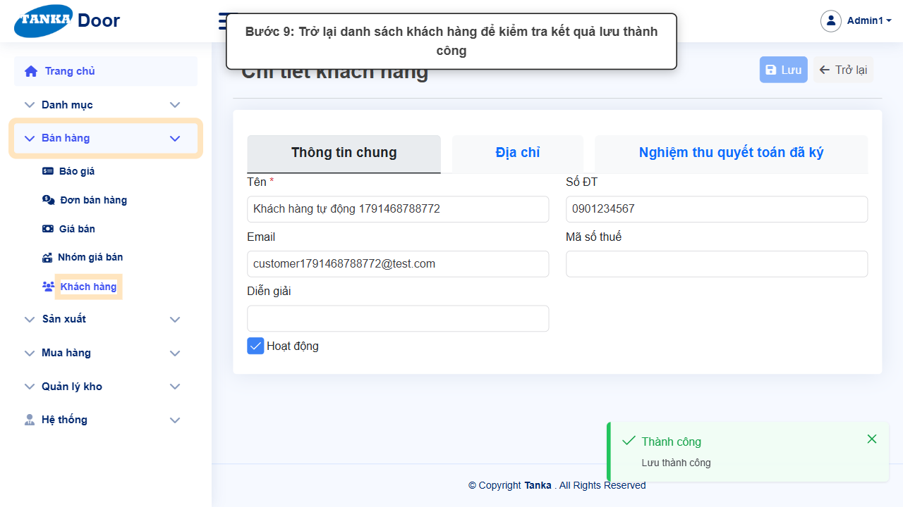

# HƯỚNG DẪN SỬ DỤNG — KHÁCH HÀNG

**Đường dẫn:** Bán hàng > Khách hàng  
**Mục tiêu:** Tạo một khách hàng mới với thông tin liên hệ để dùng khi lập báo giá, đơn bán hàng.  
**Dành cho:** Người mới sử dụng TANKA Door

## 1. Dữ liệu mẫu dùng trong hướng dẫn

Dữ liệu dưới đây là dữ liệu thật đã dùng để tạo khách hàng minh họa. Mã số thuế và Diễn giải để trống vì không bắt buộc.

| Trường | Giá trị |
| --- | --- |
| Tên | Khách hàng tự động 1791468788772 |
| Số ĐT | 0901234567 |
| Email | customer1791468788772@test.com |

## 2. Sơ đồ quy trình tóm tắt

BẮT ĐẦU → Mở Bán hàng > Khách hàng → Bấm Tạo mới, nhập Tên/Email/Số ĐT → Bấm Lưu → Bấm Trở lại, kiểm tra kết quả

## 3. Quy trình thao tác từng bước

### Bước 1. Mở trang chủ Tanka Door

Đăng nhập vào hệ thống, màn hình **Trang chủ** hiện ra.

*Hình 1: Trang chủ sau khi đăng nhập.*

### Bước 2. Mở menu Bán hàng

Ở menu bên trái, bấm vào mục **Bán hàng** để xổ ra các chức năng con (Báo giá, Đơn bán hàng, Giá bán, Nhóm giá bán, Khách hàng).

*Hình 2: Mở menu Bán hàng.*

### Bước 3. Chọn chức năng Khách hàng

Trong danh sách con, bấm vào **Khách hàng**.

*Hình 3: Chọn chức năng Khách hàng.*

### Bước 4. Bấm nút Tạo mới

Trước khi tạo mới, có thể dùng ô Từ khóa tìm kiếm phía trên bảng để tránh tạo trùng. Nếu chưa có, bấm **Tạo mới**.

*Hình 4: Bấm nút Tạo mới.*

### Bước 5. Nhập Tên khách hàng

Hệ thống mở màn hình **Chi tiết khách hàng** gồm 2 tab: **Thông tin chung** và **Địa chỉ**. Ở tab Thông tin chung, nhập **Tên *** — ô bắt buộc duy nhất.

*Hình 5: Nhập Tên khách hàng.*

### Bước 6. Nhập Email khách hàng

Nhập **Email** liên hệ (không bắt buộc nhưng nên điền để gửi báo giá/chứng từ).

*Hình 6: Nhập Email khách hàng.*

### Bước 7. Nhập Số điện thoại

Nhập **Số ĐT** liên hệ. Các ô Mã số thuế, Diễn giải là tùy chọn.

- Có thể chuyển sang tab **Địa chỉ** để khai báo địa chỉ giao hàng/thanh toán — đây là bước tùy chọn, không bắt buộc để lưu khách hàng.

*Hình 7: Nhập Số điện thoại.*

### Bước 8. Bấm nút Lưu

Sau khi nhập đủ thông tin liên hệ, bấm nút **Lưu** ở góc phải phía trên đúng một lần.

*Hình 8: Bấm nút Lưu.*

### Bước 9. Trở lại danh sách để kiểm tra kết quả

Hệ thống hiện thông báo xanh **"Thành công — Lưu thành công"**. Bấm nút **Trở lại** để quay về danh sách Khách hàng và kiểm tra bản ghi vừa tạo.

*Hình 9: Thông báo Lưu thành công, bấm Trở lại.*

## 4. Khi không thao tác được

| Hiện tượng | Cách xử lý ngay |
| --- | --- |
| Nút Lưu đang mờ / không bấm được | Tìm ô có dấu * chưa nhập hoặc dropdown chưa chọn; cuộn hết form để kiểm tra. |
| Ô hiện viền đỏ kèm thông báo lỗi | Đọc đúng thông báo dưới ô, sửa lại giá trị rồi bấm ra ngoài ô để hệ thống kiểm tra lại. |
| Gõ vào dropdown nhưng không thấy dữ liệu | Xóa bớt từ khóa, gõ lại đúng một phần mã/tên và chờ vài giây để danh sách tải xong. |
| Bấm Lưu nhưng không thấy phản hồi | Không bấm thêm lần nữa; chờ hệ thống xử lý xong rồi tìm lại bản ghi trong danh sách. |

## 5. Dấu hiệu hoàn thành

- Thông báo xanh "Thành công — Lưu thành công" xuất hiện sau khi bấm Lưu.
- Bản ghi mới xuất hiện trong danh sách với đúng dữ liệu đã nhập.
- Mở lại bản ghi vẫn thấy đúng dữ liệu đã nhập/chọn.
- Khách hàng mới có thể được chọn trong dropdown Khách hàng khi lập Báo giá/Đơn bán hàng.

## 6. Checklist dành cho người mới

- [ ] Đã mở đúng menu và chức năng theo đường dẫn hướng dẫn.
- [ ] Đã nhập/chọn đủ các ô bắt buộc (có dấu *).
- [ ] Toàn form không còn ô viền đỏ trước khi Lưu.
- [ ] Chỉ bấm Lưu một lần và đã thấy thông báo Thành công.
- [ ] Đã tìm và mở lại kết quả vừa tạo để đối chiếu dữ liệu.

---

_Tài liệu này được biên soạn dựa trên thao tác thực tế trên hệ thống door-v1.test.tankasoft.com. Ảnh minh họa có thể thay đổi theo phiên bản giao diện._
