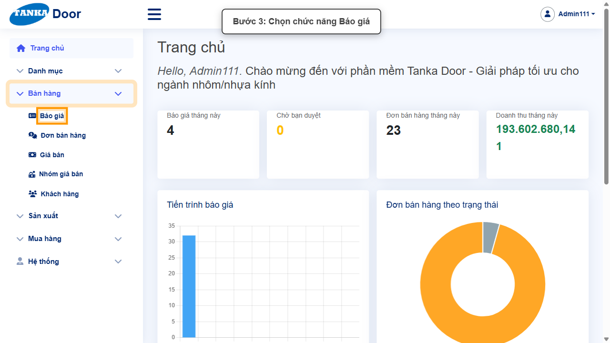
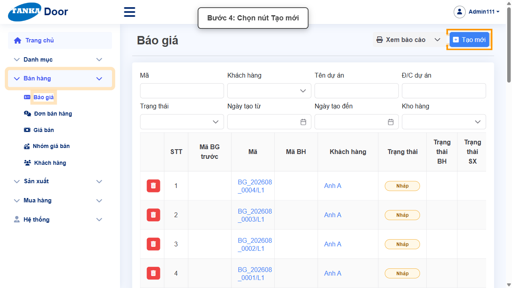
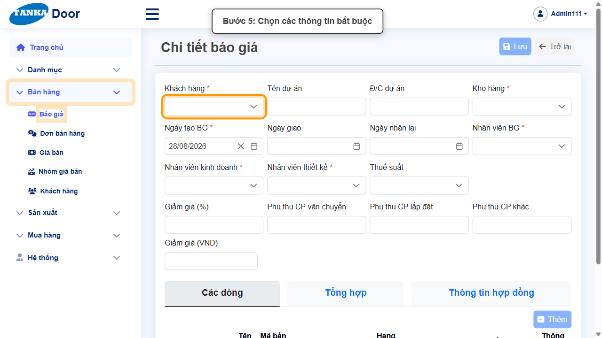
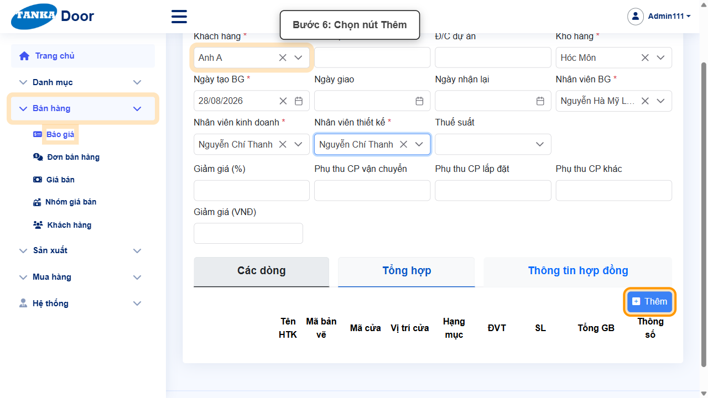
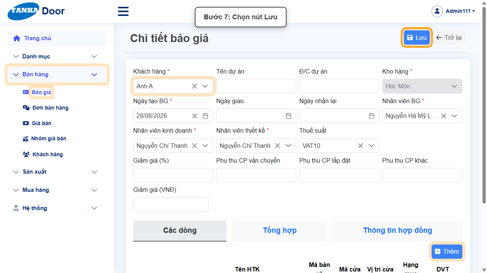
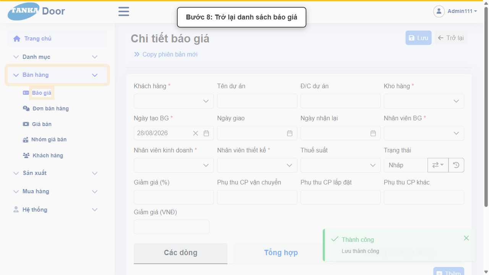
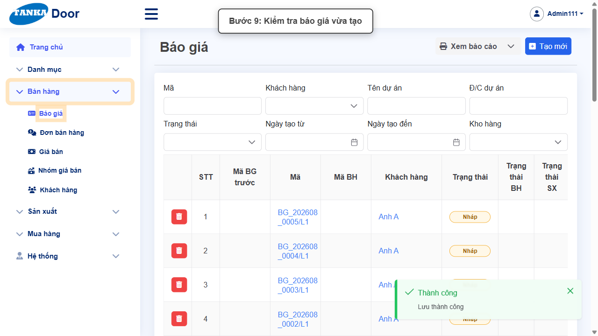

# HƯỚNG DẪN SỬ DỤNG — BÁO GIÁ

**Đường dẫn:** Bán hàng > Báo giá  
**Mục tiêu:** Lập một báo giá mới với đầy đủ thông tin bắt buộc và ít nhất một dòng hàng tồn kho (HTK), lưu thành công.  
**Dành cho:** Người mới sử dụng TANKA Door

## 1. Dữ liệu mẫu dùng trong hướng dẫn

Dữ liệu dưới đây là dữ liệu thật đã dùng để tạo báo giá minh họa (mã hệ thống sinh ra: BG_202608_0005/L1). Tên khách hàng/nhân viên có thể khác khi bạn tự thao tác vì phụ thuộc dữ liệu thực tế — cứ chọn giá trị phù hợp trong dropdown.

| Trường | Giá trị |
| --- | --- |
| Khách hàng | Anh A |
| Kho hàng | Hóc Môn |
| Nhân viên BG (báo giá) | Nguyễn Hà Mỹ Linh |
| Nhân viên kinh doanh | Nguyễn Chí Thanh |
| Nhân viên thiết kế | Nguyễn Chí Thanh |
| HTK (hàng tồn kho) | SQ-01-TDA-55-1.2 — Cửa sổ mở quay 1 cánh - Tiến Đạt 55 - 1.2mm |
| Mã bản vẽ | D1 |
| Kính | 08-CL-KD-VIFG/CL |

## 2. Sơ đồ quy trình tóm tắt

BẮT ĐẦU → Mở Bán hàng > Báo giá → Bấm Tạo mới, chọn Khách hàng/Kho/Nhân viên → Bấm Thêm, chọn HTK → Mã bản vẽ → Kính → Cập nhật → Đóng → Bấm Lưu, trở lại danh sách kiểm tra

## 3. Quy trình thao tác từng bước

### Bước 1. Mở trang chủ Tanka Door

Đăng nhập vào hệ thống, màn hình **Trang chủ** hiện ra.

*Hình 1: Trang chủ sau khi đăng nhập.*

### Bước 2. Mở menu Bán hàng

Ở menu bên trái, bấm vào mục **Bán hàng**.

*Hình 2: Mở menu Bán hàng.*

### Bước 3. Chọn chức năng Báo giá

Trong danh sách con (Báo giá, Đơn bán hàng, Giá bán, Nhóm giá bán, Khách hàng), bấm vào **Báo giá**.

*Hình 3: Chọn chức năng Báo giá.*

### Bước 4. Bấm nút Tạo mới

Trước khi tạo mới, có thể dùng các ô lọc phía trên bảng để kiểm tra báo giá đã tồn tại chưa. Nếu chưa có, bấm **Tạo mới**.

*Hình 4: Bấm nút Tạo mới.*

### Bước 5. Chọn các thông tin bắt buộc

Hệ thống mở màn hình **Chi tiết báo giá**. Các ô có dấu ***** là bắt buộc:

- **Khách hàng ***, **Kho hàng *** — chọn trong danh sách sổ xuống.
- **Nhân viên BG ***, **Nhân viên kinh doanh ***, **Nhân viên thiết kế *** — chọn nhân viên phụ trách.
- Ô **Ngày tạo BG** hệ thống tự điền sẵn ngày hôm nay. Các ô còn lại (Tên dự án, Thuế suất, Giảm giá...) là tùy chọn.

*Hình 5: Form Chi tiết báo giá — bắt đầu chọn Khách hàng.*

### Bước 6. Bấm nút Thêm để thêm dòng HTK

Sau khi chọn đủ Khách hàng, Kho hàng và các nhân viên, cuộn xuống tab **Các dòng** và bấm nút **Thêm** ở góc phải bảng dòng.

- Popup **"Thông số chi tiết cho ..."** mở ra: chọn HTK (gõ mã, ví dụ `SQ-01-TDA`, rồi chọn dòng có giá).
- **Lưu ý:** nếu dòng HTK báo _"Chưa có giá"_, đóng cảnh báo và chọn dòng khác.
- Nhập **Mã bản vẽ** (ví dụ D1), chọn **Kính** (ví dụ 08-CL-KD-VIFG/CL).
- Xem thêm tab **Các lựa chọn thuộc tính** nếu cần kiểm tra thông số phụ.
- Bấm **Cập nhật** để tính lại thông tin dòng, rồi bấm **Đóng** để đóng popup.

*Hình 6: Bấm nút Thêm ở tab Các dòng.*

### Bước 7. Rà soát rồi bấm Lưu

Cuộn lên đầu form, kiểm tra lại các ô bắt buộc và dòng HTK vừa thêm không còn viền đỏ. Bấm **Lưu** đúng một lần.

*Hình 7: Form đã điền đủ, bấm nút Lưu.*

### Bước 8. Trở lại danh sách báo giá

Hệ thống hiện thông báo xanh **"Thành công — Lưu thành công"**, ô Trạng thái chuyển thành **Nháp**. Bấm **Trở lại** để quay về danh sách.

*Hình 8: Bấm Trở lại danh sách báo giá.*

### Bước 9. Kiểm tra báo giá vừa tạo

Báo giá mới xuất hiện ở đầu danh sách với mã hệ thống tự sinh (dạng BG_YYYYMM_xxxx/Lx) và trạng thái Nháp.

*Hình 9: Báo giá vừa tạo xuất hiện trong danh sách.*

> Việc chuyển trạng thái tiếp theo (Chờ duyệt, Đã duyệt...) và tạo Đơn bán hàng từ báo giá là nghiệp vụ riêng, không thuộc phạm vi hướng dẫn tạo mới này.

## 4. Khi không thao tác được

| Hiện tượng | Cách xử lý ngay |
| --- | --- |
| Nút Lưu đang mờ / không bấm được | Tìm ô có dấu * chưa nhập hoặc dropdown chưa chọn; cuộn hết form để kiểm tra. |
| Ô hiện viền đỏ kèm thông báo lỗi | Đọc đúng thông báo dưới ô, sửa lại giá trị rồi bấm ra ngoài ô để hệ thống kiểm tra lại. |
| Gõ vào dropdown nhưng không thấy dữ liệu | Xóa bớt từ khóa, gõ lại đúng một phần mã/tên và chờ vài giây để danh sách tải xong. |
| Bấm Lưu nhưng không thấy phản hồi | Không bấm thêm lần nữa; chờ hệ thống xử lý xong rồi tìm lại bản ghi trong danh sách. |
| Chọn HTK xong nhưng popup báo "Chưa có giá" | Bấm Đóng ở cảnh báo, mở lại ô chọn HTK và chọn một dòng khác cùng mã nhưng có giá. |
| Popup "Thông số chi tiết" không đóng được | Bấm đúng nút Đóng ở cuối popup (không bấm ra ngoài popup); chờ popup biến mất rồi mới thao tác tiếp. |

## 5. Dấu hiệu hoàn thành

- Thông báo xanh "Thành công — Lưu thành công" xuất hiện sau khi bấm Lưu.
- Ô Trạng thái của báo giá chuyển thành "Nháp".
- Báo giá xuất hiện ở đầu danh sách với mã hệ thống tự sinh.
- Mở lại báo giá vẫn thấy đúng Khách hàng, Kho hàng, nhân viên phụ trách và dòng HTK đã nhập.

## 6. Checklist dành cho người mới

- [ ] Đã mở đúng menu và chức năng theo đường dẫn hướng dẫn.
- [ ] Đã nhập/chọn đủ các ô bắt buộc (có dấu *).
- [ ] Toàn form không còn ô viền đỏ trước khi Lưu.
- [ ] Chỉ bấm Lưu một lần và đã thấy thông báo Thành công.
- [ ] Đã tìm và mở lại kết quả vừa tạo để đối chiếu dữ liệu.
- [ ] Đã thêm ít nhất một dòng HTK có giá, có Mã bản vẽ và Kính.

---

_Tài liệu này được biên soạn dựa trên thao tác thực tế trên hệ thống door-v1.test.tankasoft.com. Ảnh minh họa có thể thay đổi theo phiên bản giao diện._
