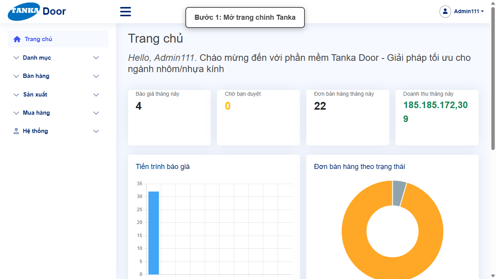
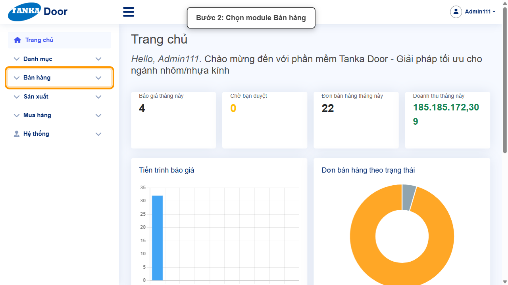
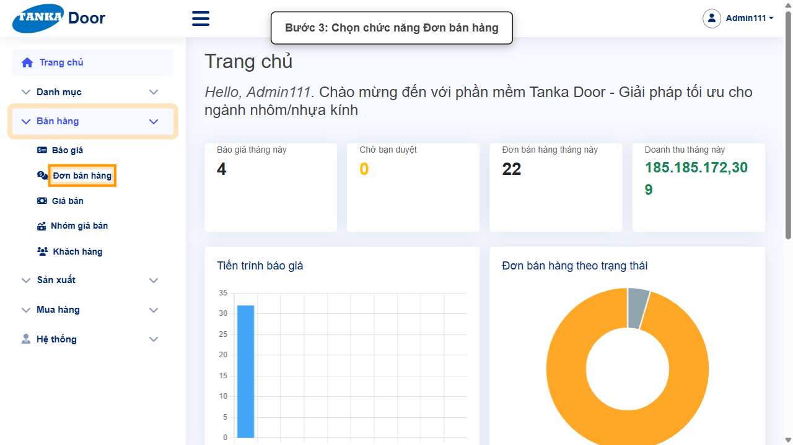
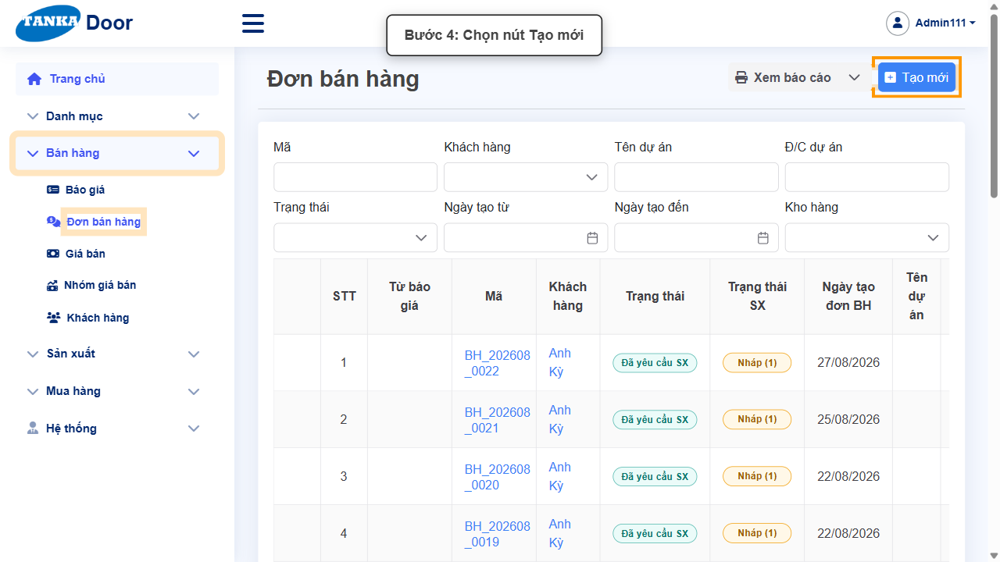
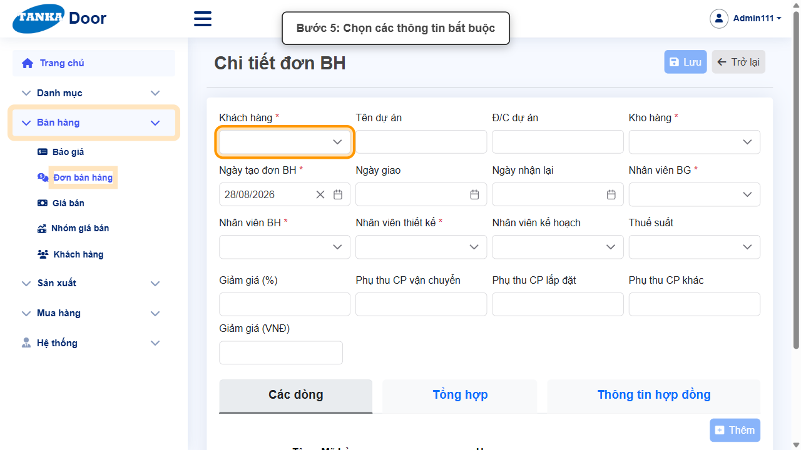
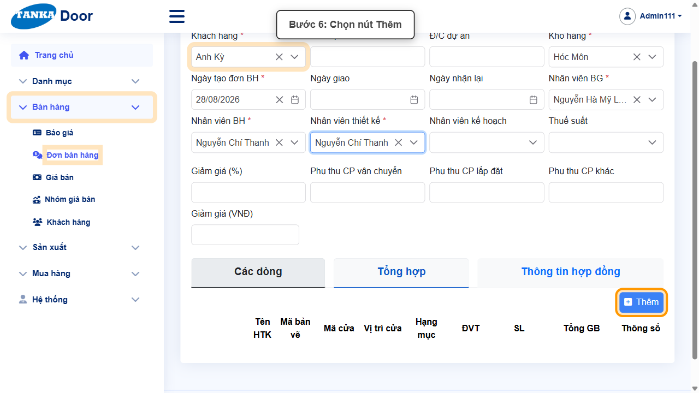
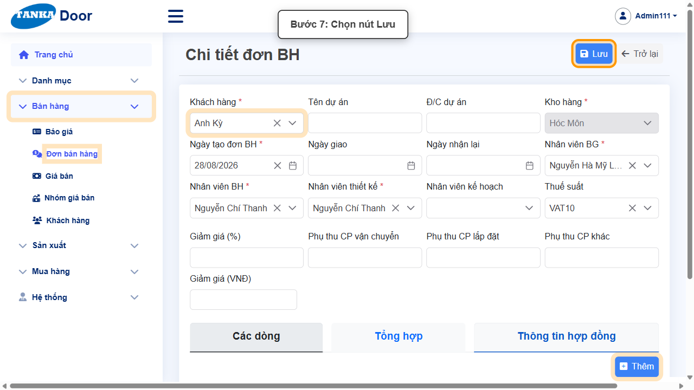
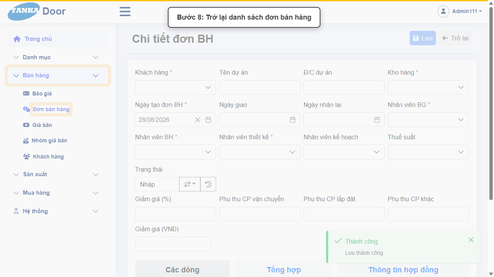
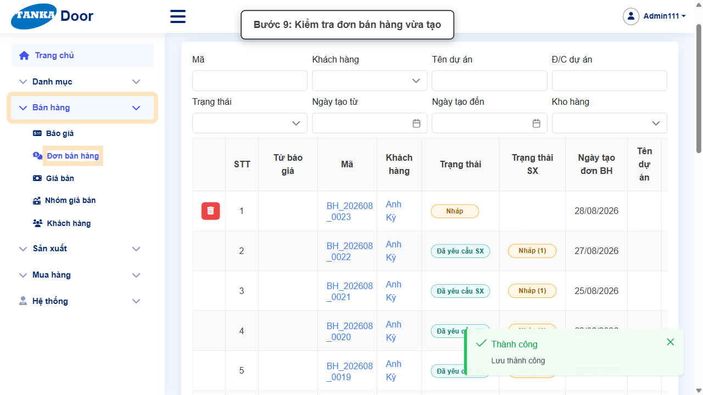

# HƯỚNG DẪN SỬ DỤNG — ĐƠN BÁN HÀNG

**Đường dẫn:** Bán hàng > Đơn bán hàng  
**Mục tiêu:** Tạo một Đơn bán hàng mới với đầy đủ thông tin bắt buộc và ít nhất một dòng hàng tồn kho (HTK), lưu thành công và kiểm tra lại kết quả.  
**Dành cho:** Người mới sử dụng TANKA Door

## 1. Dữ liệu mẫu dùng trong hướng dẫn

Dữ liệu dưới đây là dữ liệu thật đã dùng để tạo đơn bán hàng minh họa (mã hệ thống sinh ra: BH_202608_0023). Tên khách hàng/nhân viên có thể khác khi bạn tự thao tác — cứ chọn giá trị phù hợp trong dropdown.

| Trường | Giá trị |
| --- | --- |
| Khách hàng | Anh Kỳ |
| Kho hàng | Hóc Môn |
| Nhân viên BG (báo giá) | Nguyễn Hà Mỹ Linh |
| Nhân viên BH (bán hàng) | Nguyễn Chí Thanh |
| Nhân viên thiết kế | Nguyễn Chí Thanh |
| HTK (hàng tồn kho) | SQ-01-XF-55-1.4 — Cửa sổ mở quay 1 cánh - Xingfa 55 - 1.4mm |
| Mã bản vẽ | D1 |
| Kính | 08-CL-KD-VIFG/CL — Kính đơn 8 mm trong (VIFG/CL) |

## 2. Sơ đồ quy trình tóm tắt

BẮT ĐẦU → Mở Bán hàng > Đơn bán hàng → Bấm Tạo mới, chọn Khách hàng/Kho/Nhân viên → Bấm Thêm, chọn HTK → Mã bản vẽ → Kính → Cập nhật → Đóng → Bấm Lưu, trở lại danh sách kiểm tra

## 3. Quy trình thao tác từng bước

### Bước 1. Mở trang chủ Tanka Door

Đăng nhập vào hệ thống, màn hình **Trang chủ** hiện ra với các số liệu tổng quan (Báo giá tháng này, Đơn bán hàng tháng này...).

*Hình 1: Trang chủ sau khi đăng nhập.*

### Bước 2. Mở menu Bán hàng

Ở menu bên trái, bấm vào mục **Bán hàng** để xổ ra các chức năng con.

*Hình 2: Mở menu Bán hàng.*

### Bước 3. Chọn chức năng Đơn bán hàng

Trong danh sách con vừa xổ ra (Báo giá, **Đơn bán hàng**, Giá bán, Nhóm giá bán, Khách hàng), bấm vào **Đơn bán hàng**.

*Hình 3: Chọn chức năng Đơn bán hàng.*

> Kiểm tra trước khi tiếp tục: trang Đơn bán hàng đã hiển thị bảng danh sách và các ô lọc (Mã, Khách hàng, Trạng thái, Ngày tạo, Kho hàng) phía trên.

### Bước 4. Bấm nút Tạo mới

Trước khi tạo mới, có thể dùng các ô lọc phía trên bảng (Mã, Khách hàng, Trạng thái...) để kiểm tra xem đơn đã tồn tại chưa, tránh tạo trùng. Nếu chưa có, bấm nút **Tạo mới** ở góc phải phía trên.

*Hình 4: Bấm nút Tạo mới trên trang danh sách.*

### Bước 5. Nhập các thông tin bắt buộc

Hệ thống mở màn hình **Chi tiết đơn BH**. Các ô có dấu ***** là bắt buộc phải chọn/nhập trước khi lưu:

- **Khách hàng *** — bấm vào ô, chọn khách hàng trong danh sách (ví dụ: Anh Kỳ).
- **Kho hàng *** — chọn kho xuất hàng (ví dụ: Hóc Môn).
- **Nhân viên BG ***, **Nhân viên BH ***, **Nhân viên thiết kế *** — chọn nhân viên phụ trách.
- Các ô còn lại (Tên dự án, ĐC dự án, Ngày giao, Ngày nhận lại, Nhân viên kế hoạch, Thuế suất, Giảm giá...) là tùy chọn. Ô **Ngày tạo đơn BH** hệ thống tự điền sẵn ngày hôm nay.

*Hình 5: Form Chi tiết đơn BH với các ô bắt buộc.*

### Bước 6. Bấm nút Thêm để thêm dòng HTK

Cuộn xuống khu vực tab **Các dòng**, bấm nút **Thêm** ở góc phải bảng dòng. Popup **"Thông số chi tiết cho ..."** mở ra, thực hiện theo thứ tự:

- Chọn HTK, gõ mã cần tìm (ví dụ `SQ-01-XF`) rồi chọn đúng dòng có giá trong danh sách gợi ý.
- **Lưu ý:** nếu dòng HTK báo _"Chưa có giá"_, đóng cảnh báo và chọn một dòng khác có giá — dòng chưa có giá không thể dùng để nhập Mã bản vẽ.
- Nhập **Mã bản vẽ** (ví dụ D1).
- Chọn **Kính**, gõ mã cần tìm (ví dụ 08-CL-KD-VIFG/CL) rồi chọn đúng dòng.
- Xem thêm tab **Các lựa chọn thuộc tính** nếu cần kiểm tra/điều chỉnh thông số phụ.
- Bấm **Cập nhật** để hệ thống tính lại thông tin dòng, rồi bấm **Đóng** để đóng popup.

*Hình 6: Bấm nút Thêm ở tab Các dòng.*

### Bước 7. Rà soát rồi bấm Lưu

Cuộn lên đầu form, kiểm tra lại các ô có dấu * và dòng HTK vừa thêm không còn viền đỏ/thông báo lỗi. Bấm nút **Lưu** ở góc phải phía trên đúng một lần.

*Hình 7: Rà soát rồi bấm nút Lưu.*

### Bước 8. Xác nhận lưu thành công

Hệ thống hiện thông báo xanh **"Thành công — Lưu thành công"** ở góc phải màn hình, ô **Trạng thái** chuyển thành **Nháp**. Bấm nút **Trở lại** ở góc phải phía trên để quay về danh sách.

*Hình 8: Thông báo Lưu thành công, bấm Trở lại.*

> Việc chuyển trạng thái tiếp theo (từ Nháp sang các trạng thái duyệt/yêu cầu sản xuất) là nghiệp vụ riêng — xem hướng dẫn "Quản lý sản xuất và chuyển trạng thái".

### Bước 9. Kiểm tra đơn bán hàng vừa tạo

Ở màn hình danh sách **Đơn bán hàng**, dòng vừa tạo nằm trên cùng với mã hệ thống tự sinh (ví dụ `BH_202608_0023`), khách hàng, ngày tạo đúng như đã nhập, và cột **Trạng thái** hiển thị **Nháp**. Bấm vào mã đơn để mở lại và đối chiếu từng giá trị đã nhập nếu cần.

*Hình 9: Đơn vừa tạo xuất hiện trong danh sách.*

## 4. Khi không thao tác được

| Hiện tượng | Cách xử lý ngay |
| --- | --- |
| Ô Khách hàng / Kho hàng / Nhân viên BG / BH / thiết kế vẫn trống khi bấm Lưu | Đây là các ô bắt buộc (*). Bấm lại vào ô, chọn đúng một dòng trong danh sách sổ xuống rồi mới bấm Lưu. |
| Chọn HTK xong nhưng popup báo "Chưa có giá" | Bấm Đóng ở cảnh báo, mở lại ô chọn HTK và chọn một dòng khác cùng mã nhưng có giá. |
| Không tìm thấy HTK/Kính khi gõ mã tìm kiếm | Xóa bớt từ khóa, gõ lại đúng một phần mã (ví dụ chỉ gõ "SQ-01-XF") và chờ danh sách tải xong. |
| Popup "Thông số chi tiết" không đóng được | Bấm đúng nút Đóng ở cuối popup (không bấm ra ngoài popup); chờ popup biến mất rồi mới thao tác tiếp. |
| Bấm Lưu nhưng không thấy phản hồi | Không bấm Lưu lần hai; chờ hệ thống xử lý xong rồi kiểm tra thông báo hoặc tìm lại đơn trong danh sách. |
| Sau khi lưu, không thấy đơn trong danh sách | Dùng ô lọc Mã hoặc Khách hàng phía trên bảng để tìm lại; danh sách mặc định sắp xếp theo ngày tạo mới nhất lên đầu. |

## 5. Dấu hiệu hoàn thành

- Thông báo xanh "Thành công — Lưu thành công" xuất hiện sau khi bấm Lưu.
- Ô Trạng thái của đơn chuyển thành "Nháp".
- Đơn xuất hiện ở đầu danh sách Đơn bán hàng với mã hệ thống tự sinh (dạng BH_YYYYMM_xxxx).
- Mở lại đơn vẫn thấy đúng Khách hàng, Kho hàng, nhân viên phụ trách và dòng HTK đã nhập.

## 6. Checklist dành cho người mới

- [ ] Đã mở đúng Bán hàng > Đơn bán hàng.
- [ ] Đã kiểm tra/lọc trước khi tạo mới để tránh trùng.
- [ ] Đã chọn đủ Khách hàng, Kho hàng, Nhân viên BG/BH/thiết kế.
- [ ] Đã bấm Thêm, chọn HTK có giá, nhập Mã bản vẽ, chọn Kính, bấm Cập nhật rồi Đóng popup.
- [ ] Toàn form không còn ô lỗi trước khi Lưu.
- [ ] Chỉ bấm Lưu một lần và đã thấy thông báo Thành công.
- [ ] Đã tìm và mở lại đơn vừa tạo để đối chiếu dữ liệu.

---

_Tài liệu này được biên soạn dựa trên thao tác thực tế trên hệ thống door-v1.test.tankasoft.com. Ảnh minh họa có thể thay đổi theo phiên bản giao diện._
