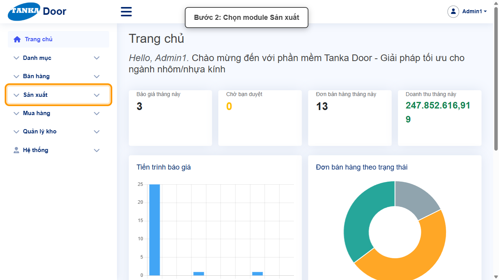
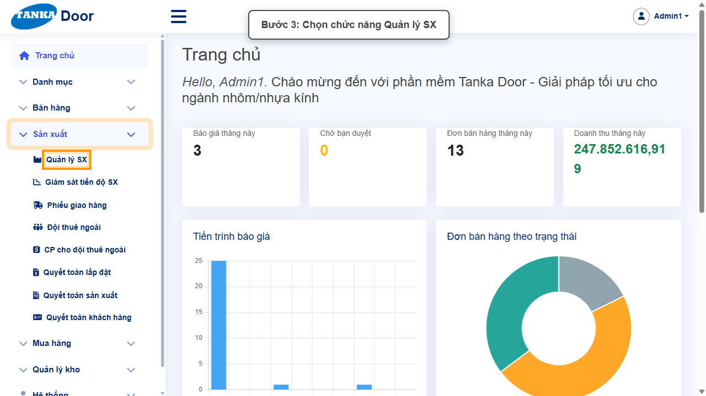
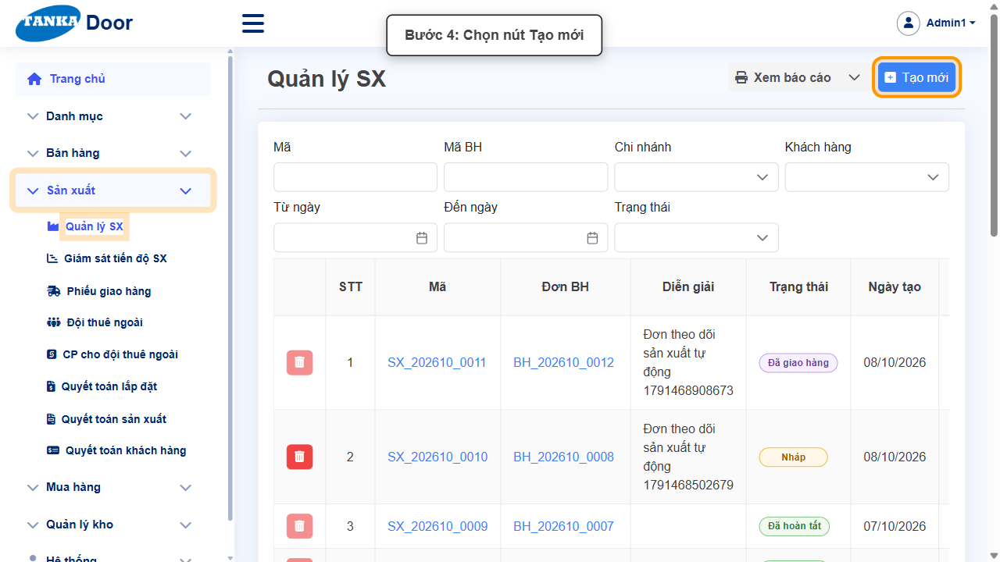
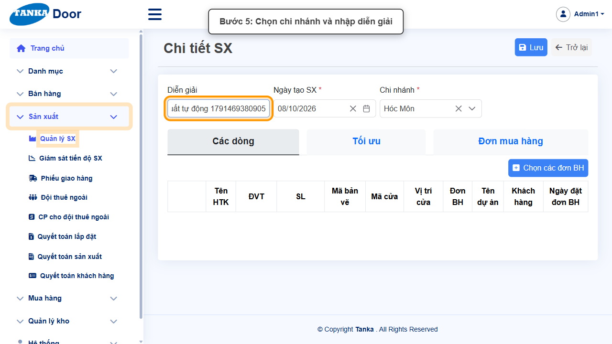
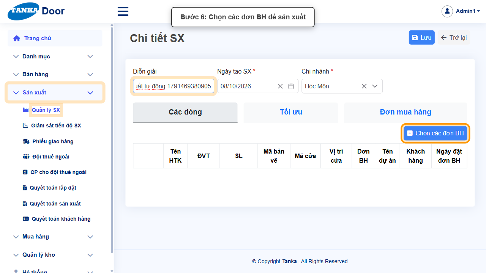
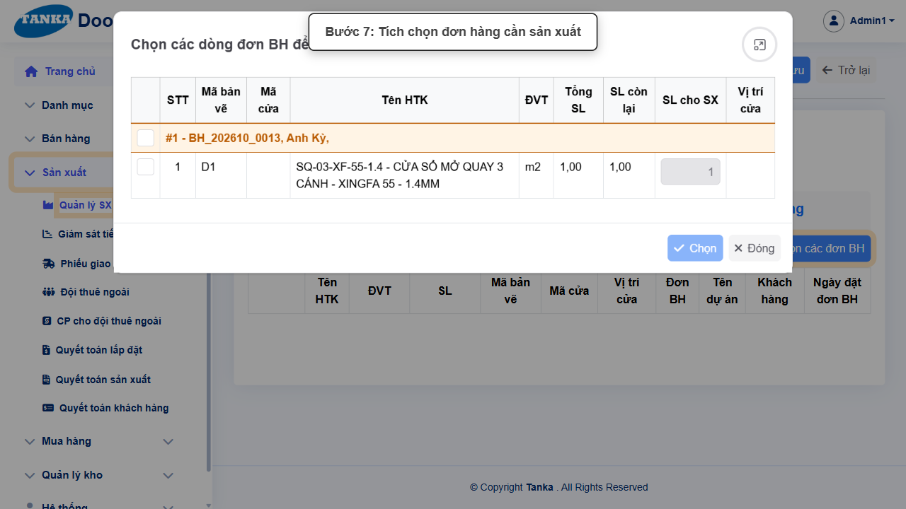
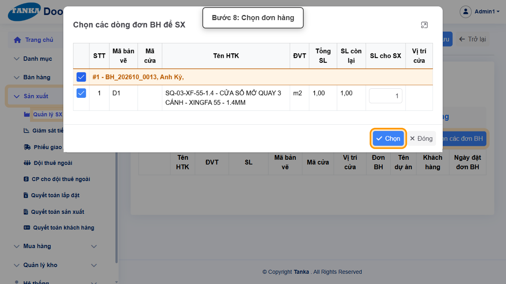
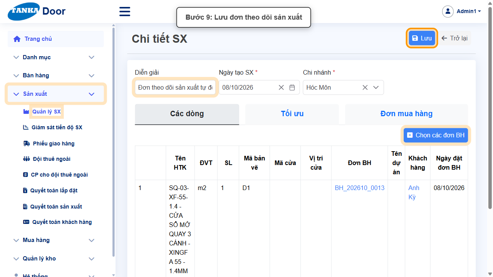
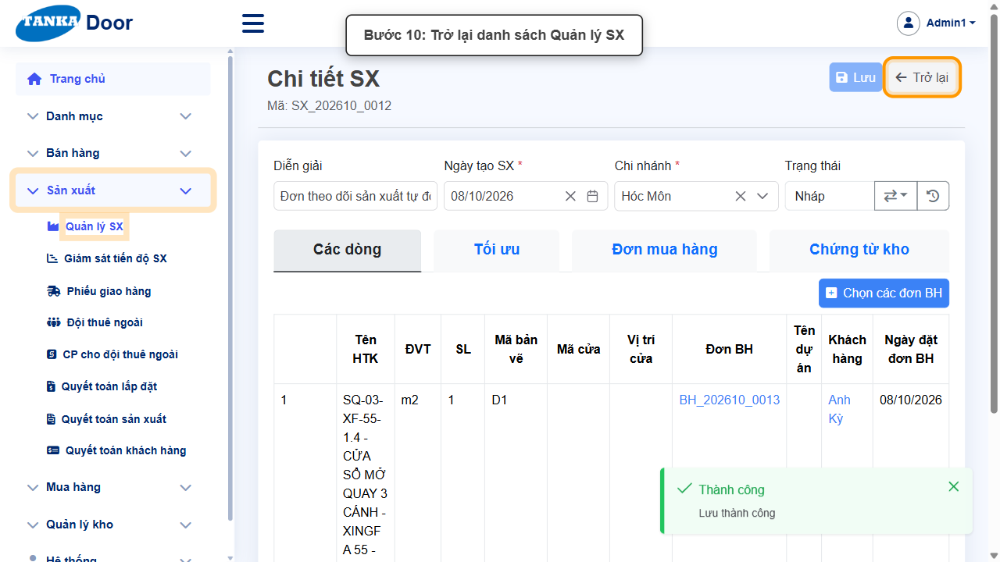

# HƯỚNG DẪN SỬ DỤNG — TẠO LỆNH SẢN XUẤT

**Đường dẫn:** Sản xuất > Quản lý SX  
**Mục tiêu:** Tạo một lệnh sản xuất (SX) từ các dòng của đơn bán hàng đã ở trạng thái "Đã yêu cầu SX".  
**Dành cho:** Người mới sử dụng TANKA Door

> Hướng dẫn này nối tiếp **UG-031 Yêu cầu sản xuất từ đơn bán hàng**. Lệnh SX tạo ra ở trạng thái Nháp; xử lý tiếp theo **UG-032 Tối ưu và mua hàng cho lệnh SX**.

## 1. Dữ liệu mẫu dùng trong hướng dẫn

Dữ liệu dưới đây là dữ liệu thật đã dùng để minh họa.

| Trường | Giá trị |
| --- | --- |
| Diễn giải | Đơn theo dõi sản xuất tự động 1791469380905 |
| Ngày tạo SX | Tự điền ngày hiện tại |
| Chi nhánh | Hóc Môn |
| Đơn BH đưa vào sản xuất | BH_202610_0013 (Anh Kỳ) — 1 dòng SQ-03-XF-55-1.4 |
| Mã lệnh SX sinh ra | SX_202610_0012 |

## 2. Sơ đồ quy trình tóm tắt

BẮT ĐẦU → Mở Sản xuất > Quản lý SX → Bấm Tạo mới → Chọn Chi nhánh, nhập Diễn giải → Chọn các đơn BH → Tích chọn đơn cần sản xuất → Bấm Chọn → Bấm Lưu → Trở lại kiểm tra

## 3. Quy trình thao tác từng bước

### Bước 1. Mở trang chủ Tanka Door

Đăng nhập vào hệ thống, màn hình **Trang chủ** hiện ra.

*Hình 1: Trang chủ sau khi đăng nhập.*

### Bước 2. Mở menu Sản xuất

Ở menu bên trái, bấm vào **Sản xuất** để xổ ra các chức năng con.

*Hình 2: Mở menu Sản xuất.*

### Bước 3. Chọn Quản lý SX

Bấm **Quản lý SX**. Màn hình danh sách lệnh sản xuất hiện ra.

*Hình 3: Chọn chức năng Quản lý SX.*

### Bước 4. Bấm nút Tạo mới

Bấm **Tạo mới** ở góc phải phía trên để mở màn hình **Chi tiết SX**.

*Hình 4: Bấm nút Tạo mới.*

### Bước 5. Chọn Chi nhánh và nhập Diễn giải

- **Chi nhánh *** — chọn chi nhánh sản xuất (ví dụ **Hóc Môn**). Chỉ đơn BH cùng chi nhánh mới chọn được ở bước sau.
- **Diễn giải** — nhập mô tả ngắn để dễ tìm lại lệnh SX (không bắt buộc).
- **Ngày tạo SX *** — hệ thống tự điền ngày hiện tại.

*Hình 5: Chọn Chi nhánh và nhập Diễn giải.*

### Bước 6. Bấm Chọn các đơn BH

Ở tab **Các dòng**, bấm nút **Chọn các đơn BH**. Popup **"Chọn các dòng đơn BH để SX"** mở ra, liệt kê các đơn BH đang "Đã yêu cầu SX" còn dòng chưa đưa vào sản xuất.

*Hình 6: Bấm Chọn các đơn BH.*

### Bước 7. Tích chọn đơn hàng cần sản xuất

Mỗi đơn BH là một nhóm có dòng tiêu đề màu cam dạng **"#1 - BH_202610_0013, Anh Kỳ"**. Tích ô ở dòng tiêu đề để chọn **tất cả** dòng của đơn đó, hoặc tích từng dòng nếu chỉ sản xuất một phần. Cột **SL cho SX** cho phép sửa số lượng đưa vào lệnh này.

> Chỉ tích các dòng của đúng đơn cần sản xuất. Gộp dòng của nhiều đơn vào một lệnh SX sẽ khiến lệnh giữ vật tư cho tất cả các đơn đó, dễ bị thiếu tồn kho khi chuyển sang "Đang SX".

*Hình 7: Tích chọn đơn hàng cần sản xuất.*

### Bước 8. Bấm Chọn

Bấm nút **Chọn** ở cuối popup. Popup đóng lại và các dòng vừa chọn được đưa vào bảng **Các dòng**.

*Hình 8: Bấm Chọn để đưa dòng vào lệnh SX.*

### Bước 9. Bấm Lưu

Kiểm tra lại bảng Các dòng (đúng Đơn BH, khách hàng, số lượng) rồi bấm **Lưu** đúng một lần. Hệ thống sinh mã lệnh SX dạng **SX_YYYYMM_xxxx**, trạng thái ban đầu là **Nháp**.

*Hình 9: Bấm Lưu lệnh sản xuất.*

### Bước 10. Trở lại danh sách Quản lý SX

Bấm **Trở lại** để về danh sách. Lệnh SX vừa tạo nằm đầu danh sách với trạng thái **Nháp**.

*Hình 10: Trở lại danh sách Quản lý SX.*

## 4. Khi không thao tác được

| Hiện tượng | Cách xử lý ngay |
| --- | --- |
| Popup "Chọn các dòng đơn BH để SX" trống | Chưa có đơn BH nào ở trạng thái "Đã yêu cầu SX" còn dòng chờ sản xuất, hoặc khác Chi nhánh đã chọn. Làm hướng dẫn UG-031 cho đơn cần sản xuất trước. |
| Nút Chọn trong popup bị mờ | Chưa tích dòng nào — tích ô ở dòng tiêu đề đơn BH hoặc ở từng dòng. |
| Nút Lưu đang mờ | Kiểm tra đã chọn Chi nhánh và bảng Các dòng đã có ít nhất một dòng. |
| Bấm Lưu nhưng không thấy phản hồi | Không bấm thêm lần nữa; chờ hệ thống xử lý xong rồi tìm lại lệnh SX trong danh sách. |

## 5. Dấu hiệu hoàn thành

- Thông báo "Thành công — Lưu thành công" xuất hiện sau khi bấm Lưu.
- Lệnh SX mới (SX_YYYYMM_xxxx) có trong danh sách Quản lý SX với trạng thái Nháp và đúng mã Đơn BH.
- Đơn BH vừa chọn không còn hiện trong popup "Chọn các dòng đơn BH để SX" (đã được đưa vào sản xuất hết).

## 6. Checklist dành cho người mới

- [ ] Đơn BH nguồn đã ở trạng thái "Đã yêu cầu SX" (UG-031).
- [ ] Đã chọn đúng Chi nhánh.
- [ ] Chỉ tích dòng của đúng đơn BH cần sản xuất.
- [ ] Chỉ bấm Lưu một lần và đã thấy lệnh SX mới ở trạng thái Nháp.

---

_Tài liệu này được biên soạn dựa trên thao tác thực tế trên hệ thống door-v1.test.tankasoft.com. Ảnh minh họa có thể thay đổi theo phiên bản giao diện._
