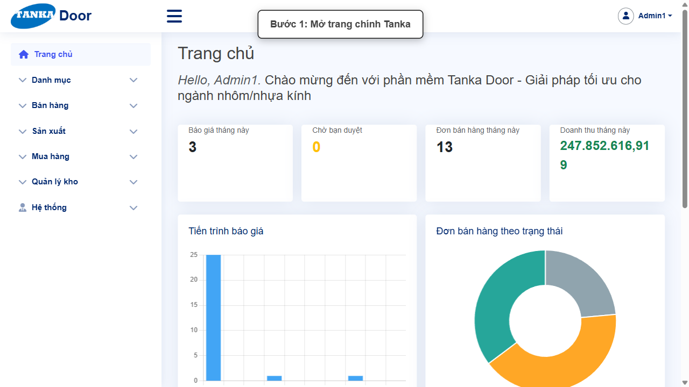
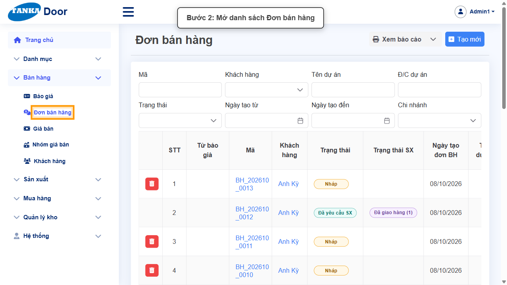
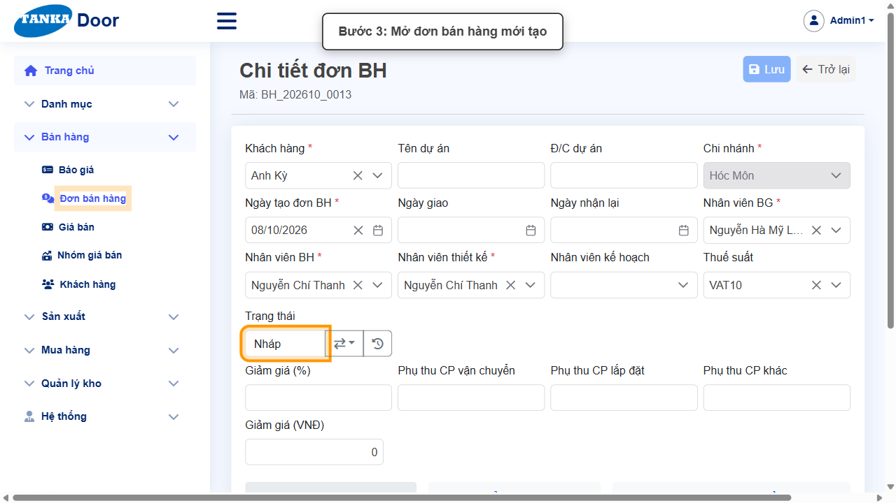
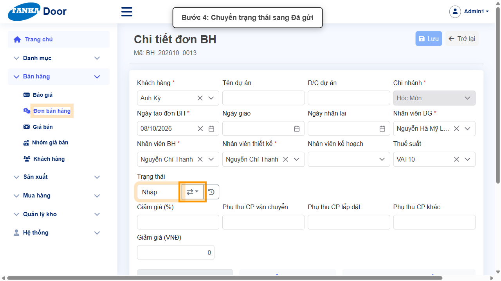
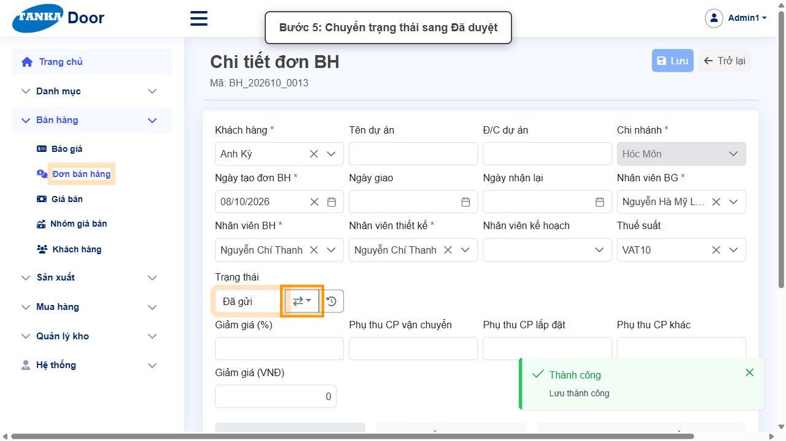
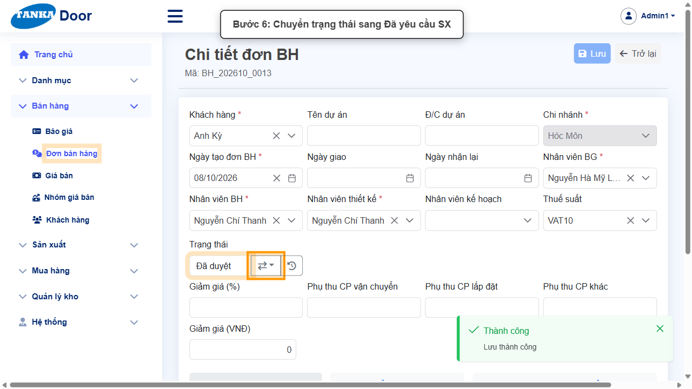

# HƯỚNG DẪN SỬ DỤNG — YÊU CẦU SẢN XUẤT TỪ ĐƠN BÁN HÀNG

**Đường dẫn:** Bán hàng > Đơn bán hàng  
**Mục tiêu:** Chuyển một đơn bán hàng ở trạng thái Nháp qua Đã gửi → Đã duyệt → Đã yêu cầu SX để đơn đủ điều kiện đưa vào sản xuất.  
**Dành cho:** Người mới sử dụng TANKA Door

> Hướng dẫn này nối tiếp **UG-022 Đơn bán hàng**. Sau khi đơn ở trạng thái "Đã yêu cầu SX", làm tiếp **UG-030 Tạo lệnh sản xuất** để tạo lệnh SX từ đơn này.

## 1. Dữ liệu mẫu dùng trong hướng dẫn

Dữ liệu dưới đây là dữ liệu thật đã dùng để minh họa (đơn bán hàng BH_202610_0013, tạo bằng hướng dẫn "Đơn bán hàng"). Khi tự thao tác, hãy dùng đúng mã đơn bán hàng bạn vừa tạo.

| Trường | Giá trị |
| --- | --- |
| Đơn BH nguồn | BH_202610_0013 (Khách hàng: Anh Kỳ, Chi nhánh: Hóc Môn) |
| Ghi chú khi chuyển trạng thái | đã thực hiện bước này |

## 2. Sơ đồ quy trình tóm tắt

BẮT ĐẦU → Mở Bán hàng > Đơn bán hàng → Mở đơn đang Nháp → Chuyển Đã gửi → Đã duyệt → Đã yêu cầu SX → (tiếp UG-030: tạo lệnh sản xuất)

## 3. Quy trình thao tác từng bước

### Bước 1. Mở trang chủ Tanka Door

Đăng nhập vào hệ thống, màn hình **Trang chủ** hiện ra.

*Hình 1: Trang chủ sau khi đăng nhập.*

### Bước 2. Mở danh sách Đơn bán hàng

Ở menu bên trái, mở **Bán hàng > Đơn bán hàng**.

*Hình 2: Mở danh sách Đơn bán hàng.*

### Bước 3. Mở đơn bán hàng cần chuyển trạng thái

Bấm vào **mã đơn BH** (ví dụ `BH_202610_0013`) có cột Trạng thái là **Nháp** để mở màn hình **Chi tiết đơn BH**.

> Đơn tạo từ báo giá có thêm cột **Từ báo giá** (mã BG_...) đứng trước mã đơn — bấm đúng vào mã **BH_...**, không bấm mã BG.

*Hình 3: Mở đơn bán hàng, trạng thái hiện tại là Nháp.*

### Bước 4. Chuyển trạng thái sang Đã gửi

Bấm nút mũi tên (⇄) cạnh ô **Trạng thái**, chọn **Đã gửi**, có thể nhập ghi chú trong popup rồi bấm **Cập nhật** và bấm **Đồng ý** ở popup xác nhận tiếp theo.

*Hình 4: Chuyển trạng thái sang Đã gửi.*

### Bước 5. Chuyển trạng thái sang Đã duyệt

Lặp lại thao tác: bấm nút mũi tên trạng thái, chọn **Đã duyệt**, nhập ghi chú (nếu cần) rồi bấm **Cập nhật** và **Đồng ý**.

*Hình 5: Chuyển trạng thái sang Đã duyệt.*

### Bước 6. Chuyển trạng thái sang Đã yêu cầu SX

Tiếp tục chuyển trạng thái sang **Đã yêu cầu SX**. Đơn bán hàng lúc này đã đủ điều kiện để tạo lệnh sản xuất — các dòng của đơn sẽ xuất hiện trong popup "Chọn các dòng đơn BH để SX" ở màn hình **Sản xuất > Quản lý SX** (xem UG-030).

*Hình 6: Chuyển trạng thái sang Đã yêu cầu SX.*

> Mỗi lần chuyển trạng thái, hệ thống hiện popup xác nhận — phải bấm Cập nhật rồi bấm Đồng ý ở popup tiếp theo mới hoàn tất một bước chuyển. Không thể nhảy cóc trạng thái.

## 4. Khi không thao tác được

| Hiện tượng | Cách xử lý ngay |
| --- | --- |
| Bấm vào mã trong danh sách nhưng mở ra "Chi tiết báo giá" | Đã bấm nhầm mã ở cột **Từ báo giá** (BG_...). Quay lại danh sách và bấm vào mã ở cột **Mã** (BH_...). |
| Bấm nút chuyển trạng thái nhưng không có phản ứng | Kiểm tra đơn đã ở đúng trạng thái liền trước trong chuỗi Nháp → Đã gửi → Đã duyệt → Đã yêu cầu SX; không thể nhảy cóc trạng thái. |
| Bấm Cập nhật nhưng trạng thái chưa đổi | Popup xác nhận thứ hai chưa được bấm **Đồng ý** — tìm popup "Xác nhận" và bấm Đồng ý. |
| Không thấy đơn trong danh sách | Dùng ô lọc Mã hoặc Khách hàng phía trên bảng để tìm đúng mã đơn. |

## 5. Dấu hiệu hoàn thành

- Ô Trạng thái của đơn bán hàng hiển thị "Đã yêu cầu SX".
- Trong danh sách Đơn bán hàng, cột Trạng thái của đơn hiển thị "Đã yêu cầu SX".
- Các dòng của đơn xuất hiện trong popup "Chọn các dòng đơn BH để SX" khi tạo lệnh sản xuất (UG-030).

## 6. Checklist dành cho người mới

- [ ] Đã mở đúng đơn bán hàng (mã BH_...) đang ở trạng thái Nháp.
- [ ] Đã chuyển đủ chuỗi trạng thái Nháp → Đã gửi → Đã duyệt → Đã yêu cầu SX.
- [ ] Mỗi lần chuyển đều bấm Cập nhật rồi Đồng ý.
- [ ] Đã chuyển sang hướng dẫn UG-030 để tạo lệnh sản xuất.

---

_Tài liệu này được biên soạn dựa trên thao tác thực tế trên hệ thống door-v1.test.tankasoft.com. Ảnh minh họa có thể thay đổi theo phiên bản giao diện._
