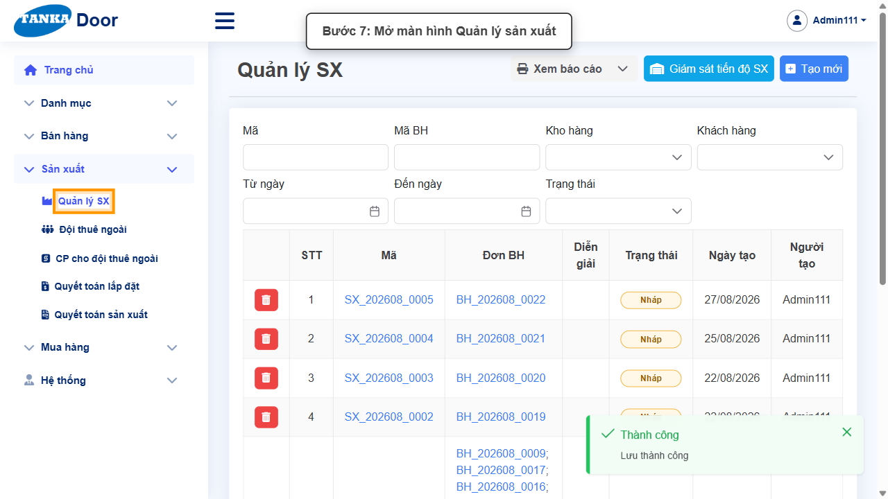
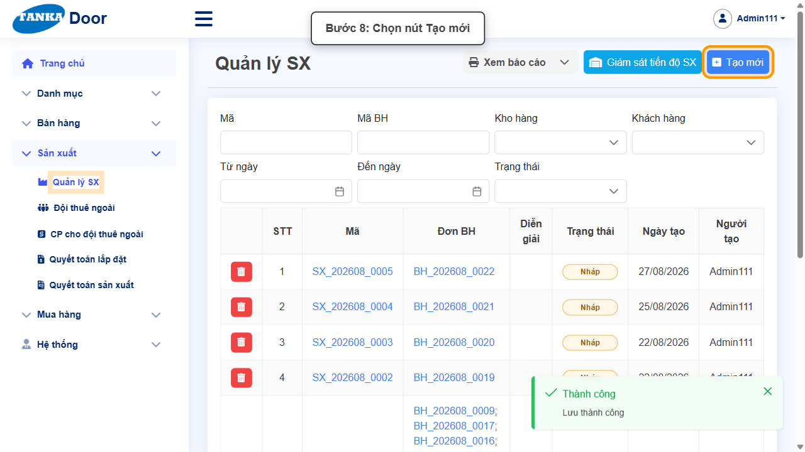
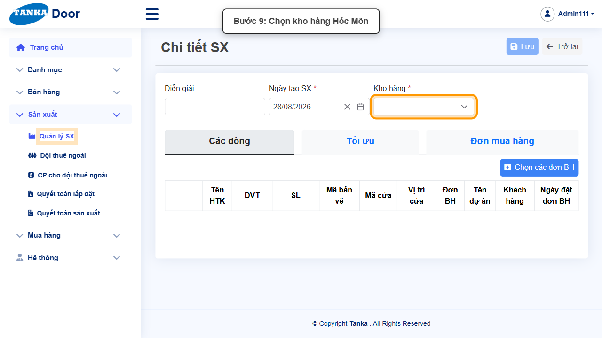
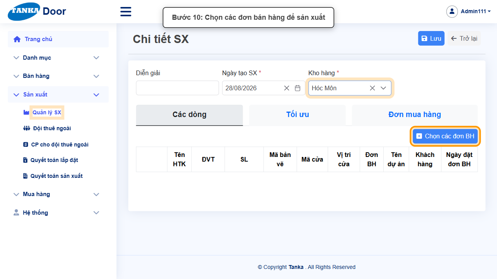
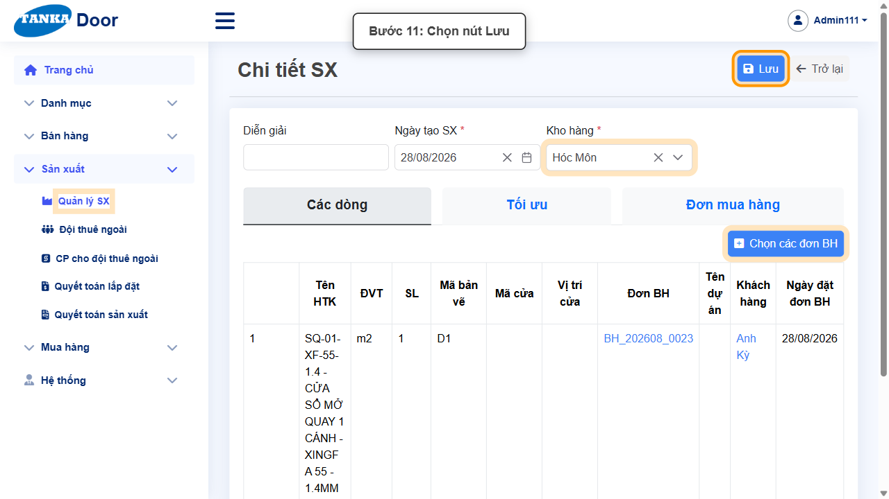

# HƯỚNG DẪN SỬ DỤNG — QUẢN LÝ SẢN XUẤT VÀ CHUYỂN TRẠNG THÁI

**Đường dẫn:** Bán hàng > Đơn bán hàng; Sản xuất > Quản lý SX  
**Mục tiêu:** Chuyển một đơn bán hàng ở trạng thái Nháp qua Đã gửi → Đã duyệt → Đã yêu cầu SX, rồi tạo hồ sơ sản xuất (SX) từ đơn đó.  
**Dành cho:** Người mới sử dụng TANKA Door

## 1. Dữ liệu mẫu dùng trong hướng dẫn

Dữ liệu dưới đây là dữ liệu thật đã dùng để minh họa (đơn bán hàng BH_202608_0023, tạo bằng hướng dẫn "Đơn bán hàng"). Khi tự thao tác, hãy dùng đúng mã đơn bán hàng bạn vừa tạo.

| Trường | Giá trị |
| --- | --- |
| Đơn BH nguồn | BH_202608_0023 (Khách hàng: Anh Kỳ, Kho: Hóc Môn) |
| Ghi chú khi chuyển trạng thái | Có thể để trống hoặc ghi chú ngắn cho từng lần chuyển |
| Kho hàng khi tạo hồ sơ SX | Hóc Môn |

## 2. Sơ đồ quy trình tóm tắt

BẮT ĐẦU → Mở Đơn bán hàng, chuyển Nháp → Đã gửi → Đã duyệt → Đã yêu cầu SX → Mở Sản xuất > Quản lý SX, bấm Tạo mới → Chọn Kho hàng, chọn các đơn BH cần sản xuất → Bấm Lưu

## 3. Quy trình thao tác từng bước

### Bước 1. Mở trang chủ Tanka Door

Đăng nhập vào hệ thống, màn hình **Trang chủ** hiện ra.

*Hình 1: Trang chủ sau khi đăng nhập.*

### Bước 2. Mở danh sách Đơn bán hàng

Ở menu bên trái, mở **Bán hàng > Đơn bán hàng**.

*Hình 2: Mở danh sách Đơn bán hàng.*

### Bước 3. Mở đơn bán hàng cần chuyển trạng thái

Bấm vào mã đơn (ví dụ `BH_202608_0023`) đang ở trạng thái **Nháp** để mở màn hình **Chi tiết đơn BH**.

*Hình 3: Mở đơn bán hàng, trạng thái hiện tại là Nháp.*

### Bước 4. Chuyển trạng thái sang Đã gửi

Bấm nút mũi tên (⇄) cạnh ô **Trạng thái**, chọn **Đã gửi**, có thể nhập ghi chú trong popup rồi bấm **Cập nhật** và xác nhận ở popup tiếp theo.

*Hình 4: Chuyển trạng thái sang Đã gửi.*

### Bước 5. Chuyển trạng thái sang Đã duyệt

Lặp lại thao tác: bấm nút mũi tên trạng thái, chọn **Đã duyệt**, nhập ghi chú (nếu cần) rồi bấm **Cập nhật**.

*Hình 5: Chuyển trạng thái sang Đã duyệt.*

### Bước 6. Chuyển trạng thái sang Đã yêu cầu SX

Tiếp tục chuyển trạng thái sang **Đã yêu cầu SX**. Đơn bán hàng lúc này đã đủ điều kiện để tạo hồ sơ sản xuất.

*Hình 6: Chuyển trạng thái sang Đã yêu cầu SX.*

> Mỗi lần chuyển trạng thái, hệ thống hiện popup xác nhận — phải bấm Cập nhật rồi bấm Đồng ý/Xác nhận ở popup tiếp theo mới hoàn tất một bước chuyển. Không thể nhảy cóc trạng thái.

### Bước 7. Mở màn hình Quản lý sản xuất

Ở menu bên trái, mở **Sản xuất > Quản lý SX**.

*Hình 7: Màn hình Quản lý SX với danh sách hồ sơ sản xuất đã có.*

### Bước 8. Bấm nút Tạo mới

Bấm **Tạo mới** ở góc phải phía trên để mở màn hình **Chi tiết SX**.

*Hình 8: Bấm nút Tạo mới.*

### Bước 9. Chọn Kho hàng

Nhập **Diễn giải** (tùy chọn), kiểm tra **Ngày tạo SX** (tự điền sẵn), chọn **Kho hàng *** — ví dụ Hóc Môn.

*Hình 9: Chọn Kho hàng Hóc Môn.*

### Bước 10. Chọn các đơn bán hàng để sản xuất

Bấm nút **Chọn các đơn BH**, tìm đúng mã đơn (ví dụ BH_202608_0023) trong popup, tích chọn dòng cần đưa vào sản xuất rồi xác nhận.

*Hình 10: Dòng HTK từ đơn BH_202608_0023 đã được thêm vào bảng.*

### Bước 11. Bấm Lưu

Kiểm tra lại dòng vừa chọn (đúng mã đơn, kho, số lượng) rồi bấm nút **Lưu** đúng một lần.

*Hình 11: Bấm Lưu để tạo hồ sơ sản xuất.*

> Hệ thống hiện thông báo "Thành công" và sinh mã hồ sơ sản xuất dạng SX_YYYYMM_xxxx, trạng thái ban đầu là Nháp.

## 4. Khi không thao tác được

| Hiện tượng | Cách xử lý ngay |
| --- | --- |
| Nút Lưu đang mờ / không bấm được | Tìm ô có dấu * chưa nhập hoặc dropdown chưa chọn; cuộn hết form để kiểm tra. |
| Ô hiện viền đỏ kèm thông báo lỗi | Đọc đúng thông báo dưới ô, sửa lại giá trị rồi bấm ra ngoài ô để hệ thống kiểm tra lại. |
| Gõ vào dropdown nhưng không thấy dữ liệu | Xóa bớt từ khóa, gõ lại đúng một phần mã/tên và chờ vài giây để danh sách tải xong. |
| Bấm Lưu nhưng không thấy phản hồi | Không bấm thêm lần nữa; chờ hệ thống xử lý xong rồi tìm lại bản ghi trong danh sách. |
| Bấm nút chuyển trạng thái nhưng không có phản ứng | Kiểm tra đơn đã ở đúng trạng thái liền trước trong chuỗi Nháp → Đã gửi → Đã duyệt → Đã yêu cầu SX; không thể nhảy cóc trạng thái. |
| Không tìm thấy đơn BH trong popup "Chọn các đơn BH" | Kiểm tra đơn đã ở trạng thái "Đã yêu cầu SX" và đúng Kho hàng đã chọn ở Chi tiết SX. |

## 5. Dấu hiệu hoàn thành

- Đơn bán hàng nguồn hiển thị trạng thái "Đã yêu cầu SX".
- Hồ sơ sản xuất mới xuất hiện trong danh sách Quản lý SX với mã dạng SX_YYYYMM_xxxx, trạng thái Nháp.
- Dòng HTK trong hồ sơ SX đúng với dòng của đơn bán hàng nguồn (mã đơn, khách hàng, số lượng).

## 6. Checklist dành cho người mới

- [ ] Đã chuyển đủ chuỗi trạng thái Nháp → Đã gửi → Đã duyệt → Đã yêu cầu SX trên đơn bán hàng.
- [ ] Đã mở đúng Sản xuất > Quản lý SX và bấm Tạo mới.
- [ ] Đã chọn đúng Kho hàng và đúng đơn bán hàng cần sản xuất.
- [ ] Chỉ bấm Lưu một lần và đã thấy thông báo Thành công.

---

_Tài liệu này được biên soạn dựa trên thao tác thực tế trên hệ thống door-v1.test.tankasoft.com. Ảnh minh họa có thể thay đổi theo phiên bản giao diện._
