# HƯỚNG DẪN SỬ DỤNG — TỐI ƯU, CHUYỂN TRẠNG THÁI VÀ MUA HÀNG CHO LỆNH SX

**Đường dẫn:** Sản xuất > Quản lý SX > (mở 1 lệnh SX đang Nháp); Mua hàng > Yêu cầu mua hàng  
**Mục tiêu:** Tính tối ưu cắt vật tư, chuyển lệnh sản xuất qua Đã duyệt → Đã kế hoạch, tạo **yêu cầu mua hàng** → duyệt → lập **đơn mua hàng**, rồi chuyển lệnh SX sang Đã mua hàng.  
**Dành cho:** Người mới sử dụng TANKA Door

> Hướng dẫn này nối tiếp **UG-030 Tạo lệnh sản xuất**. Sau khi lệnh SX "Đã mua hàng", làm tiếp **UG-040 Duyệt đơn mua hàng và nhận hàng nhập kho**, rồi **UG-033 Sản xuất, giao hàng và lắp đặt**.

## 1. Dữ liệu mẫu dùng trong hướng dẫn

Dữ liệu dưới đây là dữ liệu thật đã dùng để minh họa. Khi tự thao tác, hãy dùng đúng mã lệnh sản xuất bạn đang xử lý.

| Trường | Giá trị |
| --- | --- |
| Lệnh SX nguồn | SX_202610_0012 (trạng thái ban đầu: Nháp, đơn BH_202610_0013) |
| Giá bán phế liệu (đồng/kg) | 5.000 |
| Yêu cầu mua hàng sinh ra | YCMH_202610_0011 |
| Đơn mua hàng sinh ra | MH_202610_0031, MH_202610_0032, MH_202610_0033, MH_202610_0034 (mỗi nhà cung cấp một đơn) |
| Ghi chú khi chuyển trạng thái | đã hoàn thành bước này |

## 2. Sơ đồ quy trình tóm tắt

BẮT ĐẦU (lệnh SX ở trạng thái Nháp) → Tab Tối ưu: nhập Giá bán phế liệu → Tính tối ưu → Lưu → Chuyển trạng thái Đã duyệt → Đã kế hoạch → Tab Đơn mua hàng: **Tạo yêu cầu mua hàng** → Đồng ý → **Duyệt** yêu cầu mua hàng → **Lập đơn mua hàng** (chọn NCC cho từng nhóm vật tư) → Quay lại lệnh SX → Chuyển trạng thái **Đã mua hàng**

> **Thay đổi so với phiên bản trước:** tab Đơn mua hàng không còn nút "Tiến hành tạo đơn mua hàng". Đơn mua hàng giờ được lập từ **Yêu cầu mua hàng** (YCMH) đã duyệt, và lệnh SX chỉ chuyển được sang "Đã mua hàng" khi đã có đơn mua hàng.

## 3. Quy trình thao tác từng bước

### Bước 1. Mở trang chủ Tanka Door

Đăng nhập vào hệ thống, màn hình **Trang chủ** hiện ra.

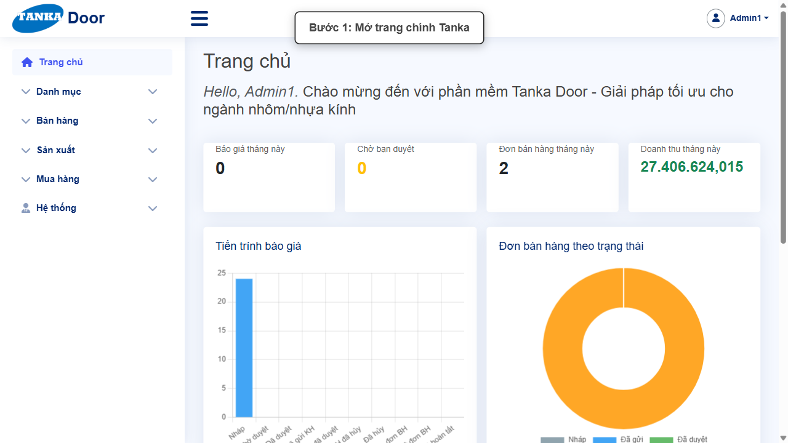

*Hình 1: Trang chủ sau khi đăng nhập.*

### Bước 2. Mở Quản lý sản xuất

Ở menu bên trái, mở **Sản xuất**, trong danh sách sổ xuống bấm **Quản lý sản xuất**.

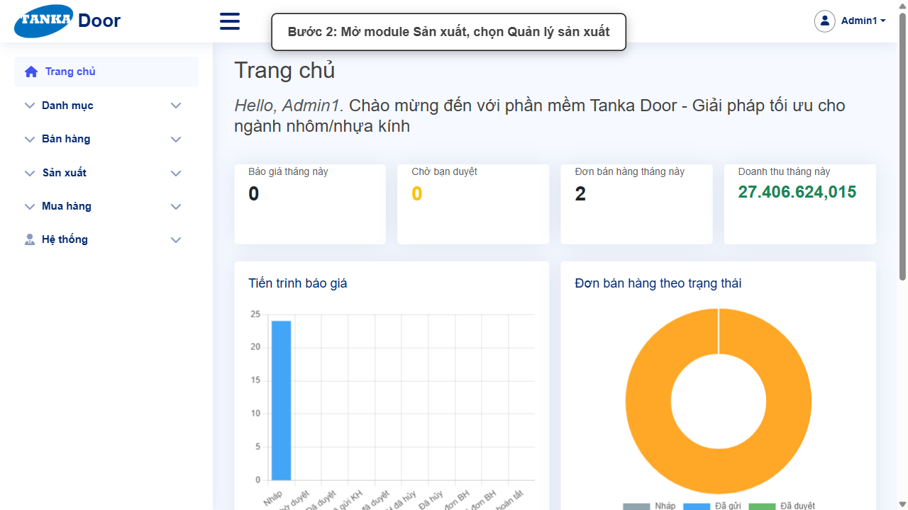

*Hình 2: Mở menu Sản xuất, chọn Quản lý sản xuất.*

### Bước 3. Màn hình Quản lý SX

Màn hình **Quản lý SX** hiện danh sách các lệnh sản xuất đã có, kèm cột Trạng thái.

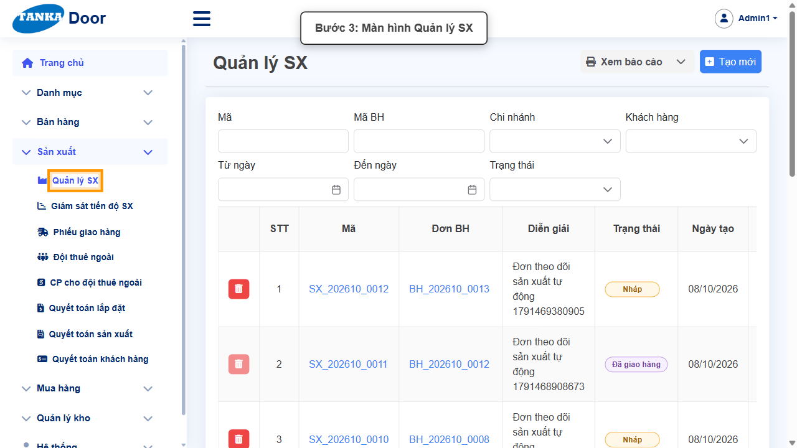

*Hình 3: Danh sách Quản lý SX.*

### Bước 4. Chọn mã sản xuất có trạng thái Nháp

Bấm vào mã lệnh sản xuất (ví dụ `SX_202610_0012`) đang ở trạng thái **Nháp** để mở màn hình **Chi tiết SX**.

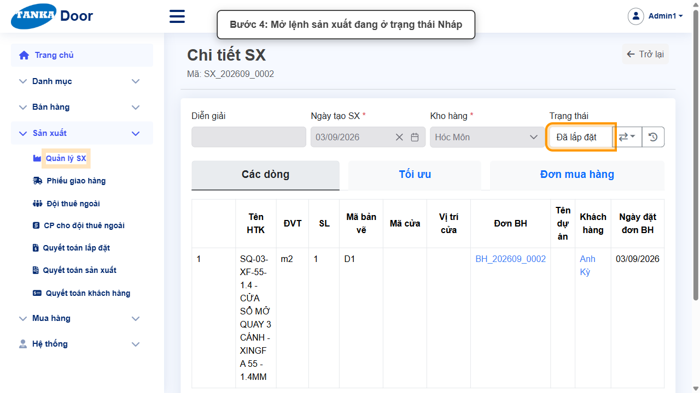

*Hình 4: Chi tiết SX, trạng thái hiện tại là Nháp.*

### Bước 5. Mở tab Tối ưu

Bấm tab **Tối ưu** ở giữa màn hình để tính tối ưu cắt vật tư cho lệnh sản xuất trước khi chuyển trạng thái.

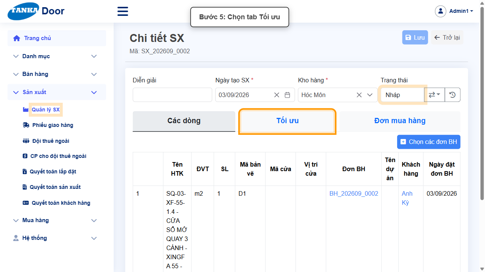

*Hình 5: Mở tab Tối ưu.*

### Bước 6. Nhập Giá bán phế liệu

Nhập giá trị vào ô **Giá phế liệu (đồng/kg)**, ví dụ `5000`.

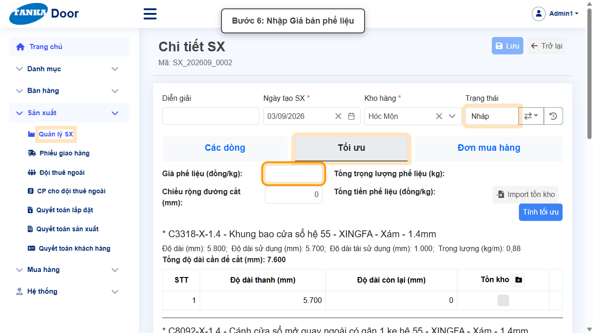

*Hình 6: Nhập Giá bán phế liệu.*

### Bước 7. Bấm Tính tối ưu

Bấm nút **Tính tối ưu** ở bên phải màn hình. Hệ thống tính toán và hiển thị chi tiết độ dài thanh cắt cho từng loại vật tư.

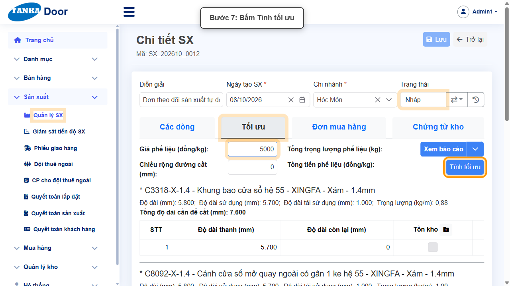

*Hình 7: Bấm Tính tối ưu.*

> Nếu muốn thay đổi dữ liệu (ví dụ nhập lại giá bán phế liệu), bấm nút **Làm lại dữ liệu** rồi nhập lại và bấm Tính tối ưu lại.

### Bước 8. Bấm Lưu để lưu dữ liệu tối ưu

Bấm nút **Lưu** ở góc trên bên phải màn hình.

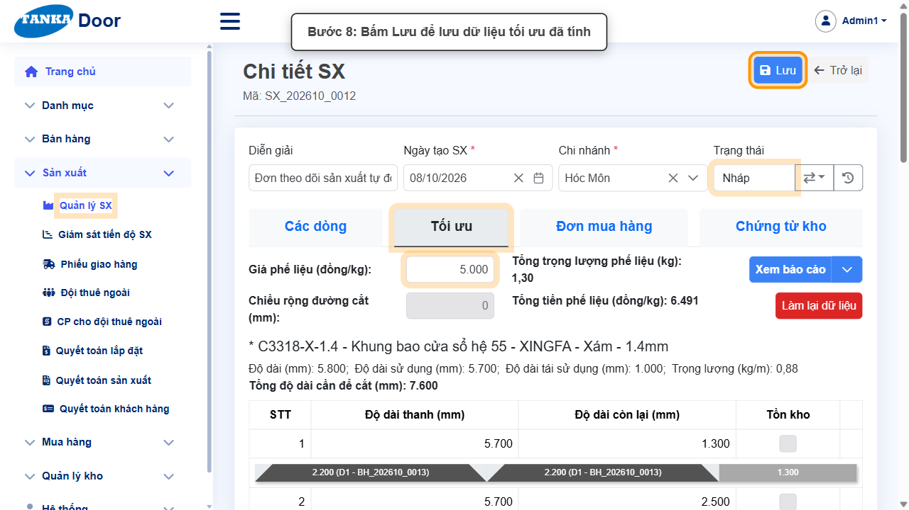

*Hình 8: Bấm Lưu.*

> Bắt buộc phải bấm Lưu để lưu dữ liệu đã tính toán — nếu chưa Lưu sẽ không chuyển được sang bước tiếp theo.

### Bước 9. Chuyển trạng thái sang Đã duyệt

Ở khung **Trạng thái**, bấm nút mũi tên (⇄) bên cạnh chữ Nháp, chọn **Đã duyệt** trong danh sách sổ xuống. Màn hình chuyển trạng thái hiện ra, nhập ghi chú (ví dụ "đã hoàn thành bước này") vào ô text, bấm **Cập nhật**, rồi bấm **Đồng ý** ở popup xác nhận.

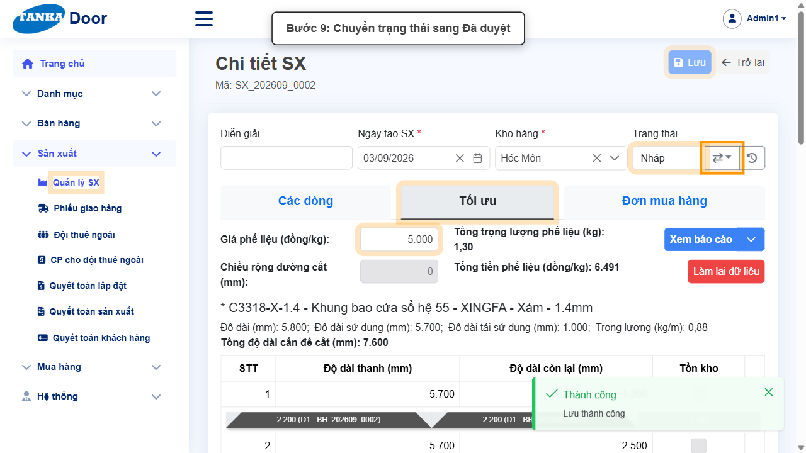

*Hình 9: Chuyển trạng thái sang Đã duyệt.*

### Bước 10. Chuyển trạng thái sang Đã kế hoạch

Lặp lại thao tác: bấm nút chuyển trạng thái, chọn **Đã kế hoạch**, nhập ghi chú, bấm Cập nhật rồi Đồng ý.

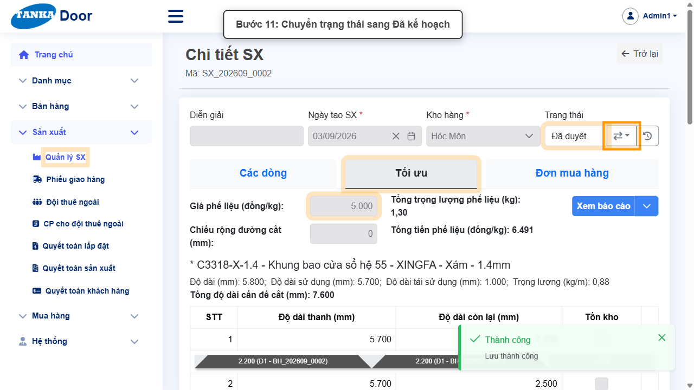

*Hình 10: Chuyển trạng thái sang Đã kế hoạch.*

### Bước 11. Tạo yêu cầu mua hàng

Bấm tab **Đơn mua hàng**, bấm nút **Tạo yêu cầu mua hàng**.

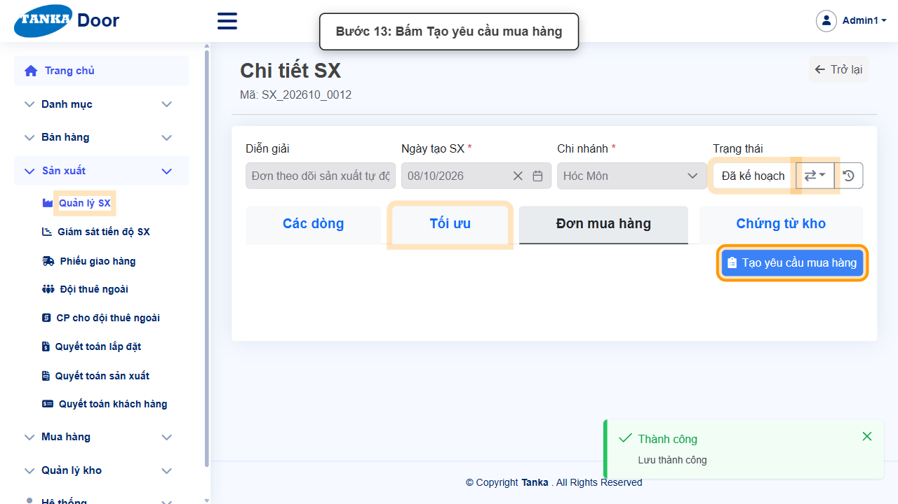

*Hình 11: Bấm Tạo yêu cầu mua hàng.*

### Bước 12. Xác nhận tạo yêu cầu mua hàng

Popup **Xác nhận** hiện ra: _"Tạo yêu cầu mua hàng cho lệnh sản xuất này? Tồn kho và đơn đang đặt được trừ tại thời điểm này."_ Bấm **Đồng ý**. Hệ thống tạo phiếu **Yêu cầu mua hàng** (mã YCMH_YYYYMM_xxxx, trạng thái Nháp) và mở màn hình phiếu đó. Số lượng **Cần mua** đã trừ tồn kho khả dụng và hàng đang đặt.

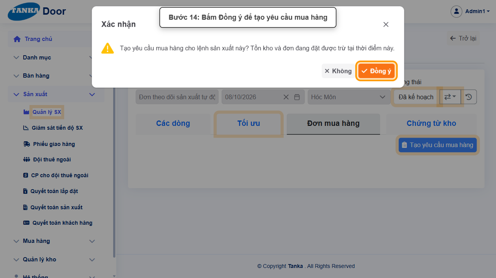

*Hình 12: Bấm Đồng ý để tạo yêu cầu mua hàng.*

### Bước 13. Duyệt yêu cầu mua hàng

Trên màn hình **Yêu cầu mua hàng**, kiểm tra các tab vật tư (Profile, PKSX, PKLĐ, VTPSX, VTPLĐ, Gioăng, Kính / Lá nhôm) rồi bấm nút **Duyệt** ở góc phải phía trên, sau đó bấm **Đồng ý** ở popup _"Duyệt yêu cầu mua hàng này? Sau khi duyệt không sửa được số lượng."_

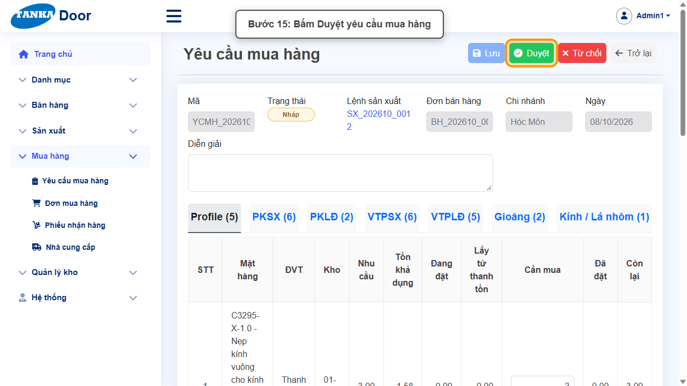

*Hình 13: Bấm Duyệt yêu cầu mua hàng.*

### Bước 14. Mở màn hình lập đơn mua hàng

Sau khi duyệt, bấm nút **Lập đơn mua hàng**. Màn hình **Chọn nhà cung cấp và lập đơn mua hàng** mở ra.

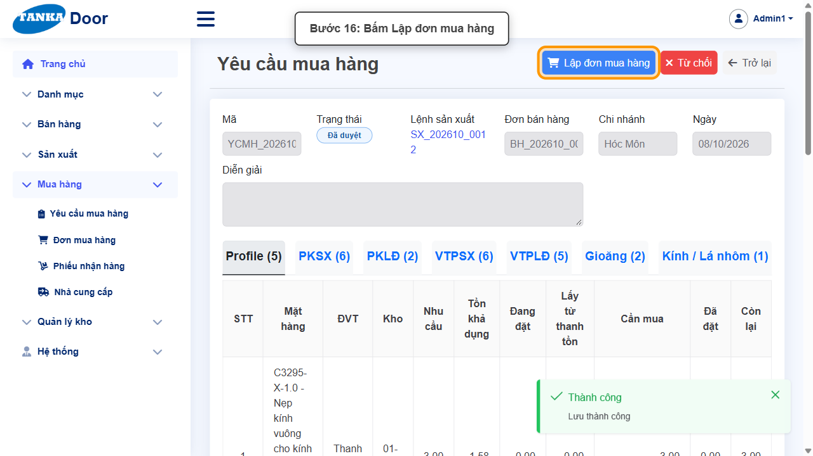

*Hình 14: Bấm Lập đơn mua hàng.*

### Bước 15. Chọn nhà cung cấp cho từng nhóm vật tư

Lần lượt ở **từng tab** vật tư:

1. Tích ô ở dòng tiêu đề bảng để chọn tất cả các dòng của tab.
2. Ở ô **Áp NCC đồng loạt**, chọn nhà cung cấp (danh sách NCC khác nhau theo nhóm vật tư).
3. Bấm **Áp dụng**. Ô **Thành tiền (chưa VAT)** cuối trang tăng lên theo các dòng đã chọn.

Lựa chọn được giữ khi chuyển tab, nên chỉ cần bấm "Lập đơn mua hàng" một lần sau khi làm xong tất cả các tab.

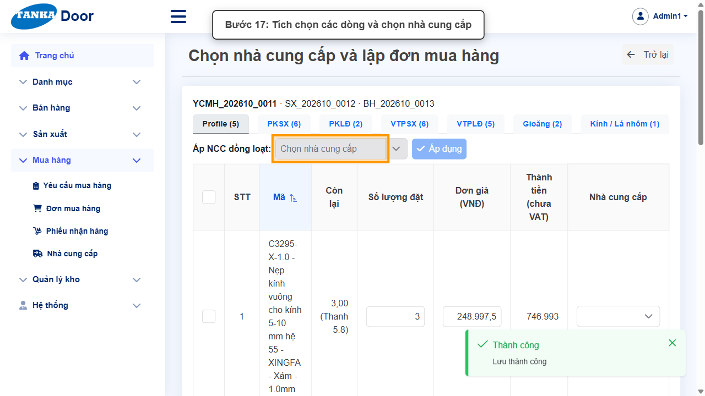

*Hình 15: Tích chọn các dòng và chọn nhà cung cấp.*

### Bước 16. Bấm Lập đơn mua hàng để hoàn thành

Cuộn xuống cuối trang, bấm **Lập đơn mua hàng**. Hệ thống tạo **mỗi nhà cung cấp một đơn mua hàng** và quay lại phiếu Yêu cầu mua hàng.

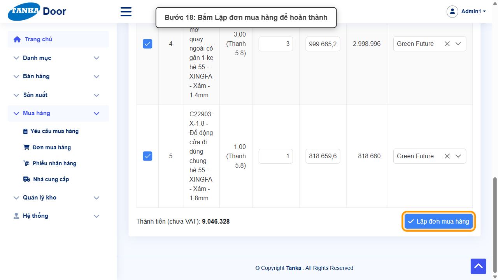

*Hình 16: Bấm Lập đơn mua hàng để hoàn thành.*

### Bước 17. Kiểm tra các đơn mua hàng đã lập

Thông báo **"Thành công — Đã lập đơn mua hàng"** hiện ra. Phiếu YCMH chuyển trạng thái **Đã lập đơn** và mục **Đơn mua hàng** liệt kê các mã MH_... vừa tạo. Bấm vào mã **Lệnh sản xuất** (SX_...) trên phiếu để quay lại lệnh SX.

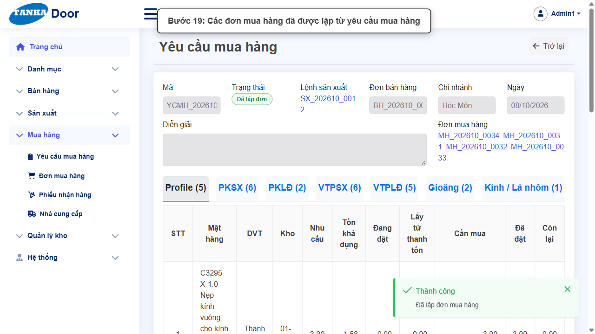

*Hình 17: Các đơn mua hàng đã được lập từ yêu cầu mua hàng.*

### Bước 18. Chuyển trạng thái sang Đã mua hàng

Trên lệnh SX, bấm nút chuyển trạng thái, chọn **Đã mua hàng**, nhập ghi chú, bấm **Cập nhật** rồi **Đồng ý**.

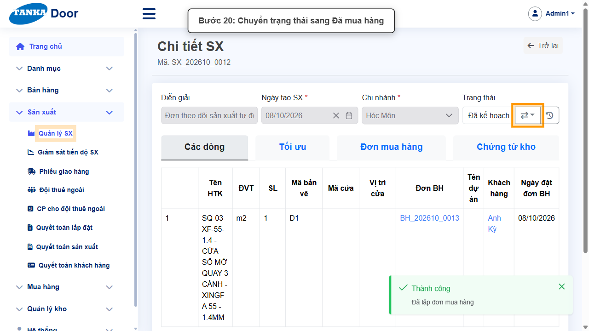

*Hình 18: Chuyển trạng thái sang Đã mua hàng.*

### Bước 19. Xác nhận trạng thái Đã mua hàng

Ô Trạng thái hiển thị **Đã mua hàng**. Bước tiếp theo là duyệt các đơn mua hàng và nhận hàng vào kho (UG-040) — lệnh SX chỉ chuyển được sang "Đang SX" khi vật tư đã có trong kho.

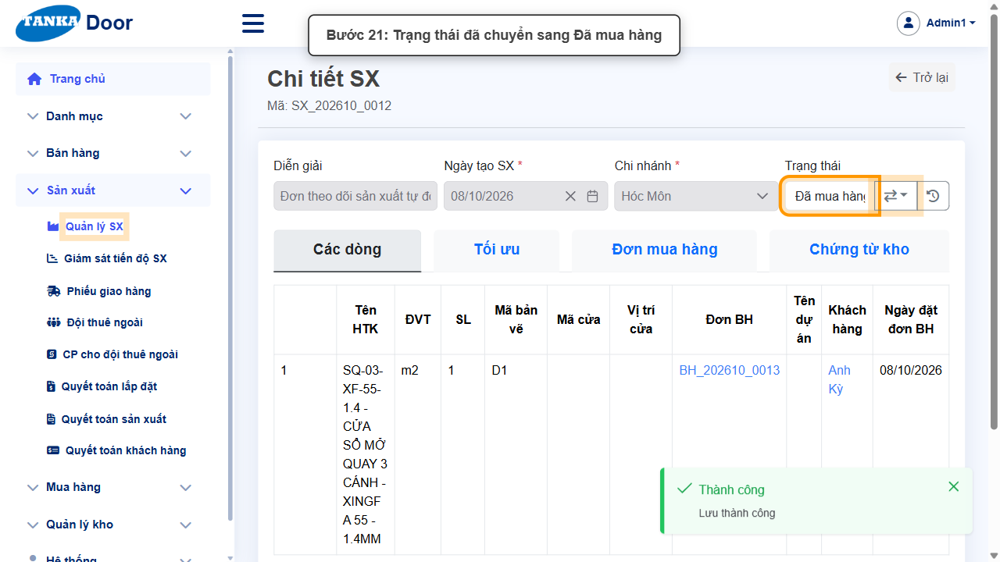

*Hình 19: Trạng thái đã chuyển sang Đã mua hàng.*

## 4. Khi không thao tác được

| Hiện tượng | Cách xử lý ngay |
| --- | --- |
| Nút Lưu đang mờ / không bấm được | Tìm ô có dấu * chưa nhập hoặc dropdown chưa chọn; cuộn hết form để kiểm tra. |
| Không thấy lệnh SX nào ở trạng thái Nháp | Cần tạo lệnh SX trước — xem hướng dẫn UG-030 "Tạo lệnh sản xuất". |
| Không chuyển được trạng thái sau khi tính tối ưu | Kiểm tra đã bấm nút Lưu ở tab Tối ưu chưa — bắt buộc phải Lưu dữ liệu tối ưu trước khi chuyển trạng thái. |
| Không thấy nút "Tạo yêu cầu mua hàng" | Lệnh SX phải ở trạng thái "Đã kế hoạch" và đang mở tab **Đơn mua hàng**. |
| Ô "Áp NCC đồng loạt" bị mờ | Chưa tích dòng nào trong tab đang mở — tích ô ở dòng tiêu đề bảng trước. |
| Chuyển "Đã mua hàng" báo "Bạn phải tạo đơn mua hàng cho SX này trước..." | Chưa lập đơn mua hàng từ yêu cầu mua hàng — làm lại bước 13–16. |
| Bấm nút chuyển trạng thái nhưng không có phản ứng | Kiểm tra lệnh SX đã ở đúng trạng thái liền trước trong chuỗi; không thể nhảy cóc trạng thái. |

## 5. Dấu hiệu hoàn thành

- Ô Trạng thái của lệnh SX hiển thị "Đã mua hàng".
- Phiếu Yêu cầu mua hàng của lệnh SX ở trạng thái "Đã lập đơn" và liệt kê các đơn mua hàng MH_... .
- Mục Mua hàng > Đơn mua hàng có các đơn mới (trạng thái Nháp, Chưa nhận) gắn với lệnh SX này.

## 6. Checklist dành cho người mới

- [ ] Đã nhập Giá bán phế liệu, bấm Tính tối ưu và bấm Lưu ở tab Tối ưu.
- [ ] Đã chuyển Đã duyệt → Đã kế hoạch.
- [ ] Đã tạo, duyệt yêu cầu mua hàng và lập đơn mua hàng cho **tất cả** các tab vật tư.
- [ ] Trạng thái lệnh SX đã là "Đã mua hàng".
- [ ] Đã chuyển sang UG-040 để duyệt đơn mua hàng và nhận hàng vào kho.

---

_Tài liệu này được biên soạn dựa trên thao tác thực tế trên hệ thống door-v1.test.tankasoft.com. Ảnh minh họa có thể thay đổi theo phiên bản giao diện._
