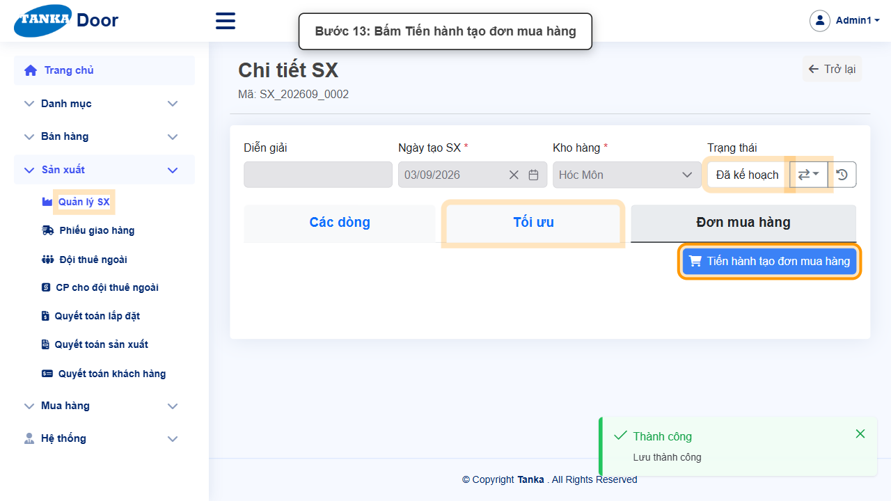
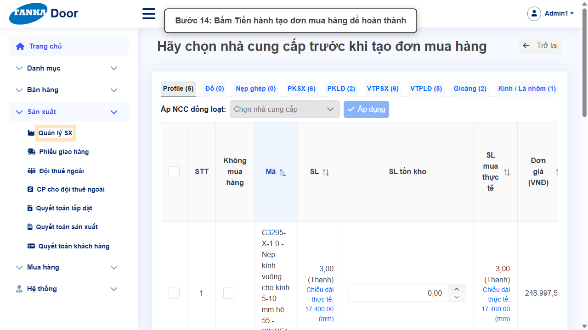
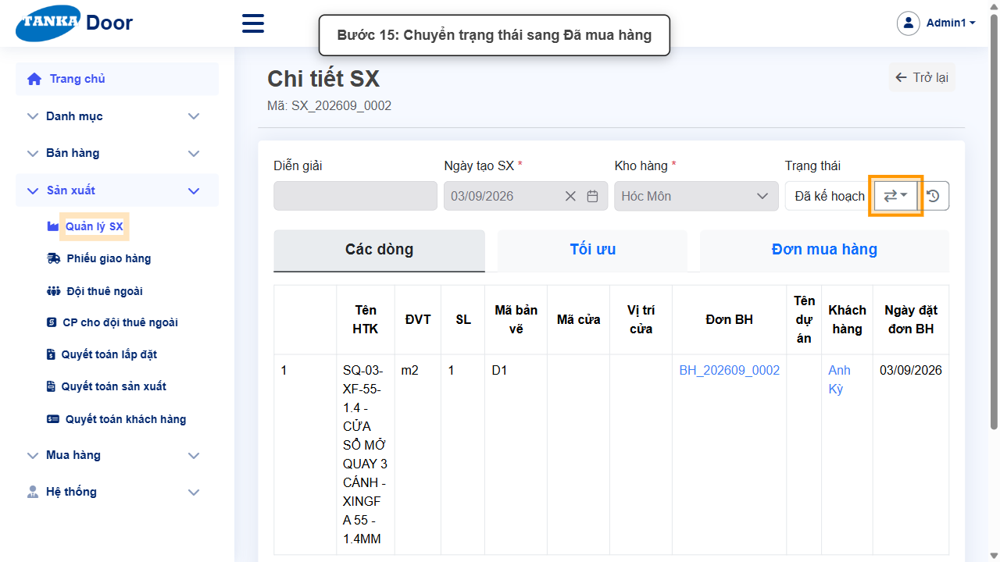
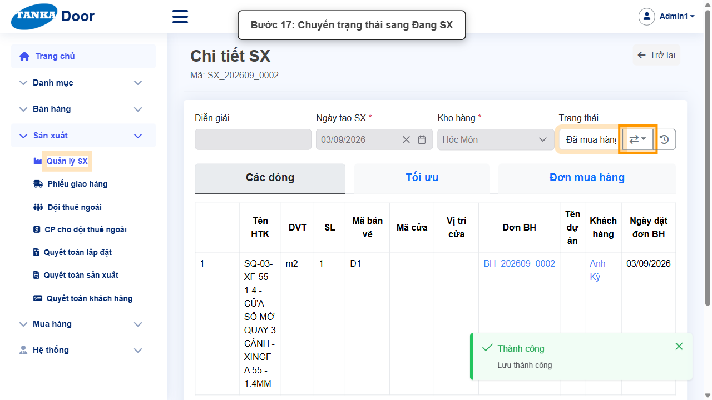
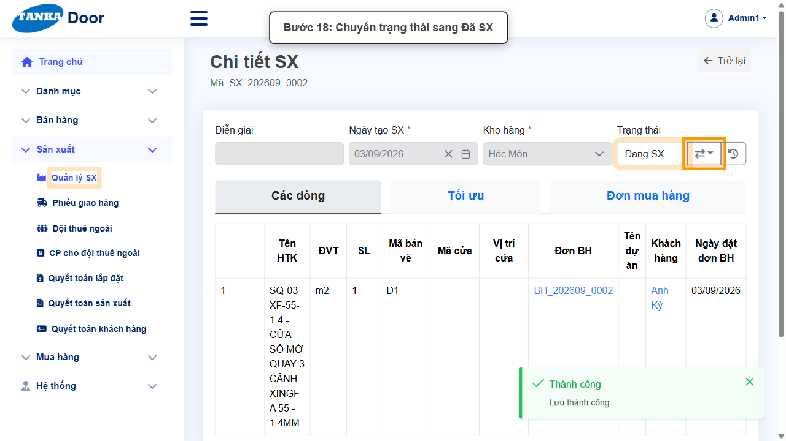
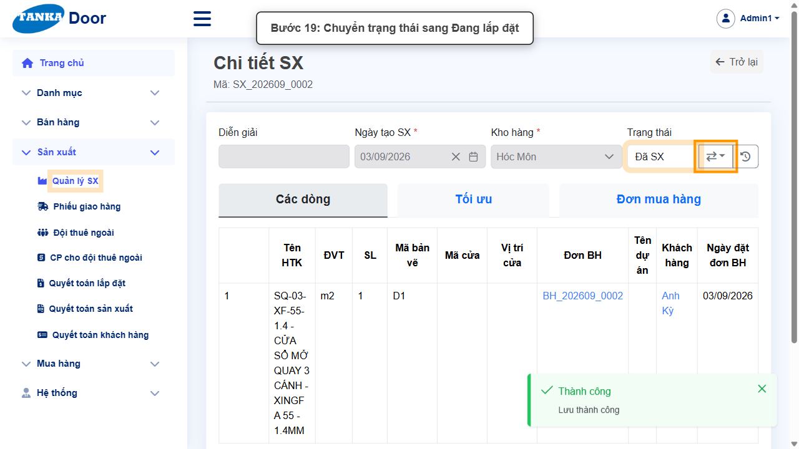
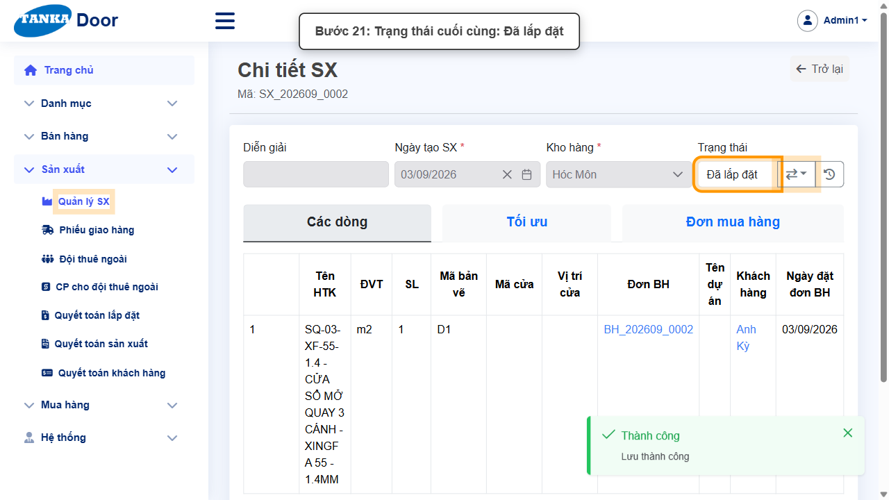

# HƯỚNG DẪN SỬ DỤNG — TỐI ƯU, CHUYỂN TRẠNG THÁI VÀ TẠO ĐƠN MUA HÀNG CHO LỆNH SX

**Đường dẫn:** Sản xuất > Quản lý SX > (mở 1 lệnh SX đang Nháp)  
**Mục tiêu:** Tính tối ưu cắt vật tư, lưu kết quả, rồi chuyển lệnh sản xuất qua toàn bộ chuỗi trạng thái Đã duyệt → Đã kế hoạch → (tạo đơn mua hàng) → Đã mua hàng → Đang SX → Đã SX → Đang lắp đặt → Đã lắp đặt.  
**Dành cho:** Người mới sử dụng TANKA Door

## 1. Dữ liệu mẫu dùng trong hướng dẫn

Dữ liệu dưới đây là dữ liệu thật đã dùng để minh họa (lệnh sản xuất SX_202609_0002, tạo từ đơn bán hàng theo hướng dẫn "Quản lý sản xuất"). Khi tự thao tác, hãy dùng đúng mã lệnh sản xuất bạn đang xử lý.

| Trường | Giá trị |
| --- | --- |
| Lệnh SX nguồn | SX_202609_0002 (trạng thái ban đầu: Nháp) |
| Giá bán phế liệu (đồng/kg) | 5.000 |
| Ghi chú khi chuyển trạng thái | đã hoàn thành bước này |

## 2. Sơ đồ quy trình tóm tắt

BẮT ĐẦU (lệnh SX ở trạng thái Nháp) → Tab Tối ưu: nhập Giá bán phế liệu → Tính tối ưu → Lưu → Chuyển trạng thái Đã duyệt → Đã kế hoạch → Tab Đơn mua hàng: Tiến hành tạo đơn mua hàng (2 lần) → Chuyển trạng thái Đã mua hàng → Đang SX → Đã SX → Đang lắp đặt → Đã lắp đặt

## 3. Quy trình thao tác từng bước

### Bước 1. Mở trang chủ Tanka Door

Đăng nhập vào hệ thống, màn hình **Trang chủ** hiện ra.

*Hình 1: Trang chủ sau khi đăng nhập.*

### Bước 2. Mở Quản lý sản xuất

Ở menu bên trái, mở **Sản xuất**, trong danh sách sổ xuống bấm **Quản lý sản xuất**.

*Hình 2: Mở menu Sản xuất, chọn Quản lý sản xuất.*

### Bước 3. Màn hình Quản lý SX

Màn hình **Quản lý SX** hiện danh sách các lệnh sản xuất đã có, kèm cột Trạng thái.

*Hình 3: Danh sách Quản lý SX.*

### Bước 4. Chọn mã sản xuất có trạng thái Nháp

Bấm vào mã lệnh sản xuất (ví dụ `SX_202609_0002`) đang ở trạng thái **Nháp** để mở màn hình **Chi tiết SX**.

*Hình 4: Chi tiết SX, trạng thái hiện tại là Nháp.*

### Bước 5. Mở tab Tối ưu

Bấm tab **Tối ưu** ở giữa màn hình để tính tối ưu cắt vật tư cho lệnh sản xuất trước khi chuyển trạng thái.

*Hình 5: Mở tab Tối ưu.*

### Bước 6. Nhập Giá bán phế liệu

Nhập giá trị vào ô **Giá phế liệu (đồng/kg)**, ví dụ `5000`.

*Hình 6: Nhập Giá bán phế liệu.*

### Bước 7. Bấm Tính tối ưu

Bấm nút **Tính tối ưu** ở bên phải màn hình. Hệ thống tính toán và hiển thị chi tiết độ dài thanh cắt cho từng loại vật tư.

*Hình 7: Bấm Tính tối ưu.*

> Nếu muốn thay đổi dữ liệu (ví dụ nhập lại giá bán phế liệu), bấm nút **Làm lại dữ liệu** rồi nhập lại và bấm Tính tối ưu lại.

### Bước 8. Bấm Lưu để lưu dữ liệu tối ưu

Bấm nút **Lưu** ở góc trên bên phải màn hình.

*Hình 8: Bấm Lưu.*

> Bắt buộc phải bấm Lưu để lưu dữ liệu đã tính toán — nếu chưa Lưu sẽ không chuyển được sang bước tiếp theo.

### Bước 9. Chuyển trạng thái sang Đã duyệt

Ở khung **Trạng thái**, bấm nút mũi tên (⇄) bên cạnh chữ Nháp, chọn **Đã duyệt** trong danh sách sổ xuống. Màn hình chuyển trạng thái hiện ra, nhập ghi chú (ví dụ "đã hoàn thành bước này") vào ô text, bấm **Cập nhật**, rồi bấm **Đồng ý** ở popup xác nhận.

*Hình 9: Chuyển trạng thái sang Đã duyệt.*

### Bước 10. Chuyển trạng thái sang Đã kế hoạch

Lặp lại thao tác: bấm nút chuyển trạng thái, chọn **Đã kế hoạch**, nhập ghi chú, bấm Cập nhật rồi Đồng ý.

*Hình 10: Chuyển trạng thái sang Đã kế hoạch.*

### Bước 11. Tạo đơn mua hàng

Bấm tab **Đơn mua hàng**, bấm nút **Tiến hành tạo đơn mua hàng**. Màn hình chuyển sang trang chọn nhà cung cấp cho từng nhóm vật tư.

*Hình 11: Bấm Tiến hành tạo đơn mua hàng.*

### Bước 12. Hoàn thành tạo đơn mua hàng

Cuộn xuống cuối trang chọn nhà cung cấp, bấm lại nút **Tiến hành tạo đơn mua hàng** để hoàn thành việc tạo đơn mua hàng. Hệ thống quay lại màn hình Chi tiết SX.

*Hình 12: Bấm Tiến hành tạo đơn mua hàng lần nữa để hoàn tất.*

### Bước 13. Chuyển trạng thái sang Đã mua hàng

Tiếp tục chuyển trạng thái: bấm nút chuyển trạng thái, chọn **Đã mua hàng**, nhập ghi chú, bấm Cập nhật rồi Đồng ý.

*Hình 13: Chuyển trạng thái sang Đã mua hàng.*

### Bước 14. Chuyển trạng thái sang Đang SX

Lặp lại thao tác chuyển trạng thái, chọn **Đang SX**.

*Hình 14: Chuyển trạng thái sang Đang SX.*

### Bước 15. Chuyển trạng thái sang Đã SX

Lặp lại thao tác chuyển trạng thái, chọn **Đã SX**.

*Hình 15: Chuyển trạng thái sang Đã SX.*

### Bước 16. Chuyển trạng thái sang Đang lắp đặt

Lặp lại thao tác chuyển trạng thái, chọn **Đang lắp đặt**.

*Hình 16: Chuyển trạng thái sang Đang lắp đặt.*

### Bước 17. Chuyển trạng thái sang Đã lắp đặt

Chuyển trạng thái lần cuối, chọn **Đã lắp đặt**. Đây là trạng thái hoàn tất toàn bộ quy trình sản xuất của lệnh SX này.

*Hình 17: Trạng thái cuối cùng — Đã lắp đặt.*

## 4. Khi không thao tác được

| Hiện tượng | Cách xử lý ngay |
| --- | --- |
| Nút Lưu đang mờ / không bấm được | Tìm ô có dấu * chưa nhập hoặc dropdown chưa chọn; cuộn hết form để kiểm tra. |
| Ô hiện viền đỏ kèm thông báo lỗi | Đọc đúng thông báo dưới ô, sửa lại giá trị rồi bấm ra ngoài ô để hệ thống kiểm tra lại. |
| Gõ vào dropdown nhưng không thấy dữ liệu | Xóa bớt từ khóa, gõ lại đúng một phần mã/tên và chờ vài giây để danh sách tải xong. |
| Bấm Lưu nhưng không thấy phản hồi | Không bấm thêm lần nữa; chờ hệ thống xử lý xong rồi tìm lại bản ghi trong danh sách. |
| Không thấy lệnh SX nào ở trạng thái Nháp | Cần tạo đơn bán hàng mới và chuyển đến "Đã yêu cầu SX" rồi tạo hồ sơ SX trước — xem hướng dẫn "Quản lý sản xuất". |
| Không chuyển được trạng thái sau khi tính tối ưu | Kiểm tra đã bấm nút Lưu ở tab Tối ưu chưa — bắt buộc phải Lưu dữ liệu tối ưu trước khi chuyển trạng thái. |
| Bấm nút chuyển trạng thái nhưng không có phản ứng | Kiểm tra lệnh SX đã ở đúng trạng thái liền trước trong chuỗi; không thể nhảy cóc trạng thái. |

## 5. Dấu hiệu hoàn thành

- Ô Trạng thái hiển thị "Đã lắp đặt".
- Tab Đơn mua hàng đã có đơn mua hàng được tạo cho các nhóm vật tư.
- Toàn bộ chuỗi trạng thái Đã duyệt → Đã kế hoạch → Đã mua hàng → Đang SX → Đã SX → Đang lắp đặt → Đã lắp đặt đã được đi qua tuần tự.

## 6. Checklist dành cho người mới

- [ ] Đã nhập Giá bán phế liệu, bấm Tính tối ưu và bấm Lưu ở tab Tối ưu.
- [ ] Đã tạo đơn mua hàng ở tab Đơn mua hàng (bấm Tiến hành tạo đơn mua hàng 2 lần).
- [ ] Đã chuyển đủ chuỗi trạng thái, mỗi lần đều nhập ghi chú, bấm Cập nhật rồi Đồng ý.
- [ ] Trạng thái cuối cùng đã là "Đã lắp đặt".

---

_Tài liệu này được biên soạn dựa trên thao tác thực tế trên hệ thống door-v1.test.tankasoft.com. Ảnh minh họa có thể thay đổi theo phiên bản giao diện._
