# HƯỚNG DẪN SỬ DỤNG — SẢN XUẤT, GIAO HÀNG VÀ LẮP ĐẶT

**Đường dẫn:** Sản xuất > Quản lý SX; Sản xuất > Phiếu giao hàng; Sản xuất > Giám sát tiến độ SX  
**Mục tiêu:** Đưa lệnh sản xuất từ "Đã mua hàng" qua sản xuất, giao hàng (bằng phiếu giao hàng), lắp đặt, rồi cập nhật đội và ngày vệ sinh để lệnh SX đủ điều kiện quyết toán.  
**Dành cho:** Người mới sử dụng TANKA Door

> Hướng dẫn này nối tiếp **UG-040** (vật tư đã nhập kho đầy đủ). Sau khi hoàn tất, lệnh SX dùng được cho các quyết toán **UG-035** (khách hàng), **UG-036** (lắp đặt) và **UG-037** (sản xuất).

## 1. Dữ liệu mẫu dùng trong hướng dẫn

Dữ liệu dưới đây là dữ liệu thật đã dùng để minh họa.

| Trường | Giá trị |
| --- | --- |
| Lệnh SX | SX_202610_0012 (trạng thái ban đầu: Đã mua hàng) |
| Đơn BH / Khách hàng | BH_202610_0013 / Anh Kỳ |
| Phiếu giao hàng sinh ra | GH_202610_0006 |
| Ngày giao hàng | 07/10/2026 (xem lưu ý ở Bước 7) |
| Đội SX | Anh Danh - GC Sản xuất |
| Đội LĐ / Đội VS | Đạt LD |
| Ngày BĐVS / Ngày HTVS | 08/10/2026 |

## 2. Sơ đồ quy trình tóm tắt

BẮT ĐẦU (lệnh SX "Đã mua hàng") → Chuyển **Đang SX** (tự xuất kho vật tư) → Chuyển **Đã SX** (tự nhập kho thành phẩm) → Tạo **Phiếu giao hàng** → Phiếu "Đang giao" (lệnh SX tự sang "Đang giao hàng") → Phiếu "Hoàn thành" (lệnh SX tự sang "Đã giao hàng") → Chuyển **Đang lắp đặt** → **Đã lắp đặt** → **Giám sát tiến độ SX**: chọn Đội SX, Đội LĐ, Đội VS, nhập Ngày BĐVS, Ngày HTVS

## 3. Quy trình thao tác từng bước

### Bước 1. Mở trang chủ Tanka Door

Đăng nhập vào hệ thống, màn hình **Trang chủ** hiện ra.

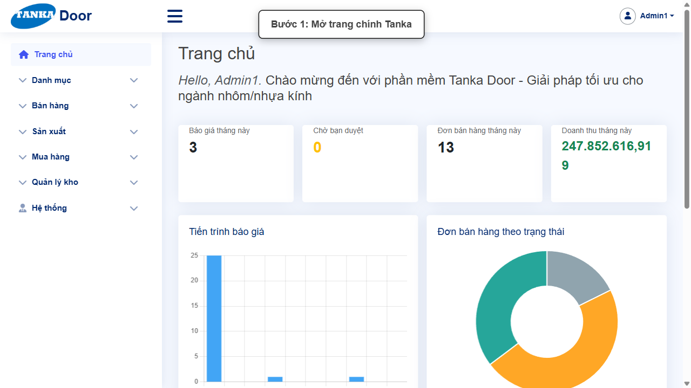

*Hình 1: Trang chủ sau khi đăng nhập.*

### Bước 2. Mở Quản lý SX

Ở menu bên trái, mở **Sản xuất > Quản lý SX**.

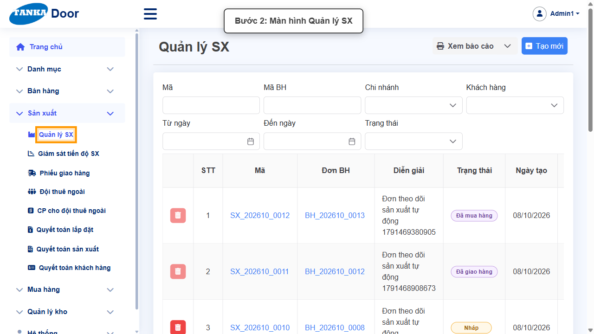

*Hình 2: Màn hình Quản lý SX.*

### Bước 3. Mở lệnh sản xuất đã mua hàng

Bấm vào mã lệnh SX (ví dụ `SX_202610_0012`) có trạng thái **Đã mua hàng**. Ghi nhớ **Đơn BH** và **Khách hàng** ở tab Các dòng — sẽ dùng khi tạo phiếu giao hàng.

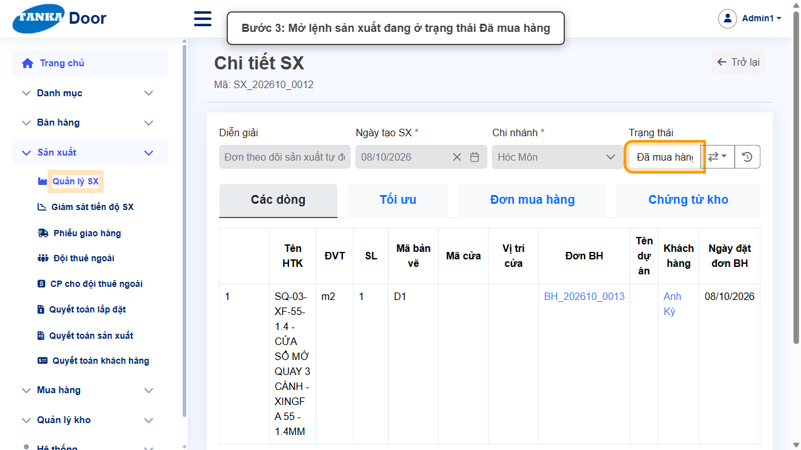

*Hình 3: Mở lệnh sản xuất đang ở trạng thái Đã mua hàng.*

### Bước 4. Chuyển trạng thái sang Đang SX

Bấm nút chuyển trạng thái (⇄), chọn **Đang SX**. Popup chuyển trạng thái có ô **Ngày BĐSX** (mặc định hôm nay) và ô lý do — nhập ghi chú, bấm **Cập nhật** rồi **Đồng ý**. Hệ thống **tự tạo phiếu xuất kho** vật tư cho lệnh SX (xem tab **Chứng từ kho**).

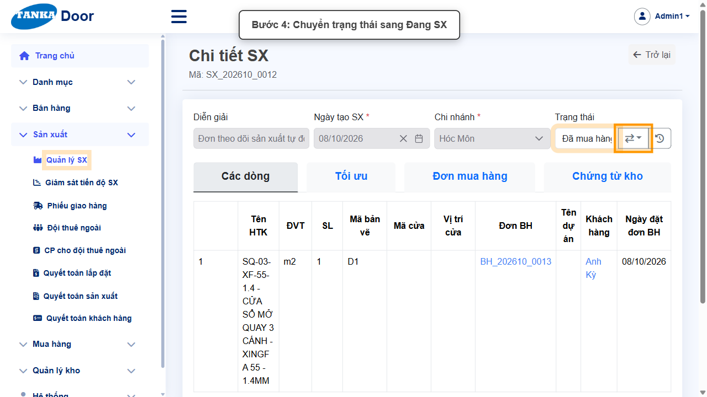

*Hình 4: Chuyển trạng thái sang Đang SX.*

### Bước 5. Chuyển trạng thái sang Đã SX

Lặp lại thao tác, chọn **Đã SX**. Hệ thống tự ghi **Ngày HTSX** và tạo phiếu **Nhập thành phẩm**.

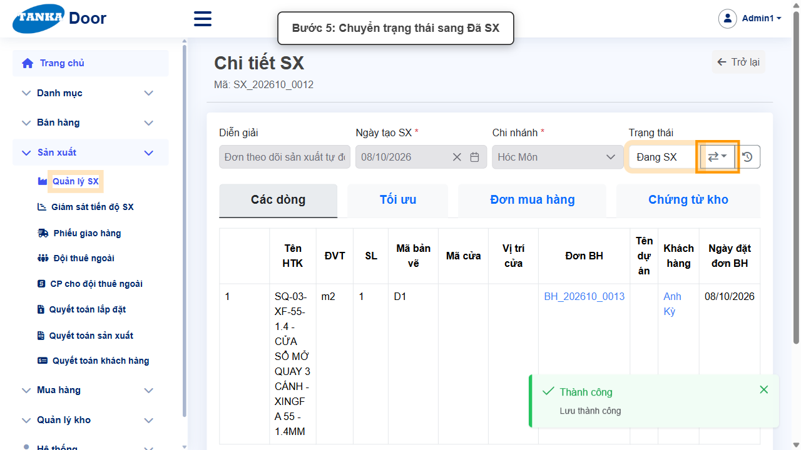

*Hình 5: Chuyển trạng thái sang Đã SX.*

> Từ "Đã SX", menu chuyển trạng thái của lệnh SX không còn mục giao hàng — việc giao hàng được ghi nhận bằng **Phiếu giao hàng** ở các bước tiếp theo.

### Bước 6. Mở Phiếu giao hàng và bấm Tạo mới

Ở menu bên trái, mở **Sản xuất > Phiếu giao hàng**, bấm **Tạo mới**.

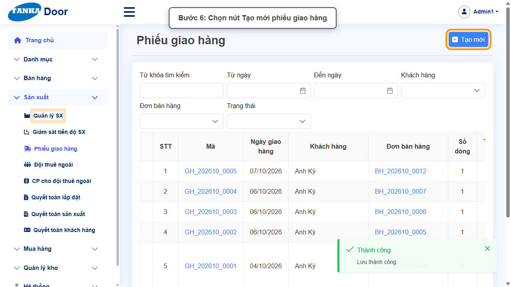

*Hình 6: Bấm Tạo mới phiếu giao hàng.*

### Bước 7. Chọn Khách hàng, Đơn bán hàng và Ngày giao hàng

- **Khách hàng *** — chọn khách hàng của đơn (ví dụ **Anh Kỳ**).
- **Đơn bán hàng *** — sau khi chọn khách hàng, ô này mới bấm được; chọn đúng đơn (ví dụ **BH_202610_0013**).
- **Ngày giao hàng *** — bấm vào ô và chọn ngày trên lịch.
- **Địa chỉ giao hàng**, **Diễn giải** — không bắt buộc.

> **Lưu ý:** tại thời điểm biên soạn, nếu để Ngày giao hàng là **hôm nay**, đến bước "Hoàn thành" hệ thống có thể báo _"Phiếu giao đang để ngày ... ở tương lai"_. Khi gặp thông báo này, chọn ngày giao là ngày đã giao thực tế (trước hôm nay) rồi Lưu lại phiếu.

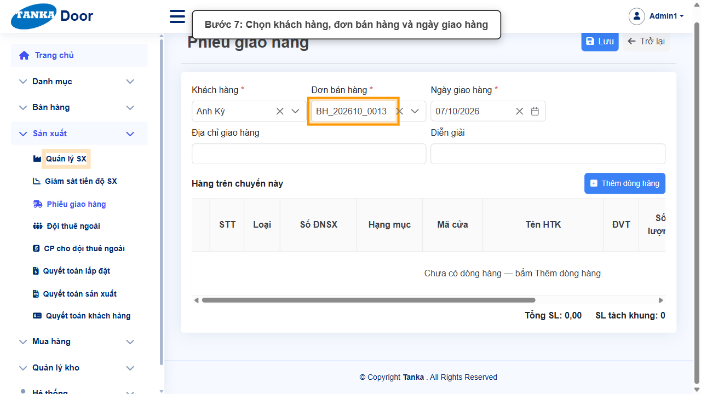

*Hình 7: Chọn khách hàng, đơn bán hàng và ngày giao hàng.*

### Bước 8. Thêm dòng hàng cần giao

Bấm **Thêm dòng hàng**. Popup **"Chọn dòng hàng để giao"** hiện các thành phẩm đã sản xuất của đơn (cột Số ĐNSX là mã lệnh SX). Tích ô ở dòng tiêu đề để chọn tất cả, rồi bấm **+ Thêm**.

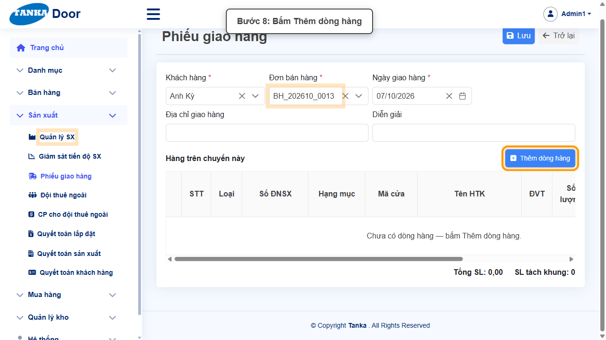

*Hình 8: Bấm Thêm dòng hàng.*

### Bước 9. Lưu phiếu giao hàng

Kiểm tra bảng **Hàng trên chuyến này** rồi bấm **Lưu**. Phiếu được tạo với mã **GH_YYYYMM_xxxx**, trạng thái **Nháp**.

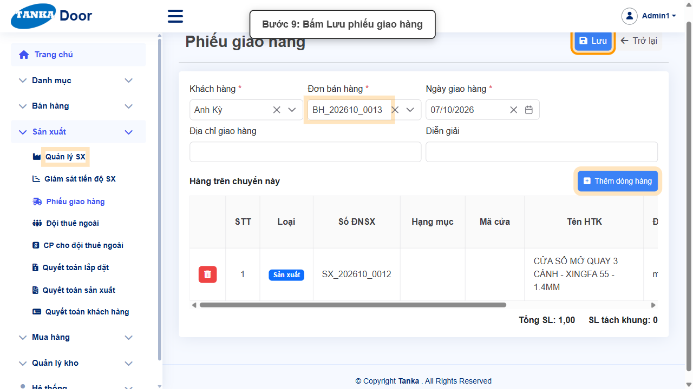

*Hình 9: Bấm Lưu phiếu giao hàng.*

### Bước 10. Chuyển phiếu sang Đang giao

Bấm nút chuyển trạng thái (⇄) cạnh ô **Trạng thái** của phiếu, chọn **Đang giao**. Popup chuyển trạng thái có **Ngày hiệu lực** và **Lý do** — bấm **Xác nhận**. Lệnh SX tự chuyển sang **Đang giao hàng**.

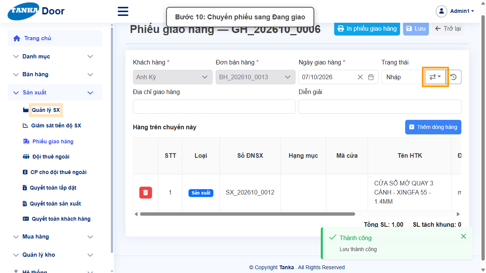

*Hình 10: Chuyển phiếu sang Đang giao.*

> Khi phiếu đã "Đang giao", các dòng hàng bị khóa — chỉ còn sửa được ngày giao, địa chỉ và diễn giải.

### Bước 11. Chuyển phiếu sang Hoàn thành

Khi hàng đã giao xong, chuyển trạng thái phiếu sang **Hoàn thành** và bấm **Xác nhận**. Hệ thống tạo chứng từ kho xuất bán (XBH_...).

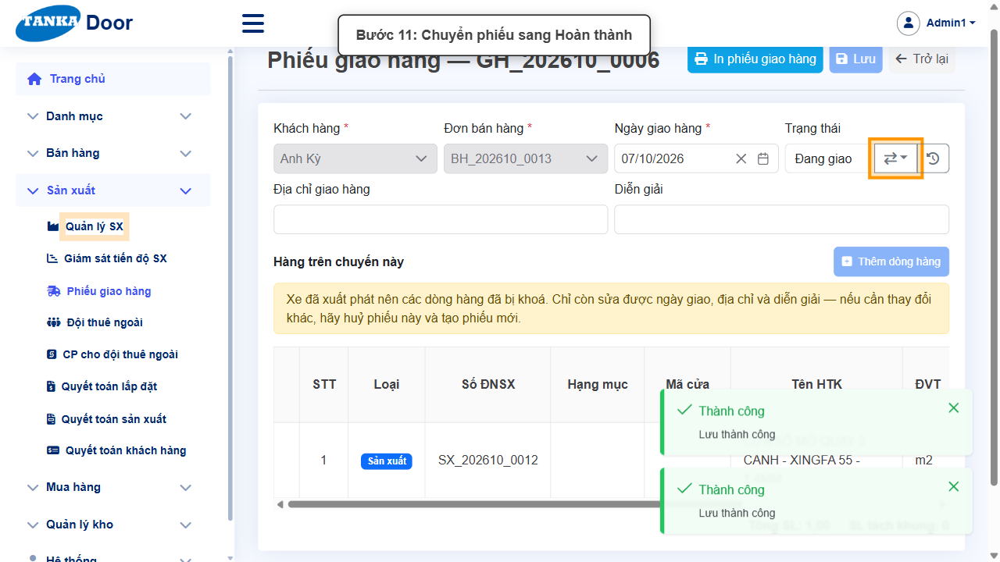

*Hình 11: Chuyển phiếu sang Hoàn thành.*

### Bước 12. Quay lại lệnh SX — trạng thái đã là Đã giao hàng

Mở lại **Sản xuất > Quản lý SX**, bấm vào lệnh SX. Trạng thái đã **tự chuyển sang Đã giao hàng**.

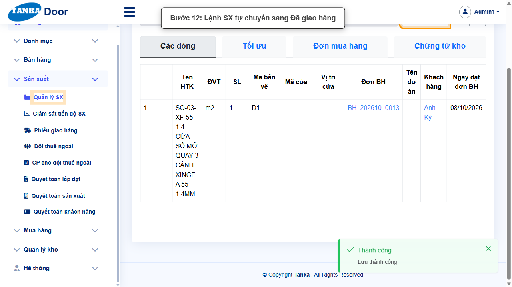

*Hình 12: Lệnh SX tự chuyển sang Đã giao hàng.*

### Bước 13. Chuyển trạng thái sang Đang lắp đặt

Bấm nút chuyển trạng thái, chọn **Đang lắp đặt**, nhập ghi chú, bấm **Cập nhật** rồi **Đồng ý**.

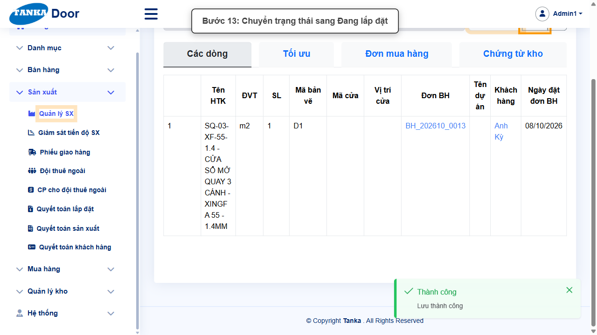

*Hình 13: Chuyển trạng thái sang Đang lắp đặt.*

### Bước 14. Chuyển trạng thái sang Đã lắp đặt

Lặp lại, chọn **Đã lắp đặt**. Hệ thống tự ghi Ngày BĐLĐ/HTLĐ và đánh dấu "LĐ 100%" cho các dòng của lệnh SX.

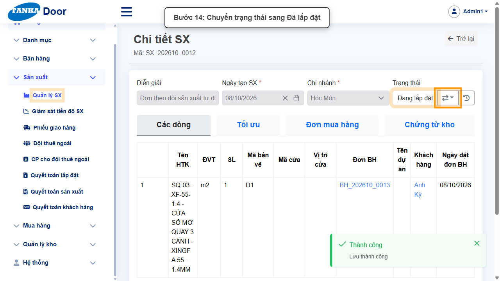

*Hình 14: Chuyển trạng thái sang Đã lắp đặt.*

### Bước 15. Mở Giám sát tiến độ SX

Ở menu bên trái, mở **Sản xuất > Giám sát tiến độ SX**. Bảng hiển thị mỗi dòng sản phẩm một hàng, cột nhóm theo giai đoạn: Sản xuất, Giao hàng, Lắp đặt, Vệ sinh, Quyết toán. Bấm trực tiếp vào ô (Đội, Ngày...) để sửa.

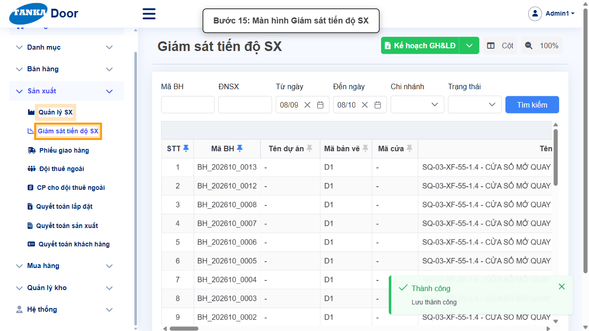

*Hình 15: Màn hình Giám sát tiến độ SX.*

### Bước 16. Chọn Đội SX, Đội LĐ và Đội VS

Trên hàng của lệnh SX (ví dụ BH_202610_0013 / SX_202610_0012), bấm vào ô:

- **Đội SX** (nhóm Sản xuất) — chọn đội sản xuất, ví dụ **Anh Danh - GC Sản xuất**. Dùng cho quyết toán sản xuất (UG-037).
- **Đội LĐ** (nhóm Lắp đặt) — chọn đội lắp đặt, ví dụ **Đạt LD**. Dùng cho quyết toán lắp đặt (UG-036).
- **Đội VS** (nhóm Vệ sinh) — chọn đội vệ sinh.

Chọn xong hệ thống **tự lưu**, không cần bấm nút Lưu.

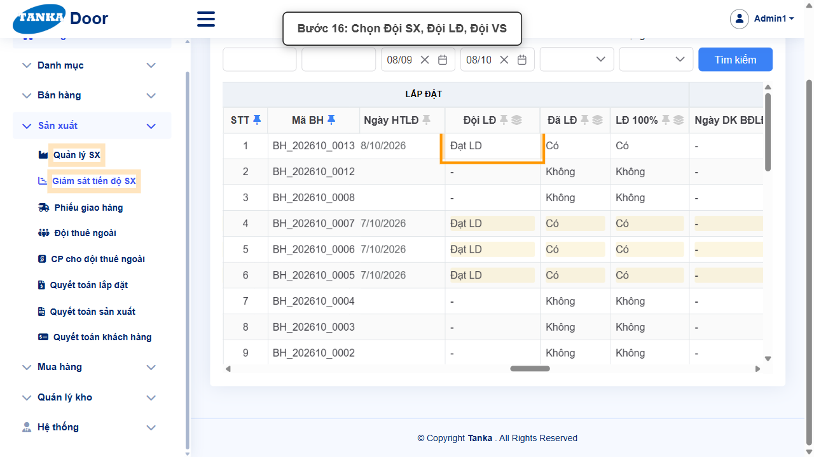

*Hình 16: Chọn Đội SX, Đội LĐ, Đội VS.*

### Bước 17. Nhập Ngày BĐVS và Ngày HTVS

Ở nhóm **Vệ sinh**, bấm vào ô **Ngày BĐVS** rồi biểu tượng lịch để chọn ngày bắt đầu vệ sinh; làm tương tự với **Ngày HTVS** (hoàn thành vệ sinh). Hệ thống tự lưu.

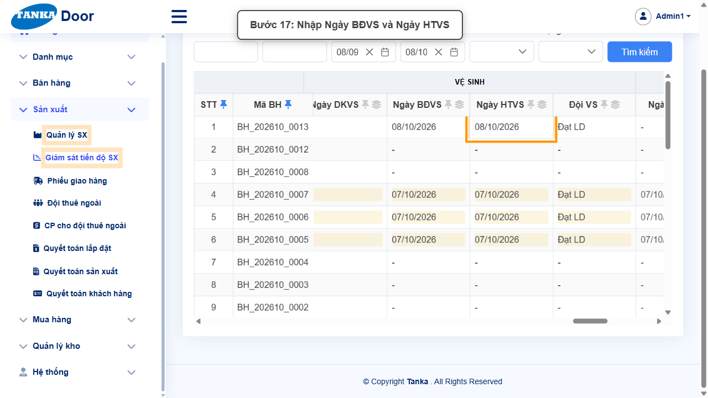

*Hình 17: Nhập Ngày BĐVS và Ngày HTVS.*

> Ô "Chọn mã sản xuất" ở các màn hình quyết toán chỉ hiện lệnh SX đã lắp đặt 100%, có ngày HTLĐ, HTVS và đúng đội đã chọn — vì vậy bước 16–17 là bắt buộc trước khi quyết toán.

## 4. Khi không thao tác được

| Hiện tượng | Cách xử lý ngay |
| --- | --- |
| Chuyển "Đang SX" báo "Mặt hàng ...: xuất ... nhưng kho chỉ còn 0" | Vật tư chưa được nhập kho — làm hướng dẫn UG-040 (duyệt đơn mua hàng, ghi sổ phiếu nhận hàng) trước. |
| Chuyển "Đang SX" báo "... đang giữ cho lệnh sản xuất — chỉ được lấy 0" | Tồn kho đang bị giữ cho lệnh SX khác cũ hơn. Liên hệ người phụ trách xử lý các lệnh SX dở dang hoặc nhập thêm vật tư. |
| Ô Đơn bán hàng ở phiếu giao hàng bị mờ | Chọn Khách hàng trước; danh sách đơn chỉ hiện đơn của khách hàng đã chọn còn hàng chưa giao. |
| Popup "Chọn dòng hàng để giao" không có dòng | Lệnh SX chưa ở trạng thái "Đã SX" hoặc hàng đã được đưa vào phiếu giao khác. |
| Hoàn thành phiếu báo "... ở tương lai; hãy sửa đúng ngày giao" | Đổi Ngày giao hàng sang ngày giao thực tế trước hôm nay, bấm Lưu, rồi chuyển lại sang Hoàn thành. |
| Menu chuyển trạng thái lệnh SX trống sau "Đã SX" | Đúng thiết kế — tạo phiếu giao hàng (bước 6–11) để lệnh SX tự chuyển sang Đang giao hàng / Đã giao hàng. |
| Sửa ô ở Giám sát tiến độ SX báo "Không thể chỉnh sửa..." | Lệnh SX đã hoàn tất/từ chối — chỉ sửa được khi lệnh SX chưa hoàn tất. |

## 5. Dấu hiệu hoàn thành

- Lệnh SX ở trạng thái "Đã lắp đặt"; tab Chứng từ kho có các phiếu xuất vật tư (XK_...) và nhập thành phẩm (NTP_...).
- Phiếu giao hàng ở trạng thái "Hoàn thành".
- Ở Giám sát tiến độ SX, hàng của lệnh SX đã có Đội SX, Đội LĐ, Đội VS, Ngày BĐVS, Ngày HTVS.
- Lệnh SX xuất hiện trong ô "Chọn mã sản xuất" của các màn hình quyết toán (UG-035/036/037).

## 6. Checklist dành cho người mới

- [ ] Vật tư của lệnh SX đã nhập kho đầy đủ (UG-040).
- [ ] Đã chuyển Đang SX → Đã SX.
- [ ] Đã tạo phiếu giao hàng, chuyển Đang giao → Hoàn thành.
- [ ] Đã chuyển lệnh SX Đang lắp đặt → Đã lắp đặt.
- [ ] Đã chọn Đội SX, Đội LĐ, Đội VS và nhập Ngày BĐVS, Ngày HTVS ở Giám sát tiến độ SX.

---

_Tài liệu này được biên soạn dựa trên thao tác thực tế trên hệ thống door-v1.test.tankasoft.com. Ảnh minh họa có thể thay đổi theo phiên bản giao diện._
