# HƯỚNG DẪN SỬ DỤNG — TẠO QUYẾT TOÁN KHÁCH HÀNG

**Đường dẫn:** Sản xuất > Quyết toán khách hàng  
**Mục tiêu:** Tạo một quyết toán khách hàng từ (các) lệnh sản xuất đã lắp đặt, rồi chuyển trạng thái từ Nháp đến Hoàn thành.  
**Dành cho:** Người mới sử dụng TANKA Door

## 1. Dữ liệu mẫu dùng trong hướng dẫn

Dữ liệu dưới đây là dữ liệu thật đã dùng để minh họa.

| Trường | Giá trị |
| --- | --- |
| Khách hàng | Anh Kỳ |
| Lệnh SX được chọn | SX_202609_0001 (trạng thái: Đã lắp đặt) |
| Ghi chú khi chuyển trạng thái | đã hoàn thành bước này |

## 2. Sơ đồ quy trình tóm tắt

BẮT ĐẦU → Tạo mới, chọn Khách hàng và mã sản xuất để quyết toán → Bấm Thêm, rồi Lưu → Chuyển trạng thái Nháp → Đã gửi → Đã duyệt → Hoàn thành → Trở lại kiểm tra kết quả

## 3. Quy trình thao tác từng bước

### Bước 1. Mở trang chủ Tanka Door

Đăng nhập vào hệ thống, màn hình **Trang chủ** hiện ra.

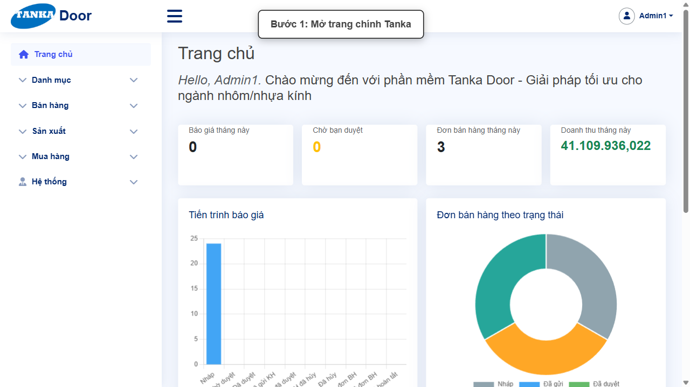

*Hình 1: Trang chủ sau khi đăng nhập.*

### Bước 2. Mở Quyết toán khách hàng

Ở menu bên trái, mở **Sản xuất**, trong danh sách sổ xuống bấm **Quyết toán khách hàng**.

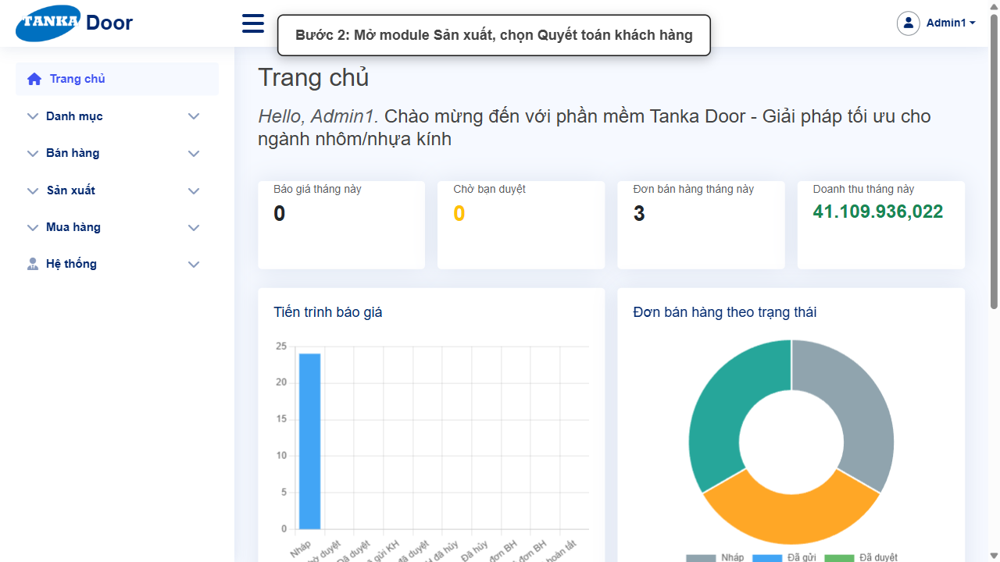

*Hình 2: Mở menu Sản xuất, chọn Quyết toán khách hàng.*

### Bước 3. Màn hình Danh sách quyết toán khách hàng

Màn hình hiện ra với danh sách các quyết toán khách hàng đã có.

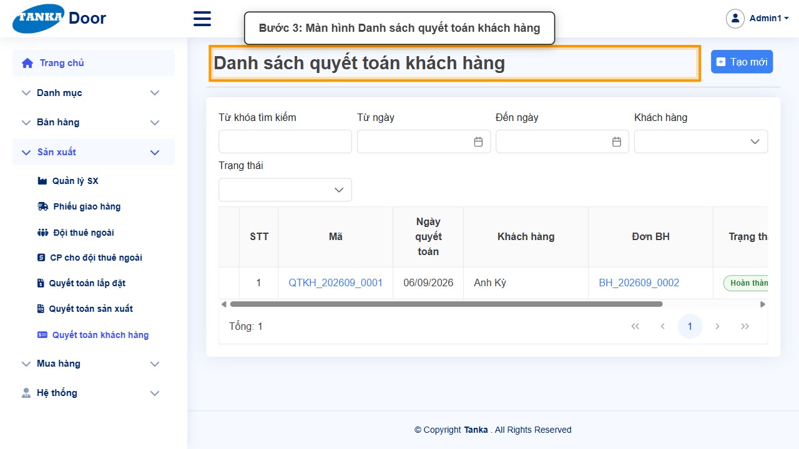

*Hình 3: Danh sách quyết toán khách hàng.*

### Bước 4. Bấm nút Tạo mới

Bấm nút **Tạo mới** ở góc phải màn hình để mở màn hình **Chi tiết quyết toán khách hàng**.

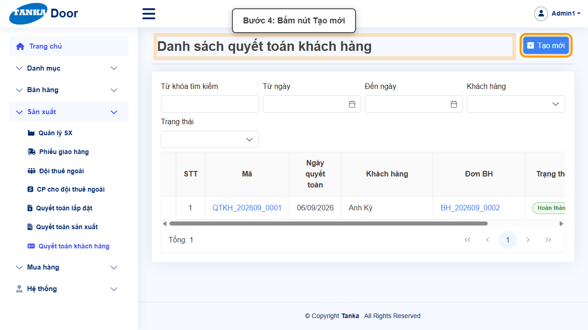

*Hình 4: Bấm nút Tạo mới.*

### Bước 5. Chọn Khách hàng

Bấm vào ô **Khách hàng**, chọn 1 khách hàng từ danh sách sổ xuống hiện ra, ví dụ `Anh Kỳ`.

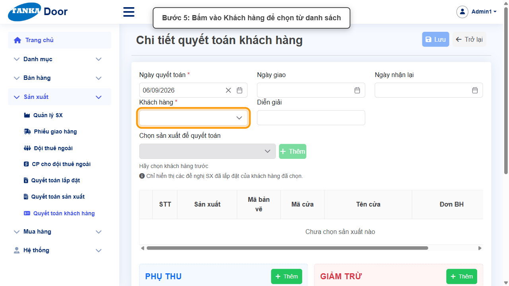

*Hình 5: Chọn Khách hàng.*

### Bước 6. Chọn sản xuất để quyết toán

Bấm vào ô **Chọn sản xuất để quyết toán**, chọn 1 mã sản xuất của khách hàng đó.

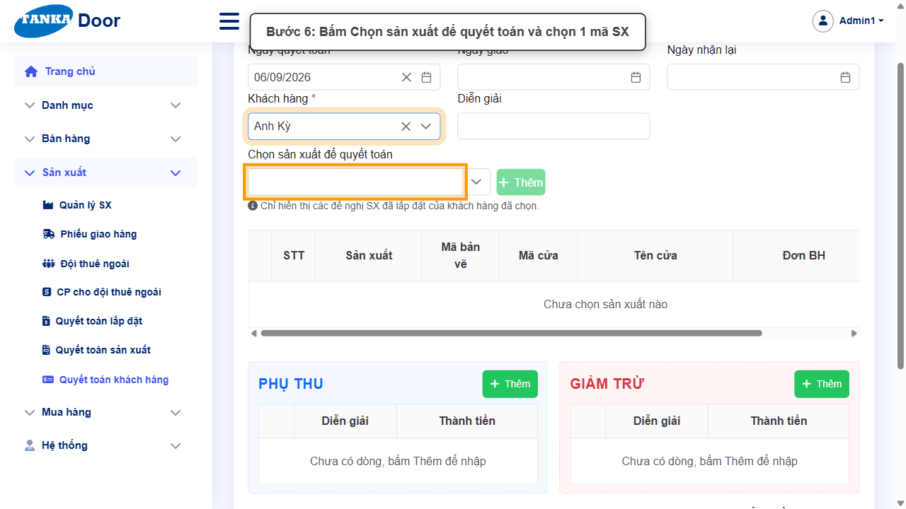

*Hình 6: Chọn sản xuất để quyết toán.*

> Danh sách chỉ hiển thị các đề nghị SX đã lắp đặt của khách hàng đã chọn.

### Bước 7. Thêm mã sản xuất vào bảng

Bấm nút **Thêm** bên cạnh mã sản xuất vừa chọn để đưa dòng vào bảng quyết toán.

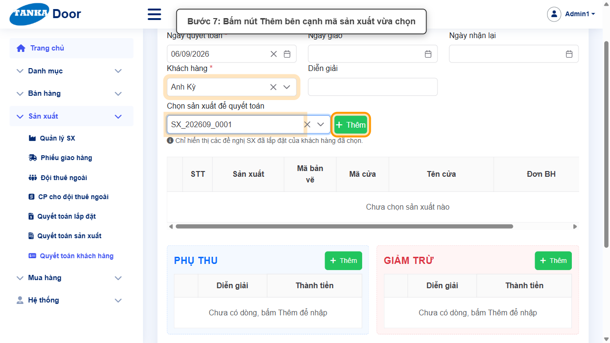

*Hình 7: Bấm nút Thêm.*

> Nếu có phụ thu thì bấm nút Thêm ở khung Phụ thu; nếu có giảm trừ thì bấm nút Thêm ở khung Giảm trừ.

### Bước 8. Bấm Lưu để hoàn thành tạo mới

Kiểm tra lại dòng vừa thêm rồi bấm nút **Lưu** đúng một lần để hoàn thành việc tạo mới quyết toán.

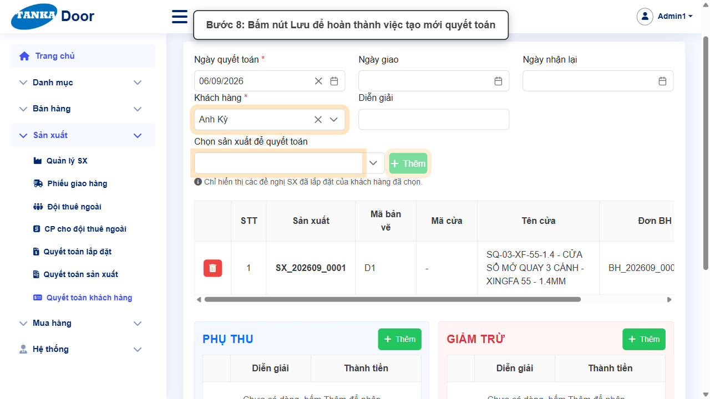

*Hình 8: Bấm Lưu.*

> Sau khi Lưu, màn hình hiện thêm khung Trạng thái với giá trị ban đầu là Nháp.

### Bước 9. Chuyển trạng thái sang Đã gửi

Ở khung **Trạng thái**, bấm nút mũi tên (⇄) bên cạnh chữ Nháp, chọn **Đã gửi**. Màn hình chuyển trạng thái hiện ra, nhập ghi chú vào ô text, bấm **Cập nhật**, rồi bấm **Đồng ý** ở popup xác nhận.

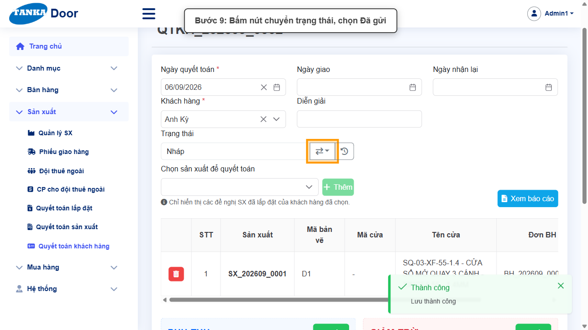

*Hình 9: Chuyển trạng thái sang Đã gửi.*

### Bước 10. Xác nhận đã chuyển sang Đã gửi

Ô Trạng thái nay hiển thị **Đã gửi**.

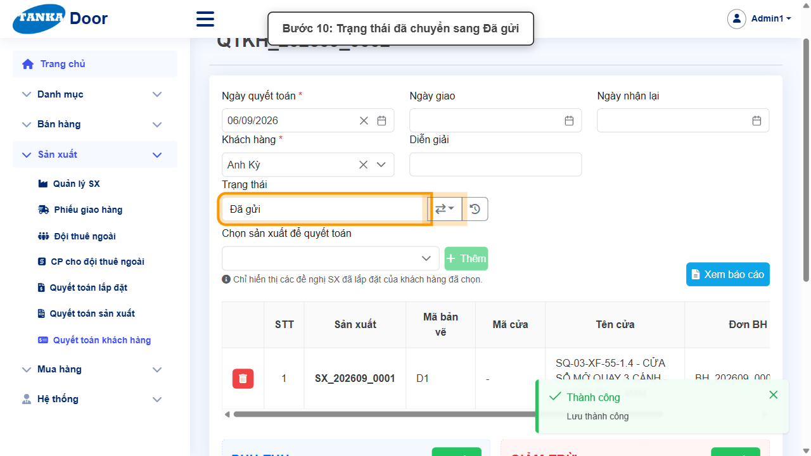

*Hình 10: Trạng thái đã là Đã gửi.*

### Bước 11. Chuyển trạng thái sang Đã duyệt

Lặp lại thao tác: bấm nút chuyển trạng thái, chọn **Đã duyệt**, nhập ghi chú, bấm Cập nhật rồi Đồng ý.

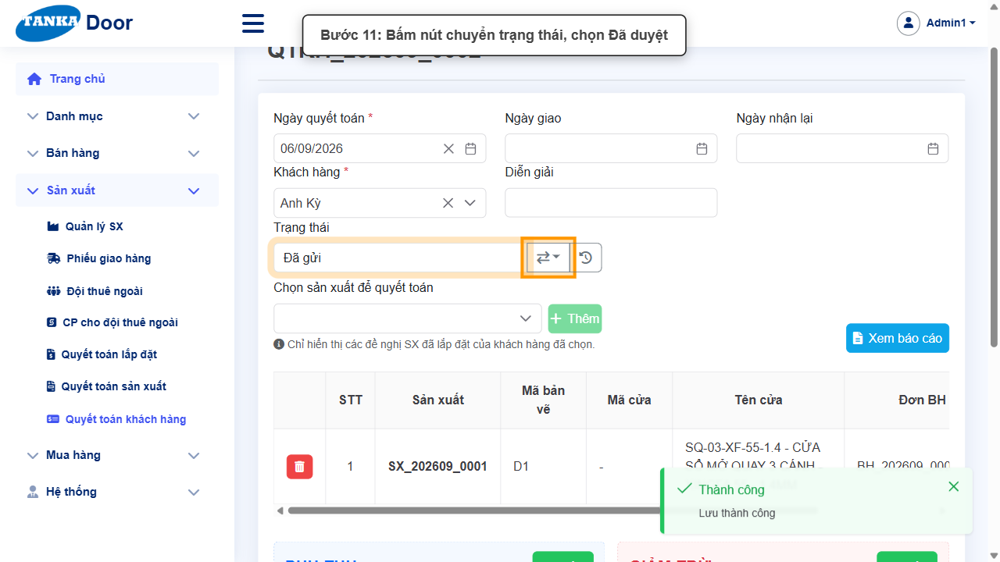

*Hình 11: Chuyển trạng thái sang Đã duyệt.*

### Bước 12. Xác nhận đã chuyển sang Đã duyệt

Ô Trạng thái nay hiển thị **Đã duyệt**.

*Hình 12: Trạng thái đã là Đã duyệt.*

### Bước 13. Chuyển trạng thái sang Hoàn thành

Lặp lại thao tác lần cuối: bấm nút chuyển trạng thái, chọn **Hoàn thành**, nhập ghi chú, bấm Cập nhật rồi Đồng ý.

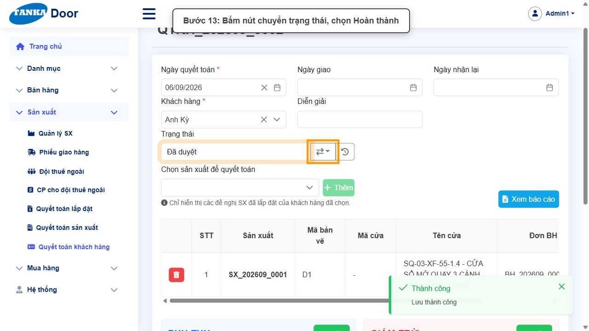

*Hình 13: Chuyển trạng thái sang Hoàn thành.*

### Bước 14. Xác nhận đã Hoàn thành

Ô Trạng thái nay hiển thị **Hoàn thành** — quyết toán khách hàng đã xử lý xong.

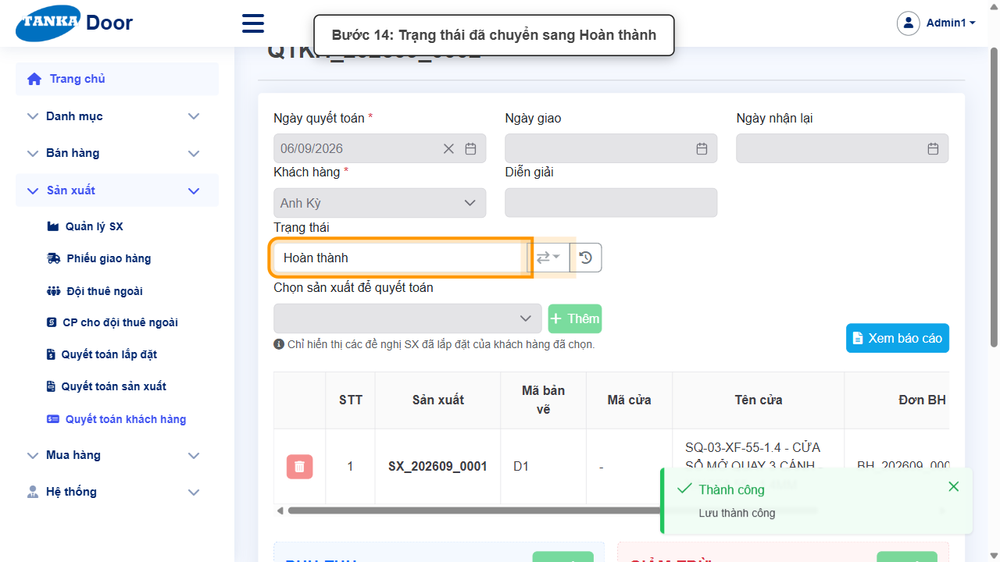

*Hình 14: Trạng thái đã là Hoàn thành.*

### Bước 15. Bấm nút Trở lại

Bấm nút **Trở lại** ở góc trên bên phải để quay về danh sách.

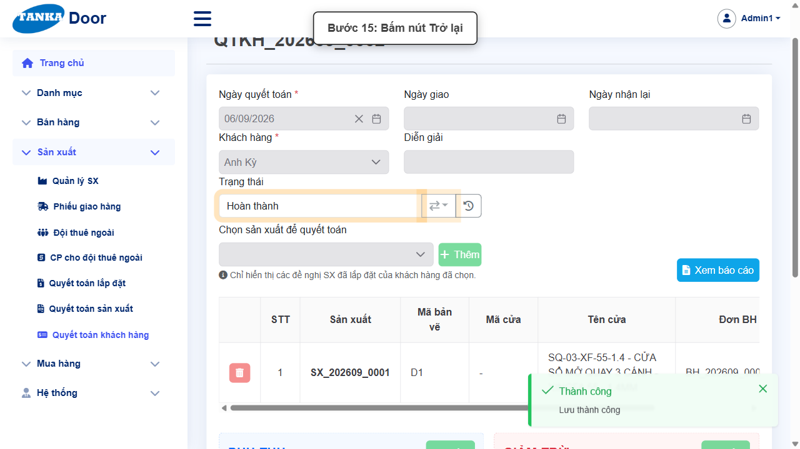

*Hình 15: Bấm Trở lại.*

### Bước 16. Kiểm tra kết quả trong danh sách

Bản ghi quyết toán khách hàng vừa tạo xuất hiện trong danh sách với trạng thái **Hoàn thành**.

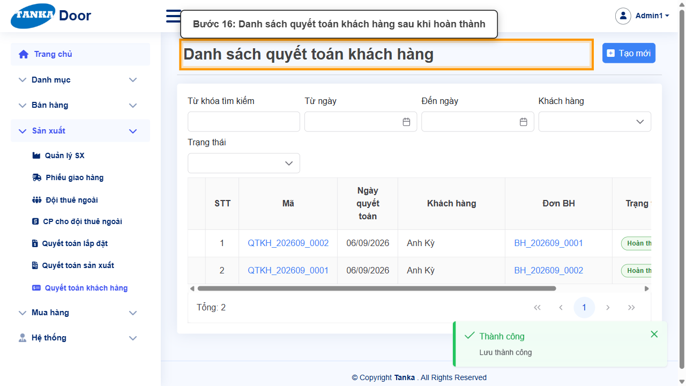

*Hình 16: Danh sách sau khi hoàn thành.*

## 4. Khi không thao tác được

| Hiện tượng | Cách xử lý ngay |
| --- | --- |
| Nút Lưu đang mờ / không bấm được | Tìm ô có dấu * chưa nhập hoặc dropdown chưa chọn; cuộn hết form để kiểm tra. |
| Ô hiện viền đỏ kèm thông báo lỗi | Đọc đúng thông báo dưới ô, sửa lại giá trị rồi bấm ra ngoài ô để hệ thống kiểm tra lại. |
| Gõ vào dropdown nhưng không thấy dữ liệu | Xóa bớt từ khóa, gõ lại đúng một phần mã/tên và chờ vài giây để danh sách tải xong. |
| Bấm Lưu nhưng không thấy phản hồi | Không bấm thêm lần nữa; chờ hệ thống xử lý xong rồi tìm lại bản ghi trong danh sách. |
| Ô "Chọn sản xuất để quyết toán" không có dữ liệu | Kiểm tra khách hàng đã chọn có lệnh sản xuất nào ở trạng thái "Đã lắp đặt" chưa — chỉ các lệnh SX đã lắp đặt mới hiển thị. |
| Nút Thêm bên cạnh mã sản xuất bị mờ | Phải chọn xong 1 mã sản xuất trong ô "Chọn sản xuất để quyết toán" trước khi nút Thêm sáng lên. |

## 5. Dấu hiệu hoàn thành

- Ô Trạng thái hiển thị "Hoàn thành".
- Bản ghi quyết toán khách hàng (mã dạng QTKH_YYYYMM_xxxx) xuất hiện trong danh sách với đúng khách hàng và trạng thái Hoàn thành.

## 6. Checklist dành cho người mới

- [ ] Đã chọn đúng Khách hàng và đúng mã sản xuất cần quyết toán.
- [ ] Đã bấm Thêm để đưa dòng vào bảng trước khi Lưu.
- [ ] Đã chuyển đủ chuỗi trạng thái Nháp → Đã gửi → Đã duyệt → Hoàn thành.
- [ ] Đã bấm Trở lại và thấy bản ghi trong danh sách với trạng thái Hoàn thành.

---

_Tài liệu này được biên soạn dựa trên thao tác thực tế trên hệ thống door-v1.test.tankasoft.com. Ảnh minh họa có thể thay đổi theo phiên bản giao diện._
