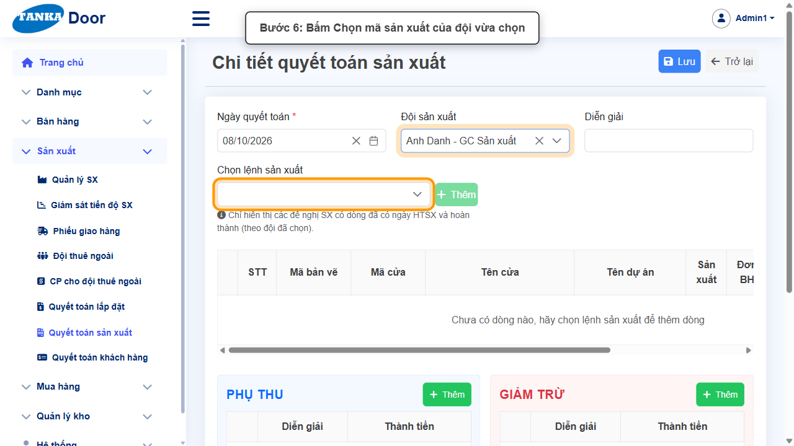
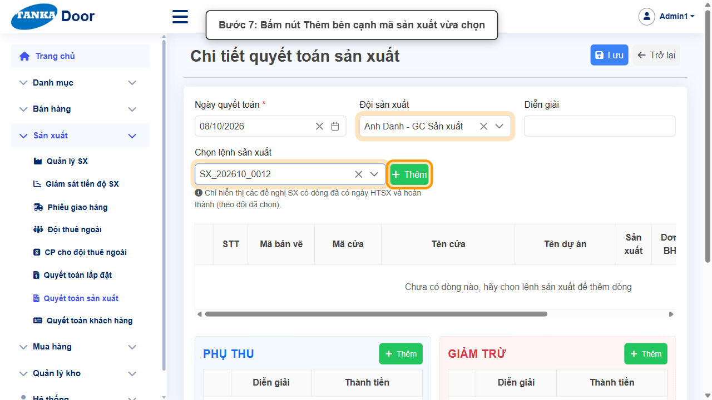
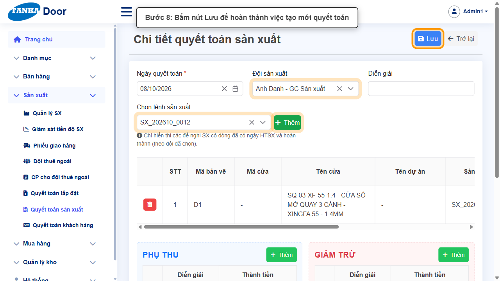
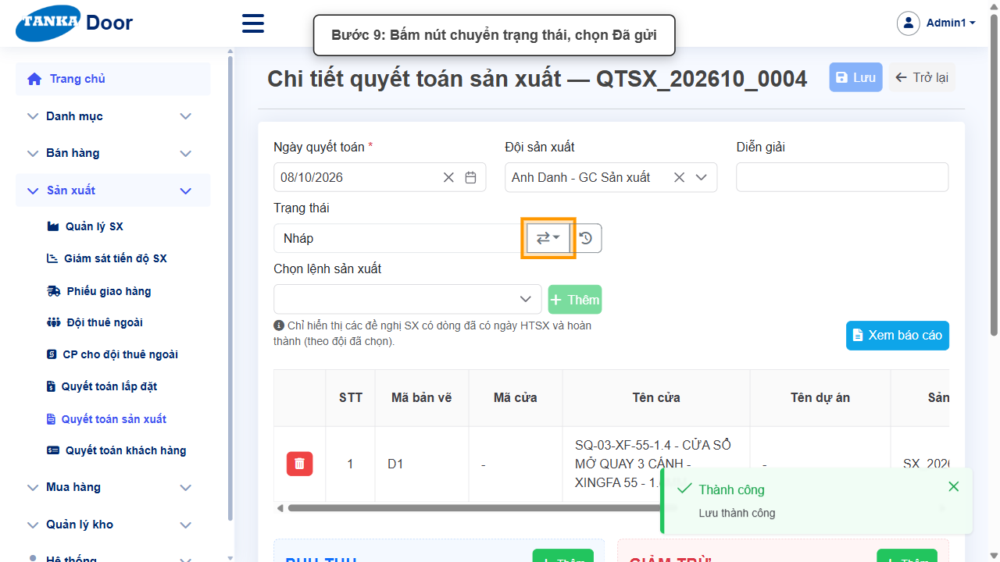
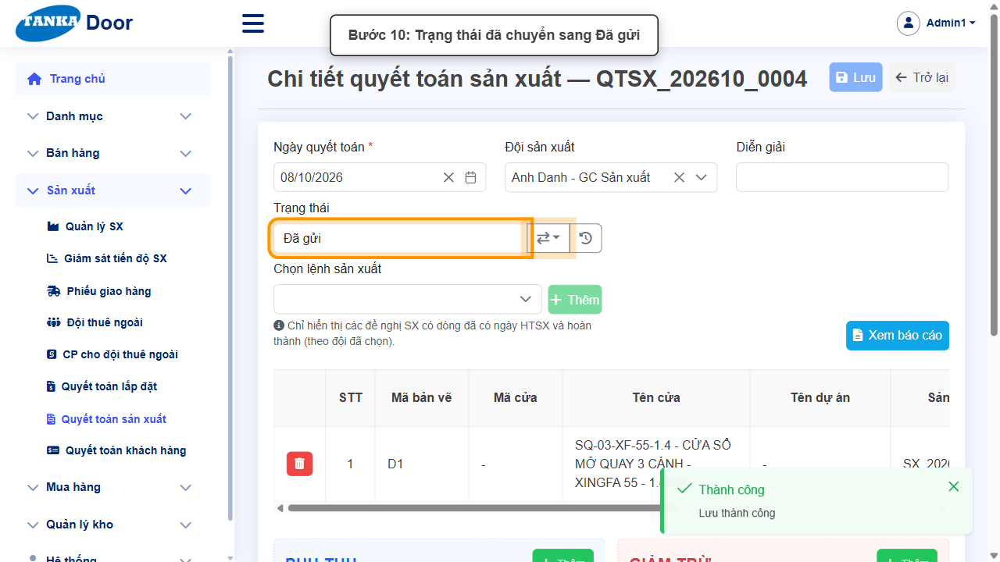
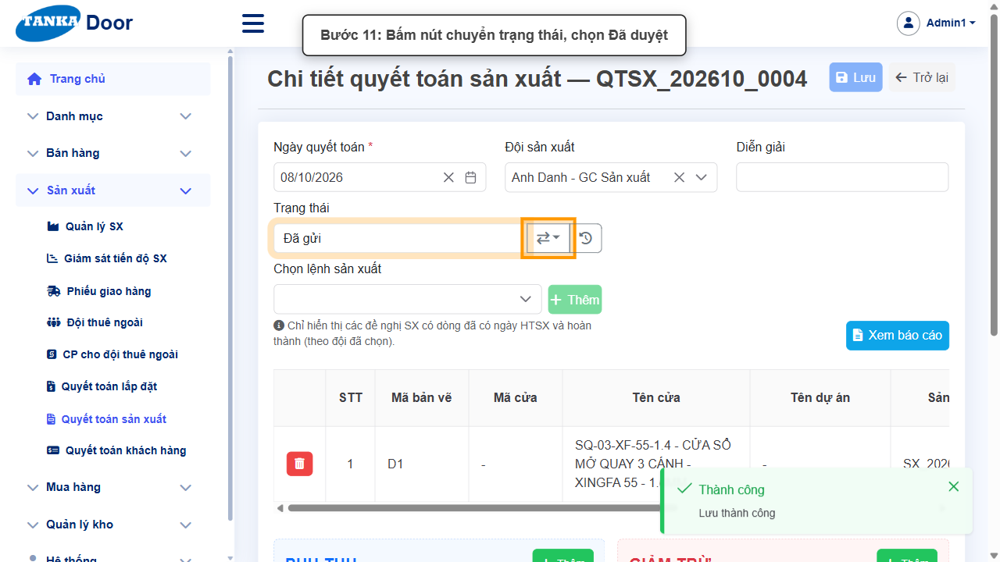
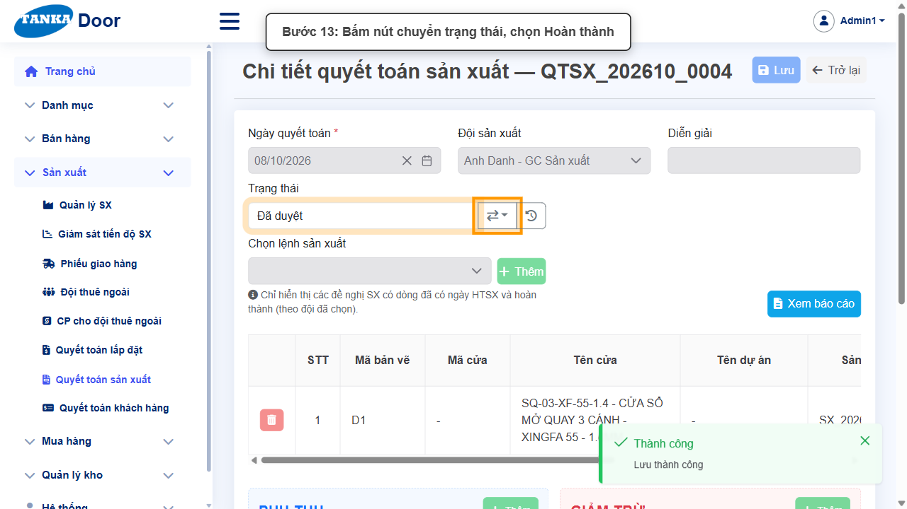
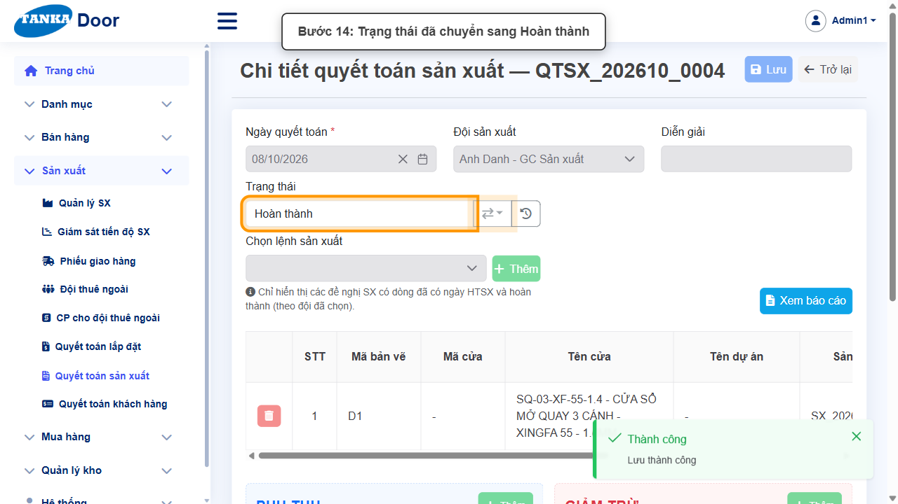
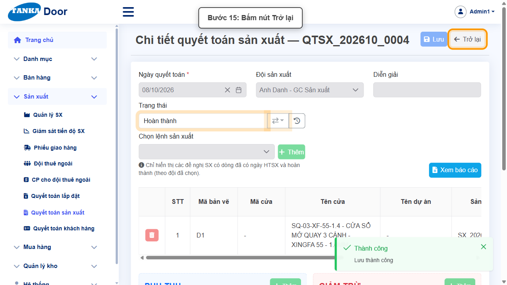
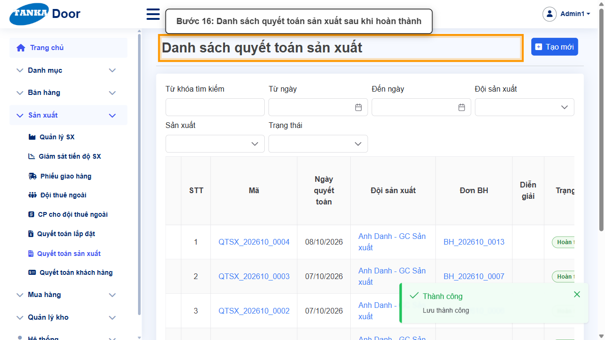

# HƯỚNG DẪN SỬ DỤNG — TẠO QUYẾT TOÁN SẢN XUẤT

**Đường dẫn:** Sản xuất > Quyết toán sản xuất  
**Mục tiêu:** Tạo một quyết toán sản xuất cho 1 đội sản xuất từ các lệnh sản xuất đủ điều kiện, rồi chuyển trạng thái từ Nháp đến Hoàn thành.  
**Dành cho:** Người mới sử dụng TANKA Door

## 1. Dữ liệu mẫu dùng trong hướng dẫn

Dữ liệu dưới đây là dữ liệu thật đã dùng để minh họa. Ô "Chọn mã sản xuất" chỉ hiện các lệnh SX có dòng đã có ngày HTSX (ngày hoàn thành sản xuất — hệ thống tự ghi khi lệnh SX chuyển sang Đã SX) và đã gán **Đội SX** ở màn hình **Sản xuất > Giám sát tiến độ SX** — xem hướng dẫn UG-033 "Sản xuất, giao hàng và lắp đặt".

| Trường | Giá trị |
| --- | --- |
| Đội sản xuất | Anh Danh - GC Sản xuất |
| Mã sản xuất được chọn | SX_202610_0012 (đã SX, có ngày HTSX, Đội SX: Anh Danh - GC Sản xuất) |
| Mã quyết toán sinh ra | QTSX_202610_0004 |
| Ghi chú khi chuyển trạng thái | đã hoàn thành bước này |

## 2. Sơ đồ quy trình tóm tắt

BẮT ĐẦU → Tạo mới, chọn Đội sản xuất và mã sản xuất đủ điều kiện → Bấm Thêm, rồi Lưu → Chuyển trạng thái Nháp → Đã gửi → Đã duyệt → Hoàn thành → Trở lại kiểm tra kết quả

## 3. Quy trình thao tác từng bước

### Bước 1. Mở trang chủ Tanka Door

Đăng nhập vào hệ thống, màn hình **Trang chủ** hiện ra.

*Hình 1: Trang chủ sau khi đăng nhập.*

### Bước 2. Mở Quyết toán sản xuất

Ở menu bên trái, mở **Sản xuất**, trong danh sách sổ xuống bấm **Quyết toán sản xuất**.

*Hình 2: Mở menu Sản xuất, chọn Quyết toán sản xuất.*

### Bước 3. Màn hình Danh sách quyết toán sản xuất

Màn hình hiện ra với danh sách các quyết toán sản xuất đã có.

*Hình 3: Danh sách quyết toán sản xuất.*

### Bước 4. Bấm nút Tạo mới

Bấm nút **Tạo mới** ở góc phải màn hình để mở màn hình **Chi tiết quyết toán sản xuất**.

*Hình 4: Bấm nút Tạo mới.*

### Bước 5. Chọn Đội sản xuất

Bấm vào ô **Đội sản xuất**, chọn 1 đội từ danh sách sổ xuống hiện ra, ví dụ `Anh Danh - GC Sản xuất`.

*Hình 5: Chọn Đội sản xuất.*

### Bước 6. Chọn mã sản xuất

Bấm vào ô **Chọn mã sản xuất** để chọn 1 mã sản xuất của đội vừa chọn.

*Hình 6: Chọn mã sản xuất.*

> Chỉ chọn được mã SX có dòng đã có ngày HTSX và đã gán đúng Đội SX vừa chọn — nếu danh sách hiện "No available options" nghĩa là đội này chưa có mã sản xuất nào đủ điều kiện. Để gán đội, vào **Sản xuất > Giám sát tiến độ SX** (xem hướng dẫn UG-033), bấm vào ô Đội SX tương ứng với dòng SX cần cập nhật.

### Bước 7. Thêm mã sản xuất vào bảng

Bấm nút **Thêm** bên cạnh mã sản xuất vừa chọn để đưa dòng vào bảng quyết toán.

*Hình 7: Bấm nút Thêm.*

> Nếu có phụ thu thì bấm nút Thêm ở khung Phụ thu; nếu có giảm trừ thì bấm nút Thêm ở khung Giảm trừ.

### Bước 8. Bấm Lưu để hoàn thành tạo mới

Kiểm tra lại dòng vừa thêm rồi bấm nút **Lưu** đúng một lần để hoàn thành việc tạo mới quyết toán.

*Hình 8: Bấm Lưu.*

> Sau khi Lưu, màn hình hiện thêm khung Trạng thái với giá trị ban đầu là Nháp.

### Bước 9. Chuyển trạng thái sang Đã gửi

Ở khung **Trạng thái**, bấm nút mũi tên (⇄) bên cạnh chữ Nháp, chọn **Đã gửi**. Màn hình chuyển trạng thái hiện ra, nhập ghi chú vào ô text, bấm **Cập nhật**, rồi bấm **Đồng ý** ở popup xác nhận.

*Hình 9: Chuyển trạng thái sang Đã gửi.*

### Bước 10. Xác nhận đã chuyển sang Đã gửi

Ô Trạng thái nay hiển thị **Đã gửi**.

*Hình 10: Trạng thái đã là Đã gửi.*

### Bước 11. Chuyển trạng thái sang Đã duyệt

Lặp lại thao tác: bấm nút chuyển trạng thái, chọn **Đã duyệt**, nhập ghi chú, bấm Cập nhật rồi Đồng ý.

*Hình 11: Chuyển trạng thái sang Đã duyệt.*

### Bước 12. Xác nhận đã chuyển sang Đã duyệt

Ô Trạng thái nay hiển thị **Đã duyệt**.

*Hình 12: Trạng thái đã là Đã duyệt.*

### Bước 13. Chuyển trạng thái sang Hoàn thành

Lặp lại thao tác lần cuối: bấm nút chuyển trạng thái, chọn **Hoàn thành**, nhập ghi chú, bấm Cập nhật rồi Đồng ý.

*Hình 13: Chuyển trạng thái sang Hoàn thành.*

### Bước 14. Xác nhận đã Hoàn thành

Ô Trạng thái nay hiển thị **Hoàn thành** — quyết toán sản xuất đã xử lý xong.

*Hình 14: Trạng thái đã là Hoàn thành.*

### Bước 15. Bấm nút Trở lại

Bấm nút **Trở lại** ở góc trên bên phải để quay về danh sách.

*Hình 15: Bấm Trở lại.*

### Bước 16. Kiểm tra kết quả trong danh sách

Bản ghi quyết toán sản xuất vừa tạo xuất hiện trong danh sách với trạng thái **Hoàn thành**.

*Hình 16: Danh sách sau khi hoàn thành.*

## 4. Khi không thao tác được

| Hiện tượng | Cách xử lý ngay |
| --- | --- |
| Nút Lưu đang mờ / không bấm được | Tìm ô có dấu * chưa nhập hoặc dropdown chưa chọn; cuộn hết form để kiểm tra. |
| Ô hiện viền đỏ kèm thông báo lỗi | Đọc đúng thông báo dưới ô, sửa lại giá trị rồi bấm ra ngoài ô để hệ thống kiểm tra lại. |
| Gõ vào dropdown nhưng không thấy dữ liệu | Xóa bớt từ khóa, gõ lại đúng một phần mã/tên và chờ vài giây để danh sách tải xong. |
| Bấm Lưu nhưng không thấy phản hồi | Không bấm thêm lần nữa; chờ hệ thống xử lý xong rồi tìm lại bản ghi trong danh sách. |
| Ô "Chọn mã sản xuất" hiện "No available options" | Đội sản xuất đã chọn chưa có mã SX nào đã có ngày HTSX và được gán đội. Kiểm tra lệnh SX đã qua trạng thái Đã SX, rồi vào **Sản xuất > Giám sát tiến độ SX** (xem hướng dẫn UG-033), bấm vào ô Đội SX của dòng SX cần quyết toán để chọn đội. |
| Nút Thêm bên cạnh mã sản xuất bị mờ | Phải chọn xong 1 mã sản xuất hợp lệ ở ô "Chọn mã sản xuất" trước khi nút Thêm sáng lên. |
| Sửa ô Đội SX/Đội LĐ/Ngày HTVS ở Giám sát tiến độ SX báo lỗi "Không thể chỉnh sửa..." | Lệnh sản xuất đó đã ở trạng thái hoàn tất/từ chối — chỉ có thể chỉnh sửa các ô này khi lệnh SX chưa hoàn tất. |

## 5. Dấu hiệu hoàn thành

- Ô Trạng thái hiển thị "Hoàn thành".
- Bản ghi quyết toán sản xuất xuất hiện trong danh sách với đúng đội sản xuất và trạng thái Hoàn thành.

## 6. Checklist dành cho người mới

- [ ] Đã chọn đúng Đội sản xuất và đúng mã sản xuất đủ điều kiện cần quyết toán.
- [ ] Đã bấm Thêm để đưa dòng vào bảng trước khi Lưu.
- [ ] Đã chuyển đủ chuỗi trạng thái Nháp → Đã gửi → Đã duyệt → Hoàn thành.
- [ ] Đã bấm Trở lại và thấy bản ghi trong danh sách với trạng thái Hoàn thành.

---

_Tài liệu này được biên soạn dựa trên thao tác thực tế trên hệ thống door-v1.test.tankasoft.com. Ảnh minh họa có thể thay đổi theo phiên bản giao diện._
