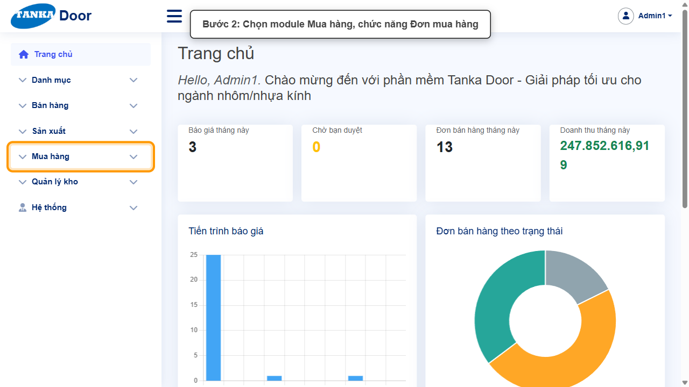
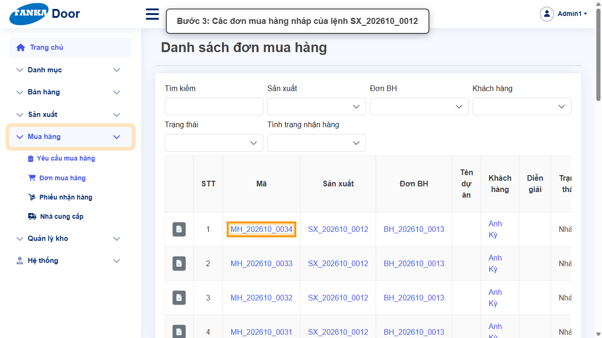
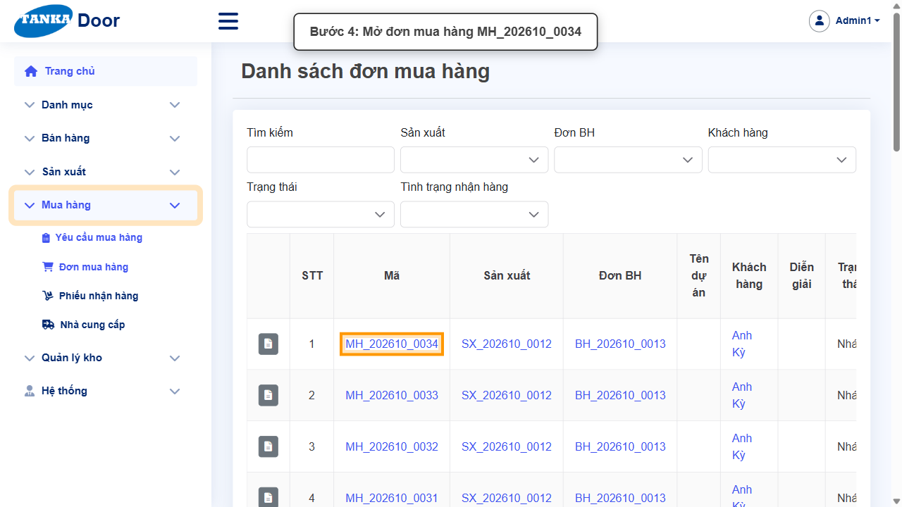
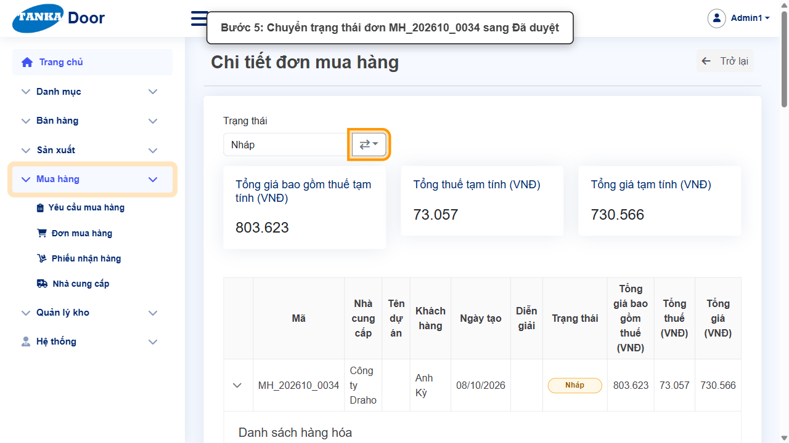
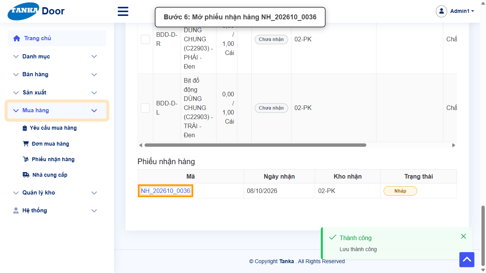
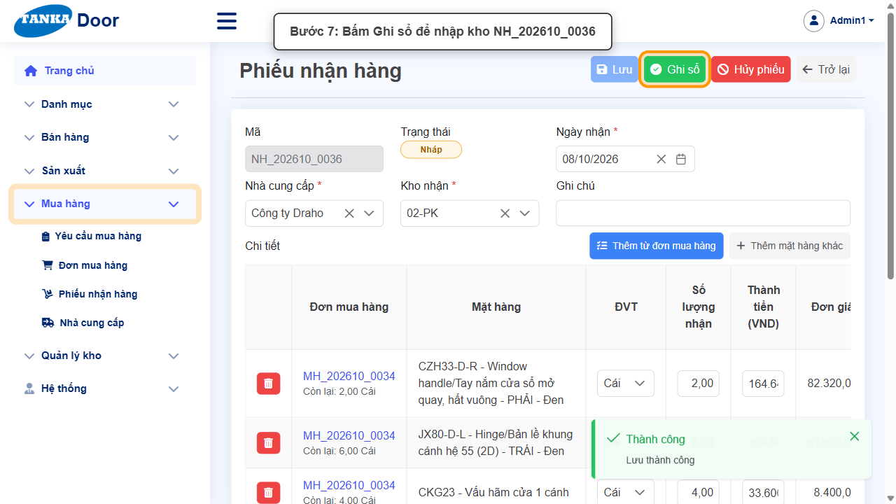
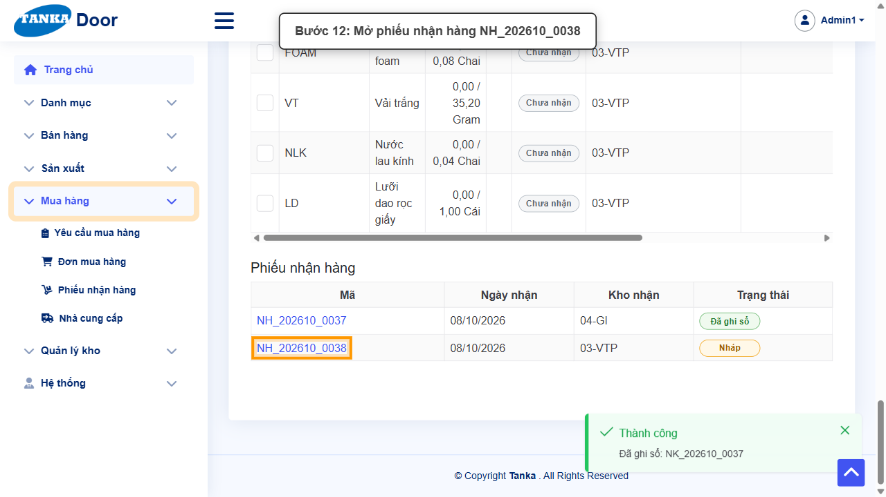
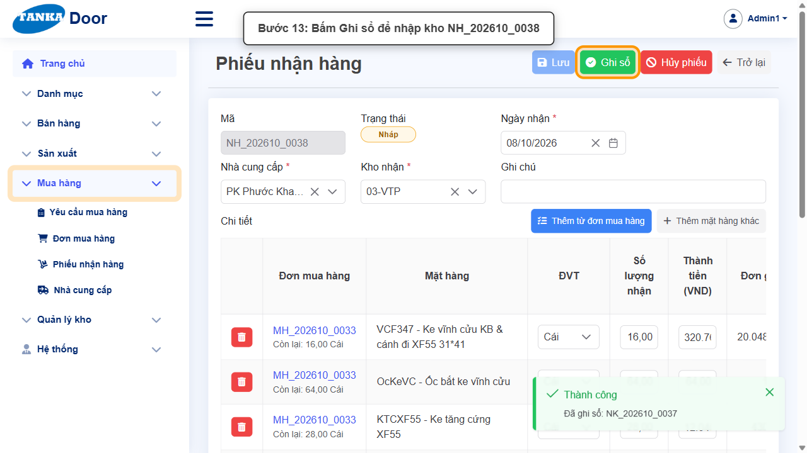
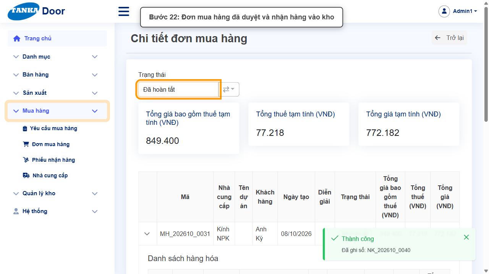

# HƯỚNG DẪN SỬ DỤNG — DUYỆT ĐƠN MUA HÀNG VÀ NHẬN HÀNG NHẬP KHO

**Đường dẫn:** Mua hàng > Đơn mua hàng; Mua hàng > Phiếu nhận hàng  
**Mục tiêu:** Duyệt các đơn mua hàng đã lập cho một lệnh sản xuất và ghi sổ phiếu nhận hàng để nhập vật tư vào kho.  
**Dành cho:** Người mới sử dụng TANKA Door

> Hướng dẫn này nối tiếp **UG-032** (lệnh SX đã "Đã mua hàng"). Vật tư phải được nhập kho đầy đủ thì lệnh SX mới chuyển được sang "Đang SX" ở **UG-033** — khi chuyển "Đang SX", hệ thống tự xuất kho vật tư cho sản xuất.

## 1. Dữ liệu mẫu dùng trong hướng dẫn

Dữ liệu dưới đây là dữ liệu thật đã dùng để minh họa.

| Trường | Giá trị |
| --- | --- |
| Lệnh SX | SX_202610_0012 |
| Đơn mua hàng (Nháp) | MH_202610_0031, MH_202610_0032, MH_202610_0033, MH_202610_0034 |
| Phiếu nhận hàng sinh ra | NH_202610_0036 → NH_202610_0040 (đơn MH_202610_0033 nhận vào 2 kho nên có 2 phiếu) |

## 2. Sơ đồ quy trình tóm tắt

BẮT ĐẦU → Mở Mua hàng > Đơn mua hàng → Mở đơn MH đang Nháp → Chuyển trạng thái **Đã duyệt** (hệ thống tự tạo phiếu nhận hàng nháp cho mỗi kho nhận) → Mở phiếu nhận hàng → **Ghi sổ** → Lặp lại cho các đơn MH còn lại của lệnh SX → Kiểm tra đơn MH "Đã hoàn tất / Đã nhận đủ"

## 3. Quy trình thao tác từng bước

### Bước 1. Mở trang chủ Tanka Door

Đăng nhập vào hệ thống, màn hình **Trang chủ** hiện ra.

*Hình 1: Trang chủ sau khi đăng nhập.*

### Bước 2. Mở danh sách Đơn mua hàng

Ở menu bên trái, mở **Mua hàng > Đơn mua hàng**.

*Hình 2: Mở Mua hàng > Đơn mua hàng.*

### Bước 3. Tìm các đơn mua hàng nháp của lệnh SX

Danh sách hiển thị cột **Sản xuất** (mã lệnh SX) và **Trạng thái**. Các đơn lập từ cùng một yêu cầu mua hàng có cùng mã lệnh SX (ví dụ `SX_202610_0012`) và đang ở trạng thái **Nháp**. Có thể dùng ô lọc **Sản xuất** phía trên để chỉ hiện đơn của lệnh SX cần xử lý.

*Hình 3: Các đơn mua hàng nháp của lệnh SX_202610_0012.*

### Bước 4. Mở một đơn mua hàng

Bấm vào mã đơn (ví dụ `MH_202610_0034`) để mở **Chi tiết đơn mua hàng**. Kiểm tra nhà cung cấp, danh sách hàng hóa và mục **Nhận hàng** — mỗi dòng đã có sẵn **kho nhận** (có thể đổi trước khi duyệt).

*Hình 4: Mở đơn mua hàng MH_202610_0034.*

### Bước 5. Chuyển đơn mua hàng sang Đã duyệt

Bấm nút mũi tên (⇄) cạnh ô **Trạng thái**, chọn **Đã duyệt**, rồi bấm **Đồng ý** ở popup _"Duyệt đơn mua hàng này? Mỗi kho nhận sẽ có một phiếu nhận hàng nháp."_ Sau khi duyệt, mục **Phiếu nhận hàng** ở cuối đơn xuất hiện mã phiếu NH_... .

*Hình 5: Chuyển trạng thái đơn mua hàng sang Đã duyệt.*

### Bước 6. Mở phiếu nhận hàng

Cuộn xuống mục **Phiếu nhận hàng**, bấm vào mã phiếu (ví dụ `NH_202610_0036`). Màn hình **Phiếu nhận hàng** mở ra ở trạng thái **Nháp** với Ngày nhận, Nhà cung cấp, Kho nhận và số lượng nhận đã điền sẵn theo đơn mua hàng.

*Hình 6: Mở phiếu nhận hàng NH_202610_0036.*

### Bước 7. Bấm Ghi sổ để nhập kho

Kiểm tra **Số lượng nhận** của từng dòng (sửa nếu hàng về thiếu), rồi bấm nút **Ghi sổ** màu xanh và bấm **Đồng ý** ở popup _"Ghi sổ phiếu này? Hàng sẽ được nhập kho và đơn mua hàng được cập nhật."_ Thông báo **"Đã ghi sổ: NK_..."** cho biết phiếu nhập kho đã được tạo. Bấm mã đơn mua hàng ở cột **Đơn mua hàng** để quay lại đơn.

*Hình 7: Bấm Ghi sổ để nhập kho.*

### Bước 8. Đơn mua hàng có nhiều phiếu nhận hàng

Nếu các dòng của đơn nhận vào nhiều kho khác nhau, mục **Phiếu nhận hàng** sẽ có **một phiếu cho mỗi kho** (ví dụ đơn `MH_202610_0033` có `NH_202610_0037` và `NH_202610_0038`). Lặp lại bước 6–7 cho **từng** phiếu.

*Hình 8: Mở phiếu nhận hàng thứ hai của cùng đơn mua hàng.*

*Hình 9: Ghi sổ phiếu nhận hàng thứ hai.*

### Bước 9. Lặp lại cho các đơn mua hàng còn lại

Quay lại **Mua hàng > Đơn mua hàng**, lần lượt làm bước 4–8 cho từng đơn còn **Nháp** của cùng lệnh SX (trong ví dụ: MH_202610_0032 và MH_202610_0031).

### Bước 10. Kiểm tra kết quả

Sau khi ghi sổ hết các phiếu, mở lại đơn mua hàng: trạng thái hiển thị **Đã hoàn tất** và mục Nhận hàng hiển thị **Đã nhận đủ**. Trong danh sách Đơn mua hàng, các đơn của lệnh SX đều ở "Đã hoàn tất / Đã nhận đủ".

*Hình 10: Đơn mua hàng đã duyệt và nhận hàng vào kho.*

## 4. Khi không thao tác được

| Hiện tượng | Cách xử lý ngay |
| --- | --- |
| Duyệt đơn xong nhưng không thấy phiếu nhận hàng | Tải lại trang đơn mua hàng; mục **Phiếu nhận hàng** ở cuối trang. Mỗi kho nhận có một phiếu riêng. |
| Nút Ghi sổ bị mờ | Phiếu không còn ở trạng thái Nháp (đã ghi sổ hoặc đã hủy) — kiểm tra ô Trạng thái của phiếu. |
| Hàng về thiếu so với đơn | Sửa **Số lượng nhận** theo thực tế trước khi Ghi sổ; phần còn lại có thể nhận ở phiếu sau hoặc dùng nút **Đóng dòng thiếu** trên đơn mua hàng. |
| Lệnh SX vẫn không chuyển được "Đang SX", báo "... kho chỉ còn 0" | Còn đơn mua hàng hoặc phiếu nhận hàng chưa ghi sổ — kiểm tra tất cả đơn của lệnh SX đã "Đã nhận đủ". |
| Lệnh SX báo "... đang giữ cho lệnh sản xuất — chỉ được lấy 0" | Vật tư trong kho đang bị **giữ cho lệnh SX khác** cũ hơn. Liên hệ người phụ trách để xử lý/hủy các lệnh SX dở dang hoặc nhập thêm vật tư. |

## 5. Dấu hiệu hoàn thành

- Mỗi phiếu nhận hàng hiển thị trạng thái "Đã ghi sổ" và có link "mở phiếu kho" (NK_...).
- Các đơn mua hàng của lệnh SX đều ở trạng thái "Đã hoàn tất", tình trạng nhận hàng "Đã nhận đủ".
- Màn hình **Quản lý kho > Tồn kho** hiển thị số tồn của các vật tư vừa nhận.

## 6. Checklist dành cho người mới

- [ ] Đã duyệt **tất cả** đơn mua hàng nháp của lệnh SX.
- [ ] Đã ghi sổ **tất cả** phiếu nhận hàng (mỗi kho nhận một phiếu).
- [ ] Đã kiểm tra số lượng nhận khớp thực tế trước khi ghi sổ.
- [ ] Đã chuyển sang UG-033 để đưa lệnh SX vào sản xuất.

---

_Tài liệu này được biên soạn dựa trên thao tác thực tế trên hệ thống door-v1.test.tankasoft.com. Ảnh minh họa có thể thay đổi theo phiên bản giao diện._
